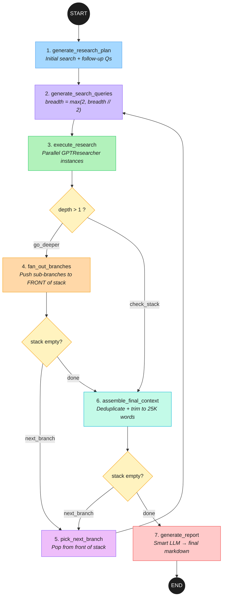
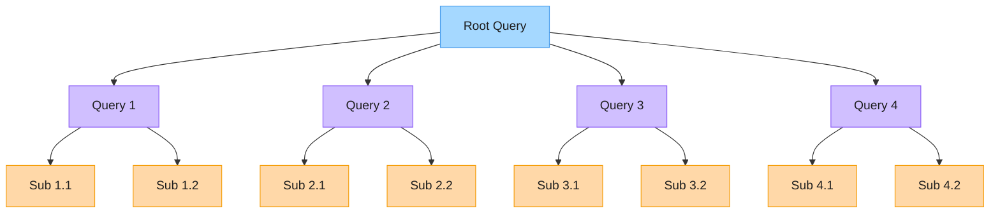
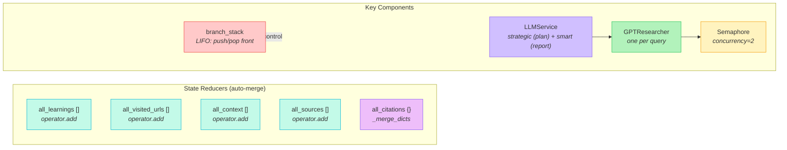

# GPT-Researcher: Deep Research LangGraph Workflow Diagrams

## Diagram 1: Main LangGraph StateGraph Flow

---

## Diagram 2: DFS Branch Stack — Complete Execution Flow

```mermaid
graph TD
    title["DFS Execution Flow — Complete Branch Stack Walkthrough<br/><i>breadth=3, depth=2 │ new_items pushed to FRONT of stack</i>"]
    style title fill:none,stroke:none,color:#1e1e1e

    title ~~~ INIT

    subgraph INIT["STEP 1 — Initialize Stack"]
        direction LR
        I1["branch_A<br/>depth=2"]
        I2["branch_B<br/>depth=2"]
        I3["branch_C<br/>depth=2"]
        I1 ~~~ I2 ~~~ I3
        IP["◀ pop"]
    end

    INIT -->|"pop branch_A, execute_research<br/>depth > 1 → fan_out_branches"| S2

    subgraph S2["STEP 2 — Fan out A's results → push to FRONT"]
        direction LR
        S2A1["sub_A1<br/>depth=1"]
        S2A2["sub_A2<br/>depth=1"]
        S2B["branch_B<br/>depth=2"]
        S2C["branch_C<br/>depth=2"]
        S2A1 ~~~ S2A2 ~~~ S2B ~~~ S2C
        S2P["◀ pop"]
    end

    S2 -->|"pop sub_A1, execute_research<br/>depth = 1 → no fan_out"| S3

    subgraph S3["STEP 3 — sub_A1 done (leaf node)"]
        direction LR
        S3A2["sub_A2<br/>depth=1"]
        S3B["branch_B<br/>depth=2"]
        S3C["branch_C<br/>depth=2"]
        S3A2 ~~~ S3B ~~~ S3C
        S3P["◀ pop"]
    end

    S3 -->|"pop sub_A2, execute_research<br/>depth = 1 → no fan_out"| S4

    subgraph S4["STEP 4 — sub_A2 done ✓ A's subtree complete"]
        direction LR
        S4B["branch_B<br/>depth=2"]
        S4C["branch_C<br/>depth=2"]
        S4B ~~~ S4C
        S4P["◀ pop"]
    end

    S4 -->|"pop branch_B, execute_research<br/>depth > 1 → fan_out_branches"| S5

    subgraph S5["STEP 5 — Fan out B's results → push to FRONT"]
        direction LR
        S5B1["sub_B1<br/>depth=1"]
        S5B2["sub_B2<br/>depth=1"]
        S5C["branch_C<br/>depth=2"]
        S5B1 ~~~ S5B2 ~~~ S5C
        S5P["◀ pop"]
    end

    S5 -->|"pop sub_B1, execute_research<br/>depth = 1 → no fan_out"| S6

    subgraph S6["STEP 6 — sub_B1 done (leaf node)"]
        direction LR
        S6B2["sub_B2<br/>depth=1"]
        S6C["branch_C<br/>depth=2"]
        S6B2 ~~~ S6C
        S6P["◀ pop"]
    end

    S6 -->|"pop sub_B2, execute_research<br/>depth = 1 → no fan_out"| S7

    subgraph S7["STEP 7 — sub_B2 done ✓ B's subtree complete"]
        direction LR
        S7C["branch_C<br/>depth=2"]
        S7P["◀ pop"]
        S7C ~~~ S7P
    end

    S7 -->|"pop branch_C, execute_research<br/>depth > 1 → fan_out_branches"| S8

    subgraph S8["STEP 8 — Fan out C's results → push to FRONT"]
        direction LR
        S8C1["sub_C1<br/>depth=1"]
        S8C2["sub_C2<br/>depth=1"]
        S8C1 ~~~ S8C2
        S8P["◀ pop"]
    end

    S8 -->|"pop sub_C1, execute_research<br/>depth = 1 → no fan_out"| S9

    subgraph S9["STEP 9 — sub_C1 done (leaf node)"]
        direction LR
        S9C2["sub_C2<br/>depth=1"]
        S9P["◀ pop"]
        S9C2 ~~~ S9P
    end

    S9 -->|"pop sub_C2, execute_research<br/>depth = 1 → no fan_out"| S10

    subgraph S10["STEP 10 — Stack Empty ✓ C's subtree complete"]
        direction LR
        S10E["∅  empty"]
    end

    S10 -->|"has_more_work? → done"| FIN

    subgraph FIN["FINAL"]
        F1["assemble_final_context<br/><i>Deduplicate + trim 25K words</i>"]
        F1 --> F2["generate_report<br/><i>Smart LLM → markdown</i>"]
        F2 --> F3(("END"))
    end

    %% ---- Colors ----

    %% Initial branches (blue)
    style I1 fill:#a5d8ff,stroke:#4a9eed,color:#1e1e1e
    style I2 fill:#a5d8ff,stroke:#4a9eed,color:#1e1e1e
    style I3 fill:#a5d8ff,stroke:#4a9eed,color:#1e1e1e

    %% A sub-branches (orange)
    style S2A1 fill:#ffd8a8,stroke:#f59e0b,color:#1e1e1e
    style S2A2 fill:#ffd8a8,stroke:#f59e0b,color:#1e1e1e
    style S3A2 fill:#ffd8a8,stroke:#f59e0b,color:#1e1e1e

    %% B items (blue when waiting, green sub-branches)
    style S2B fill:#a5d8ff,stroke:#4a9eed,color:#1e1e1e
    style S3B fill:#a5d8ff,stroke:#4a9eed,color:#1e1e1e
    style S4B fill:#a5d8ff,stroke:#4a9eed,color:#1e1e1e
    style S5B1 fill:#b2f2bb,stroke:#22c55e,color:#1e1e1e
    style S5B2 fill:#b2f2bb,stroke:#22c55e,color:#1e1e1e
    style S6B2 fill:#b2f2bb,stroke:#22c55e,color:#1e1e1e

    %% C items (blue when waiting, purple sub-branches)
    style S2C fill:#a5d8ff,stroke:#4a9eed,color:#1e1e1e
    style S3C fill:#a5d8ff,stroke:#4a9eed,color:#1e1e1e
    style S4C fill:#a5d8ff,stroke:#4a9eed,color:#1e1e1e
    style S5C fill:#a5d8ff,stroke:#4a9eed,color:#1e1e1e
    style S6C fill:#a5d8ff,stroke:#4a9eed,color:#1e1e1e
    style S7C fill:#a5d8ff,stroke:#4a9eed,color:#1e1e1e
    style S8C1 fill:#d0bfff,stroke:#8b5cf6,color:#1e1e1e
    style S8C2 fill:#d0bfff,stroke:#8b5cf6,color:#1e1e1e
    style S9C2 fill:#d0bfff,stroke:#8b5cf6,color:#1e1e1e

    %% Pop indicators
    style IP fill:none,stroke:none,color:#ef4444
    style S2P fill:none,stroke:none,color:#ef4444
    style S3P fill:none,stroke:none,color:#ef4444
    style S4P fill:none,stroke:none,color:#ef4444
    style S5P fill:none,stroke:none,color:#ef4444
    style S6P fill:none,stroke:none,color:#ef4444
    style S7P fill:none,stroke:none,color:#ef4444
    style S8P fill:none,stroke:none,color:#ef4444
    style S9P fill:none,stroke:none,color:#ef4444

    %% Empty & final
    style S10E fill:#f0f0f0,stroke:#999,color:#757575
    style F1 fill:#c3fae8,stroke:#06b6d4,color:#1e1e1e
    style F2 fill:#ffc9c9,stroke:#ef4444,color:#1e1e1e
    style F3 fill:#1e1e1e,stroke:#1e1e1e,color:#fff

    %% Step completion markers
    style S4 stroke:#22c55e,stroke-width:3px
    style S7 stroke:#22c55e,stroke-width:3px
    style S10 stroke:#22c55e,stroke-width:3px
```

---

## Diagram 3: Research Tree (breadth=4, depth=2)

> **Depth 2** (purple): 4 queries (breadth=4)  
> **Depth 1** (orange): 2 queries each = max(2, 4//2)  
> **Total**: 4 + 8 = **12 queries**  
> **DFS order**: Q1 → S1.1 → S1.2 → Q2 → S2.1 → S2.2 → Q3 → S3.1 → S3.2 → Q4 → S4.1 → S4.2

---

## Diagram 4: State Management & Components

