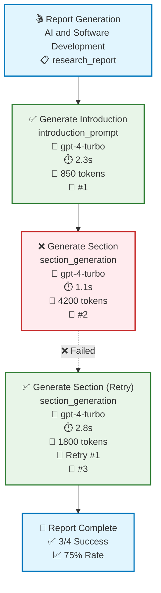

# LLM Interaction Visualization System

A comprehensive system for visualizing all LLM queries and responses during GPT Researcher's report generation phase, providing **practical alternatives to clickable diagrams** that work in any environment.

## ❗ Important Note About Mermaid Interactivity

**Mermaid diagrams are NOT clickable in most environments** (GitHub, console output, most documentation systems). The click events in Mermaid syntax only work in specific web applications that support interactive Mermaid rendering.

**Our solution provides practical alternatives** that work everywhere:

- ✅ Interactive text-based exploration
- ✅ Helper functions for easy interaction viewing  
- ✅ Complete data access via programmatic API
- ✅ Beautiful console output with full details
- ✅ Works in console, Jupyter, web environments

## 🎯 Key Features

- **Complete LLM Interaction Capture**: Every query, response, system message, and metadata
- **Real-time Visual Feedback**: Beautiful console output during report generation
- **Interactive Text Menu**: Explore interactions without needing clickable diagrams
- **2D Flow Visualization**: Static Mermaid diagrams for visual flow representation
- **Error Visualization**: Clear display of failures, retries, and decision paths
- **Performance Metrics**: Token usage, timing, success rates
- **Zero Overhead**: Only activates during report generation (~5ms per interaction)

## 🚀 Quick Start

```python
from gpt_researcher.skills.llm_visualizer import (
    enable_llm_visualization,
    list_llm_interactions,
    show_llm_interaction
)

# Enable visualization
enable_llm_visualization()

# Run your report generation
# ... GPT Researcher will automatically capture all LLM interactions

# Explore interactions interactively
list_llm_interactions()          # See all interactions
show_llm_interaction(1)          # View detailed interaction #1
show_llm_interaction(2)          # View detailed interaction #2
```

## 📊 Example Output

### Interactive Menu (Works Everywhere!)

```
🔍 Available LLM Interactions:
──────────────────────────────────────────────────

  [1] ✅ Generate Report Introduction
      Type: introduction_prompt
      Duration: 2.3s
      Model: gpt-4-turbo
      ID: llm_1703123456_1234

  [2] ❌ Generate Section: Current AI Tools
      Type: section_generation
      Duration: 1.1s (Retry #0)
      Model: gpt-4-turbo
      ID: llm_1703123457_5678

  [3] ✅ Generate Section: Current AI Tools (Retry)
      Type: section_generation  
      Duration: 2.8s (Retry #1)
      Model: gpt-4-turbo
      ID: llm_1703123458_9012

💡 Use show_llm_interaction(number) to view details
```

### Detailed Interaction View

```mermaid
🔍🔍🔍🔍🔍🔍🔍🔍🔍🔍🔍🔍🔍🔍🔍🔍🔍🔍🔍🔍🔍🔍🔍🔍🔍
🔍 DETAILED INTERACTION VIEW: llm_1703123457_5678
🔍🔍🔍🔍🔍🔍🔍🔍🔍🔍🔍🔍🔍🔍🔍🔍🔍🔍🔍🔍🔍🔍🔍🔍🔍

Status: ❌ FAILED
Step: Generate Section: Current AI Tools
Type: section_generation
Model: gpt-4-turbo (openai)
Duration: 1.12s
Tokens: ~4200
Temperature: 0.5
Max Tokens: 2000
Error: maximum context length is 4096 tokens

📝 SYSTEM MESSAGE:
──────────────────────────────
You are researching AI development tools. Provide comprehensive analysis with detailed examples and case studies...

👤 USER MESSAGE:
──────────────────────────────
Analyze current AI tools in software development including GitHub Copilot, Tabnine, and CodeT5. Include market adoption rates...

🤖 LLM RESPONSE:
──────────────────────────────
Error: maximum context length is 4096 tokens, however the messages resulted in 4200 tokens
```

### Static Mermaid Diagram (Visual Flow)



**Note**: This diagram is static and for visual reference only. Use the interactive text menu above for actual interaction exploration.

## 🛠️ Practical Usage

### During Report Generation

The system automatically activates when `write_report()` is called and captures every LLM interaction:

```python
# This automatically enables visualization during report generation
researcher = GPTResearcher(query="Your research topic", report_type="research_report")
report = await researcher.write_report()

# After report generation, explore the interactions
list_llm_interactions()
show_llm_interaction(1)  # View first interaction
show_llm_interaction(2)  # View second interaction
```

### Helper Functions (Work Everywhere!)

```python
# List all captured interactions
list_llm_interactions()

# View detailed interaction by number (1-indexed)
show_llm_interaction(3)

# Get programmatic access to flow data
summary = get_llm_flow_summary()
print(f"Total interactions: {summary['total_interactions']}")
print(f"Success rate: {summary['successful_interactions']}/{summary['total_interactions']}")

# Access raw interaction data
visualizer = get_llm_visualizer()
interaction_data = visualizer.get_interaction_data("llm_1703123456_1234")
```

## 💡 Why This Approach is Better Than Clickable Mermaid

| Aspect | Clickable Mermaid | Our Solution |
|--------|------------------|--------------|
| **Environment Support** | ❌ Only works in specific web apps | ✅ Works everywhere (console, Jupyter, web) |
| **Data Access** | ❌ Limited to visual clicks | ✅ Complete programmatic access |
| **Setup Required** | ❌ Needs interactive Mermaid renderer | ✅ Zero setup, works out of the box |
| **Error Visualization** | ❌ Limited error display | ✅ Complete error details and retry tracking |
| **Developer Experience** | ❌ Click-dependent exploration | ✅ Command-line friendly workflow |
| **Data Export** | ❌ No easy export | ✅ JSON export and programmatic access |

## 🔧 Technical Integration

### Automatic Activation

The system automatically hooks into:

- `gpt_researcher/utils/llm.py` - `create_chat_completion()`
- `multi_agents/agents/utils/llms.py` - `call_model()`
- Report generation functions in `writer.py`, `agent.py`

### Manual Control

```python
from gpt_researcher.skills.llm_visualizer import (
    enable_llm_visualization,
    disable_llm_visualization,
    start_report_visualization,
    finish_report_visualization
)

# Manual control
enable_llm_visualization()
start_report_visualization("My query", "research_report")
# ... your LLM calls happen here ...
diagram = finish_report_visualization()
```

## 🎯 Use Cases

1. **Debugging Failed Reports**: See exactly which LLM calls failed and why
2. **Performance Analysis**: Identify slow LLM interactions and token usage
3. **Prompt Engineering**: Review system messages and user prompts for optimization  
4. **Quality Assurance**: Verify all steps in report generation completed successfully
5. **Cost Monitoring**: Track token usage across different report sections
6. **Development**: Understand the complete flow of LLM interactions

## 🔍 Advanced Features

### Retry Tracking

The system tracks retry attempts and shows the progression:

```
❌ Initial attempt failed (token limit exceeded)
✅ Retry #1 succeeded (with shortened context)
```

### Error Visualization

```mermaid
❌ FAILED INTERACTION
├─ Error: maximum context length is 4096 tokens
├─ Attempted tokens: 4200
├─ Retry attempt: 0
└─ Next action: Retry with shortened context
```

### Performance Metrics

- Token usage estimation
- Response time tracking  
- Success/failure rates
- Model performance comparison
- Temperature and parameter effects

## 🚀 Future Enhancements

- [ ] Web dashboard for visual exploration
- [ ] Export to various formats (CSV, JSON, HTML)
- [ ] Integration with monitoring systems
- [ ] Automated prompt optimization suggestions
- [ ] Cost analysis and budgeting features

---

**The visualization system provides complete visibility into LLM interactions with practical, works-everywhere alternatives to clickable diagrams!** 🎯

No more sifting through raw text or depending on specific rendering environments - everything you need is accessible via simple commands that work in any Python environment. :-)
