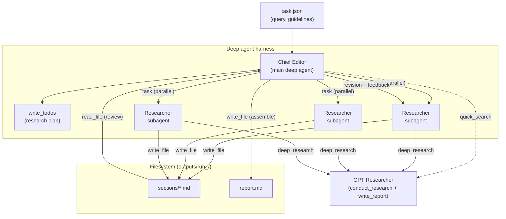

# Deep Agents x GPT Researcher

This example uses LangChain's [Deep Agents](https://docs.langchain.com/oss/python/deepagents/overview) to automate the process of an in depth research on any given topic, with GPT Researcher as the research engine inside the harness.

## Use case

By using Deep Agents, the same research pipeline as the [LangGraph example](../multi_agents) (plan → parallel section research → review → publish) can be achieved with far less code, because planning, delegation and context management are emergent from the agent harness rather than a hardcoded graph:


| Capability                | LangGraph example                        | Deep Agents example                                          |
| ------------------------- | ---------------------------------------- | ------------------------------------------------------------ |
| Planning                  | `EditorAgent` node + `ResearchState`     | built-in `write_todos` tool                                  |
| Parallel section research | nested subgraph per section              | `task` tool spawning `researcher` subagents in parallel      |
| Context management        | state keys passed between nodes          | drafts offloaded to a filesystem, subagent context isolation |
| Review / revision         | `Reviewer` and `Revisor` nodes in a loop | the chief editor reads drafts and delegates revisions        |
| Publishing                | `PublisherAgent`                         | final `report.md` assembled on disk                          |


An average run generates a 5-6 page research report with inline citations and a deduplicated references section.

## Why GPT Researcher as the research engine?

We benchmarked this setup against the stock deepagents quickstart (same harness, same model, same prompt and step budget - the only difference being a raw Tavily search tool vs GPT Researcher's tools) on [DeepResearch Bench](https://github.com/Ayanami0730/deep_research_bench), the industry-standard benchmark for deep research agents:

| Metric | Deep agent + raw search | Deep agent + GPT Researcher |
|---|---|---|
| RACE report quality | 0.503 | **0.512** |
| **Effective (verified) citations per report** | 18.6 | **35.2 (+89%)** |
| Citation precision | 53.9% | **56.0%** |

Because GPT Researcher plans sub-queries, scrapes and reads full pages, and returns pre-cited synthesis (instead of search snippets), the same agent grounds its reports in roughly **2x the verified evidence** - putting it in the effective-citation range of dedicated deep research products on the DeepResearch Bench leaderboard. Full methodology, results and reproduction steps in [BENCHMARK.md](BENCHMARK.md) - see [Benchmarks](#benchmarks) below for the full result set.

Research is not limited to the web: by setting `source` to `local` or `hybrid` in `task.json`, the same pipeline runs over your own documents (PDF, DOCX, markdown and more via the `DOC_PATH` env var), or combines them with web sources - for example, researching an internal strategy doc and enriching it with market data from the web. On a benchmarked due-diligence task over a realistic private corpus, this recovered **up to 94% of internal-document facts** where a web-only deep agent scores 0%.

Please note: the deep agent model is set in `task.json` (`provider:model` format), while the GPT Researcher tools use the standard [LLM config](https://docs.gptr.dev/docs/gpt-researcher/llms) from env variables.

## The Research Team

The research team is made up of 2 agents plus the core GPT Researcher:

- **Chief Editor** - The main deep agent. Oversees the research process: plans the outline, delegates research to subagents, reviews the drafts and assembles the final report.
- **Researcher** (subagent) - A specialized subagent that conducts in depth research on one report section with an isolated context, so heavy research output never bloats the chief editor.
- **GPT Researcher** - The core research pipeline, exposed to the agents as two tools:
  - `quick_search` - fast search returning ranked results with snippets and URLs, for scoping and fact checks.
  - `deep_research` - the full research pipeline (`conduct_research` + `write_report`), returning a detailed markdown report with citations. Depending on the `source` setting, it researches the web, your local documents, or both.


## How it works

Generally, the process is based on the following stages:

1. Planning stage
2. Data collection and analysis
3. Review and revision
4. Writing and submission
5. Publication


### Architecture




### Steps

More specifically (as seen in the architecture diagram) the process is as follows:

- Chief Editor - Runs a quick search to scope the topic and plans the report outline as todos.
- For each outline section (in parallel):
  - Researcher (gpt-researcher) - Runs an in depth research on the section via `deep_research` and writes a cited draft to `sections/<n>-<slug>.md`, returning only a short summary.
- Chief Editor - Reads and reviews each draft against the task guidelines, delegating revisions back to a researcher subagent with concrete feedback when needed.
- Chief Editor - Assembles and writes the final report including an introduction, table of contents, conclusion and a deduplicated references section to `report.md`.


## How to run

Requires Python 3.11+.

1. Install required packages from the repository root:
  ```bash
    pip install -r requirements.txt
    pip install -r deep_agents/requirements.txt
  ```
2. Update env variables with your API keys, see the [GPT-Researcher docs](https://docs.gptr.dev/docs/gpt-researcher/llms) for more details:
  ```bash
    export OPENAI_API_KEY=...
    export TAVILY_API_KEY=...
  ```
3. Run the application:
  ```bash
    python deep_agents/main.py
  ```

The console streams the chief editor's plan, subagent delegations and file writes. The final report is written to `deep_agents/outputs/run_<id>/report.md`, alongside the raw section drafts in `sections/`.

## Usage

To change the research query and customize the report, edit the `task.json` file in the main directory.

#### Task.json contains the following fields:

- `query` - The research query or task.
- `model` - The model for the deep agent, in `provider:model` format (e.g. `openai:gpt-5.4`, `anthropic:claude-sonnet-4-6`). Overridden by the `STRATEGIC_LLM` env var if set.
- `max_sections` - The maximum number of sections in the report. Each section is a subtopic of the research query.
- `source` - The location from which to conduct the research. Options: `web`, `local` or `hybrid` (local documents and web combined). For `local` and `hybrid`, please add the `DOC_PATH` env var pointing to your documents directory. The deep agent's filesystem stays a workspace for drafts; document retrieval and parsing (PDF, DOCX, etc.) is handled by GPT Researcher's local document pipeline.
- `follow_guidelines` - If true, the chief editor enforces the guidelines below during review. It will take longer to complete. If false, the report will be generated faster but may not follow the guidelines.
- `guidelines` - A list of guidelines that the report must follow.
- `verbose` - If true, the application will print detailed progress to the console.


#### For example:

```json
{
  "query": "Is AI in a hype cycle?",
  "model": "openai:gpt-5.4",
  "max_sections": 3,
  "source": "web",
  "follow_guidelines": true,
  "guidelines": [
    "The report MUST fully answer the original question",
    "Each section MUST include supporting sources using hyperlinks",
    "The report MUST be written in APA format"
  ],
  "verbose": true
}
```


## Observability

Set `LANGCHAIN_API_KEY` to trace runs in [LangSmith](https://smith.langchain.com). Each subagent's runs are tagged with `lc_agent_name` metadata (e.g. `researcher`), so you can filter the coordinator and each section's research separately.

## Benchmarks

We benchmarked a deep agent using GPT Researcher tools against the [deepagents quickstart](https://docs.langchain.com/oss/python/deepagents/quickstart) setup (raw Tavily search tool) on [DeepResearch Bench](https://github.com/Ayanami0730/deep_research_bench) - the industry-standard benchmark for deep research agents. Same harness, same model (`gpt-5.4`), same prompt and step budget; the only difference is the research tooling.

| Metric (10 tasks, official RACE + FACT pipelines) | Raw search tool | GPT Researcher tools |
|---|---|---|
| Report quality (RACE overall) | 0.503 | **0.512** |
| Citations per report | 34.5 | **62.9** |
| **Verified citations per report (FACT)** | 18.6 | **35.2 (+89%)** |
| Reports with zero verifiable citations | 2/10 | **0/10** |

The takeaway: the same chief agent produces reports backed by nearly **twice the verified, checkable evidence** when its research tool scrapes and synthesizes full sources instead of reading search snippets.

Supporting results (full details in [BENCHMARK.md](BENCHMARK.md)):

| Benchmark | Raw search tool | GPT Researcher tools |
|---|---|---|
| Private-docs coverage (hybrid, 27-file corpus, 3 runs) | 0% (62.5% with file tools mounted) | **87.5% avg, up to 94%** |
| Report head-to-head, blind LLM judge (8 topics) | 3 wins | **5 wins** |
| SimpleQA single-fact accuracy (n=30) | 83.3% | 83.3% (parity - no accuracy tax) |

### Running the benchmarks

Requirements: `OPENAI_API_KEY` and `TAVILY_API_KEY` env vars, plus the installs from [How to run](#how-to-run) (`pip install -r requirements.txt -r deep_agents/requirements.txt`).

- **DeepResearch Bench**: follow the step-by-step in [BENCHMARK.md](BENCHMARK.md) (clones the official harness, generates reports with `drb_generate.py`, scores with the official RACE/FACT pipelines).
- **Hybrid private-docs**: `python deep_agents/hybrid_benchmark.py` - the document corpus ships in `benchmark_data/internal_docs/` (regenerable with `benchmark_data/build_corpus.py`).
- **Report head-to-head**: `python deep_agents/report_benchmark.py`.

Raw artifacts for every published run (per-checkpoint grades, judge verdicts, full reports and official pipeline outputs) are tracked in [`benchmark_results/`](benchmark_results/).
