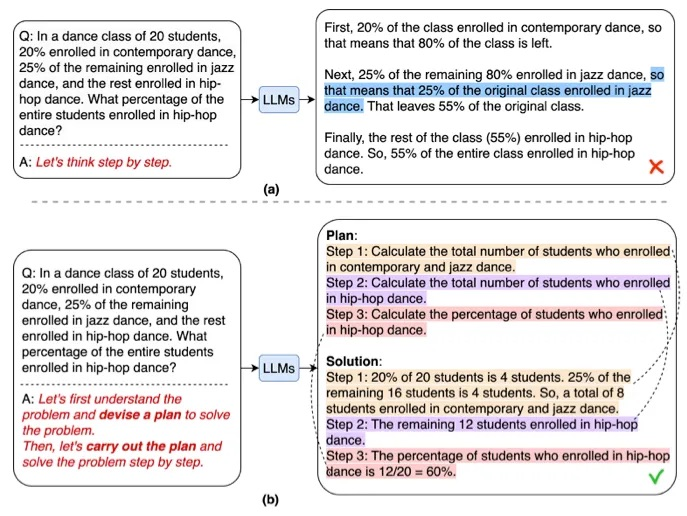

After [AutoGPT](https://github.com/Significant-Gravitas/AutoGPT) was published, we immediately took it for a spin. The first use case that came to mind was autonomous online research. Forming objective conclusions for manual research tasks can take time, sometimes weeks, to find the right resources and information. Seeing how well AutoGPT created tasks and executed them got me thinking about the great potential of using AI to conduct comprehensive research and what it meant for the future of online research.

But the problem with AutoGPT was that it usually ran into never-ending loops, required human interference for almost every step, constantly lost track of its progress, and almost never actually completed the task.

Nonetheless, the information and context gathered during the research task were lost (such as keeping track of sources), and sometimes hallucinated.

The passion for leveraging AI for online research and the limitations I found put me on a mission to try and solve it while sharing my work with the world. This is when I created [GPT Researcher](https://github.com/assafelovic/gpt-researcher) — an open source autonomous agent for online comprehensive research.

In this article, we will share the steps that guided me toward the proposed solution.

### Moving from infinite loops to deterministic results
The first step in solving these issues was to seek a more deterministic solution that could ultimately guarantee completing any research task within a fixed time frame, without human interference.

This is when we stumbled upon the recent paper [Plan and Solve](https://arxiv.org/abs/2305.04091). The paper aims to provide a better solution for the challenges stated above. The idea is quite simple and consists of two components: first, devising a plan to divide the entire task into smaller subtasks and then carrying out the subtasks according to the plan.



As it relates to research, first create an outline of questions to research related to the task, and then deterministically execute an agent for every outline item. This approach eliminates the uncertainty in task completion by breaking the agent steps into a deterministic finite set of tasks. Once all tasks are completed, the agent concludes the research.

Following this strategy has improved the reliability of completing research tasks to 100%. Now the challenge is, how to improve quality and speed?

### Aiming for objective and unbiased results
The biggest challenge with LLMs is the lack of factuality and unbiased responses caused by hallucinations and out-of-date training sets (GPT is currently trained on datasets from 2021). But the irony is that for research tasks, it is crucial to optimize for these exact two criteria: factuality and bias.

To tackle this challenges, we assumed the following:

- Law of large numbers — More content will lead to less biased results. Especially if gathered properly.
- Leveraging LLMs for the summarization of factual information can significantly improve the overall better factuality of results.

After experimenting with LLMs for quite some time, we can say that the areas where foundation models excel are in the summarization and rewriting of given content. So, in theory, if LLMs only review given content and summarize and rewrite it, potentially it would reduce hallucinations significantly.

In addition, assuming the given content is unbiased, or at least holds opinions and information from all sides of a topic, the rewritten result would also be unbiased. So how can content be unbiased? The [law of large numbers](https://en.wikipedia.org/wiki/Law_of_large_numbers). In other words, if enough sites that hold relevant information are scraped, the possibility of biased information reduces greatly. So the idea would be to scrape just enough sites together to form an objective opinion on any topic.

Great! Sounds like, for now, we have an idea for how to create both deterministic, factual, and unbiased results. But what about the speed problem?

### Speeding up the research process
Another issue with AutoGPT is that it works synchronously. The main idea of it is to create a list of tasks and then execute them one by one. So if, let’s say, a research task requires visiting 20 sites, and each site takes around one minute to scrape and summarize, the overall research task would take a minimum of +20 minutes. That’s assuming it ever stops. But what if we could parallelize agent work?

By levering Python libraries such as asyncio, the agent tasks have been optimized to work in parallel, thus significantly reducing the time to research.

```python
# Create a list to hold the coroutine agent tasks
tasks = [async_browse(url, query, self.websocket) for url in await new_search_urls]

# Gather the results as they become available
responses = await asyncio.gather(*tasks, return_exceptions=True)
```

In the example above, we trigger scraping for all URLs in parallel, and only once all is done, continue with the task. Based on many tests, an average research task takes around three minutes (!!). That’s 85% faster than AutoGPT.

### Finalizing the research report
Finally, after aggregating as much information as possible about a given research task, the challenge is to write a comprehensive report about it.

After experimenting with several OpenAI models and even open source, I’ve concluded that the best results are currently achieved with GPT-4. The task is straightforward — provide GPT-4 as context with all the aggregated information, and ask it to write a detailed report about it given the original research task.

The prompt is as follows:
```commandline
"{research_summary}" Using the above information, answer the following question or topic: "{question}" in a detailed report — The report should focus on the answer to the question, should be well structured, informative, in depth, with facts and numbers if available, a minimum of 1,200 words and with markdown syntax and apa format. Write all source urls at the end of the report in apa format. You should write your report only based on the given information and nothing else.
```

The results are quite impressive, with some minor hallucinations in very few samples, but it’s fair to assume that as GPT improves over time, results will only get better.

### The final architecture
Now that we’ve reviewed the necessary steps of GPT Researcher, let’s break down the final architecture, as shown below:

<div align="center">

</div>

More specifically:
- Generate an outline of research questions that form an objective opinion on any given task.
- For each research question, trigger a crawler agent that scrapes online resources for information relevant to the given task.
- For each scraped resource, keep track, filter, and summarize only if it includes relevant information.
- Finally, aggregate all summarized sources and generate a final research report.

### Going forward
The future of online research automation is heading toward a major disruption. As AI continues to improve, it is only a matter of time before AI agents can perform comprehensive research tasks for any of our day-to-day needs. AI research can disrupt areas of finance, legal, academia, health, and retail, reducing our time for each research by 95% while optimizing for factual and unbiased reports within an influx and overload of ever-growing online information.

Imagine if an AI can eventually understand and analyze any form of online content — videos, images, graphs, tables, reviews, text, audio. And imagine if it could support and analyze hundreds of thousands of words of aggregated information within a single prompt. Even imagine that AI can eventually improve in reasoning and analysis, making it much more suitable for reaching new and innovative research conclusions. And that it can do all that in minutes, if not seconds.

It’s all a matter of time and what [GPT Researcher](https://github.com/assafelovic/gpt-researcher) is all about.
