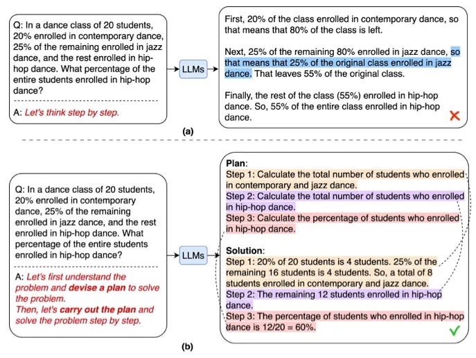

Nachdem [AutoGPT](https://github.com/Significant-Gravitas/AutoGPT) veröffentlicht worden war, haben wir es sofort ausprobiert. Der erste Anwendungsfall, der uns in den Sinn kam, war autonome Online-Recherche. Objektive Schlussfolgerungen für manuelle Forschungsaufgaben können viel Zeit kosten, manchmal Wochen, um die richtigen Ressourcen und Informationen zu finden. Als wir gesehen haben, wie gut AutoGPT Aufgaben erstellt und ausführt, wurde uns das Potenzial von KI für umfassende Recherche und die Zukunft der Online-Recherche klar.

Das Problem mit AutoGPT war jedoch, dass es häufig in Endlosschleifen lief, bei fast jedem Schritt menschliches Eingreifen brauchte, ständig den Überblick verlor und die Aufgabe fast nie wirklich abschloss.

Außerdem gingen die während der Recherche gesammelten Informationen und der Kontext verloren, etwa die Quellenverfolgung, und gelegentlich wurden Halluzinationen erzeugt.

Die Begeisterung für KI-gestützte Online-Recherche und die dabei entdeckten Grenzen haben mich motiviert, eine Lösung zu entwickeln und meine Arbeit mit der Welt zu teilen. So entstand [GPT Researcher](https://github.com/assafelovic/gpt-researcher) – ein Open-Source-Agent für autonome, umfassende Online-Recherche.

In diesem Artikel zeige ich die Schritte, die uns zur vorgeschlagenen Lösung geführt haben.

### Von Endlosschleifen zu deterministischen Ergebnissen
Der erste Schritt bestand darin, eine deterministischere Lösung zu finden, die eine Rechercheaufgabe innerhalb eines festen Zeitfensters und ohne menschliche Eingriffe zuverlässig abschließen kann.

Dabei sind wir auf die Arbeit [Plan and Solve](https://arxiv.org/abs/2305.04091) gestoßen. Die Idee ist einfach und besteht aus zwei Komponenten: Zuerst wird ein Plan erstellt, der die gesamte Aufgabe in kleinere Teilaufgaben zerlegt, und anschließend werden diese Teilaufgaben genau nach Plan ausgeführt.



Für Recherche bedeutet das: Zuerst werden Fragen formuliert, die zur Aufgabe gehören, und dann wird für jeden Punkt deterministisch ein Agent ausgeführt. Dieser Ansatz beseitigt Unsicherheit, indem die Arbeit des Agenten in eine endliche Menge an Aufgaben zerlegt wird. Sobald alle Aufgaben erledigt sind, wird die Recherche abgeschlossen.

Mit dieser Strategie konnten wir die Zuverlässigkeit beim Abschließen von Recherchen auf 100 % steigern. Die nächste Frage war nun: Wie verbessern wir Qualität und Geschwindigkeit?

### Auf objektive und unvoreingenommene Ergebnisse hinarbeiten
Die größte Herausforderung bei LLMs ist der Mangel an Faktentreue und die Tendenz zu verzerrten Antworten, verursacht durch Halluzinationen und veraltete Trainingsdaten (GPT war damals auf Daten bis 2021 trainiert). Ausgerechnet bei Rechercheaufgaben sind genau diese beiden Kriterien entscheidend: Faktentreue und geringe Verzerrung.

Um das anzugehen, haben wir folgende Annahmen getroffen:

- Das Gesetz der großen Zahlen - Mehr Inhalt führt zu weniger verzerrten Ergebnissen, vor allem wenn der Inhalt sauber gesammelt wird.
- LLMs können die Zusammenfassung faktischer Informationen deutlich verbessern.

Nach längerer Experimentierphase können wir sagen: Foundation Models sind vor allem stark beim Zusammenfassen und Umformulieren von Inhalt. Wenn LLMs also nur gegebenen Inhalt lesen, zusammenfassen und umformulieren, reduziert das Halluzinationen potenziell erheblich.

Wenn der Inhalt zusätzlich selbst unvoreingenommen ist oder zumindest Informationen und Sichtweisen aus allen relevanten Richtungen enthält, ist auch das umformulierte Ergebnis unvoreingenommen. Aber wie wird Inhalt unvoreingenommen? Durch das [Gesetz der großen Zahlen](https://en.wikipedia.org/wiki/Law_of_large_numbers). Anders gesagt: Wenn genug Seiten mit relevanten Informationen gescrapt werden, sinkt die Wahrscheinlichkeit verzerrter Informationen stark. Die Idee war also, genug Quellen zu sammeln, um sich zu jedem Thema eine objektive Meinung bilden zu können.

Großartig! Damit hätten wir theoretisch eine Idee, wie sich deterministische, faktische und unvoreingenommene Ergebnisse erzeugen lassen. Aber was ist mit dem Geschwindigkeitsproblem?

### Den Rechercheprozess beschleunigen
Ein weiteres Problem mit AutoGPT ist die synchrone Arbeitsweise. Die Grundidee war, eine Aufgabenliste zu erstellen und sie nacheinander abzuarbeiten. Wenn eine Recherchaufgabe also zum Beispiel 20 Seiten besuchen müsste und jede Seite eine Minute zum Scrapen und Zusammenfassen braucht, dauert die gesamte Aufgabe mindestens 20 Minuten. Vorausgesetzt, sie stoppt überhaupt. Aber was wäre, wenn wir die Agentenarbeit parallelisieren könnten?

Mit Python-Bibliotheken wie `asyncio` wurden die Agentenaufgaben so optimiert, dass sie parallel laufen und die Recherche deutlich schneller wird.

```python
# Liste mit Coroutine-Aufgaben für die Agenten anlegen
tasks = [async_browse(url, query, self.websocket) for url in await new_search_urls]

# Ergebnisse einsammeln, sobald sie verfügbar sind
responses = await asyncio.gather(*tasks, return_exceptions=True)
```

Im Beispiel oben starten wir das Scraping für alle URLs parallel und fahren erst fort, wenn alles abgeschlossen ist. Nach vielen Tests dauert eine durchschnittliche Recherche etwa drei Minuten (!!). Das ist 85 % schneller als AutoGPT.

### Den Forschungsbericht fertigstellen
Wenn möglichst viele Informationen zu einer Recherche gesammelt wurden, bleibt noch die Aufgabe, einen umfassenden Bericht daraus zu schreiben.

Nach Experimenten mit mehreren OpenAI-Modellen und auch Open-Source-Modellen kamen wir zu dem Schluss, dass derzeit GPT-4 die besten Ergebnisse liefert. Die Aufgabe ist einfach: Man gibt GPT-4 den gesamten gesammelten Kontext und bittet es, einen detaillierten Bericht zum ursprünglichen Forschungsthema zu schreiben.

Der Prompt lautet:
```commandline
"{research_summary}" Using the above information, answer the following question or topic: "{question}" in a detailed report — The report should focus on the answer to the question, should be well structured, informative, in depth, with facts and numbers if available, a minimum of 1,200 words and with markdown syntax and apa format. Write all source urls at the end of the report in apa format. You should write your report only based on the given information and nothing else.
```

Die Ergebnisse sind ziemlich beeindruckend, mit nur wenigen Halluzinationen in wenigen Fällen. Es ist fair anzunehmen, dass die Ergebnisse mit der weiteren Verbesserung von GPT über die Zeit nur noch besser werden.

### Die finale Architektur
Jetzt, da wir die notwendigen Schritte von GPT Researcher betrachtet haben, schauen wir uns die finale Architektur an:

<div align="center">

</div>

Genauer gesagt:
- Erzeuge eine Gliederung von Forschungsfragen, die zusammen eine objektive Einschätzung zu einer Aufgabe ergeben.
- Für jede Forschungsfrage wird ein Crawler-Agent gestartet, der Online-Ressourcen nach relevanten Informationen durchsucht.
- Für jede gescrapte Ressource werden relevante Informationen verfolgt, gefiltert und zusammengefasst.
- Abschließend werden alle zusammengefassten Quellen aggregiert und ein finaler Forschungsbericht erzeugt.

### Ausblick
Die Zukunft der automatisierten Online-Recherche steht vor einem großen Umbruch. Mit fortschreitender KI-Entwicklung ist es nur eine Frage der Zeit, bis KI-Agenten umfassende Recherchen für alle möglichen Alltagsbedürfnisse erledigen können. KI-Recherche kann Bereiche wie Finanzen, Recht, Wissenschaft, Gesundheit und Handel verändern und unsere Recherchzeit um 95 % reduzieren, während sie objektive und unvoreingenommene Berichte in einer immer größeren Flut an Online-Informationen erzeugt.

Stell dir vor, eine KI könnte irgendwann jede Form von Online-Inhalt verstehen und analysieren - Videos, Bilder, Diagramme, Tabellen, Rezensionen, Texte und Audio. Und stell dir vor, sie könnte Hunderttausende Wörter aggregierter Informationen in einem einzigen Prompt unterstützen und analysieren. Stell dir sogar vor, dass KI in Reasoning und Analyse immer besser wird und dadurch viel besser geeignet ist, neue und innovative Forschungserkenntnisse zu gewinnen. Und dass sie all das in Minuten, wenn nicht Sekunden, erledigen kann.

Es ist nur eine Frage der Zeit, und genau darum geht es bei [GPT Researcher](https://github.com/assafelovic/gpt-researcher).
