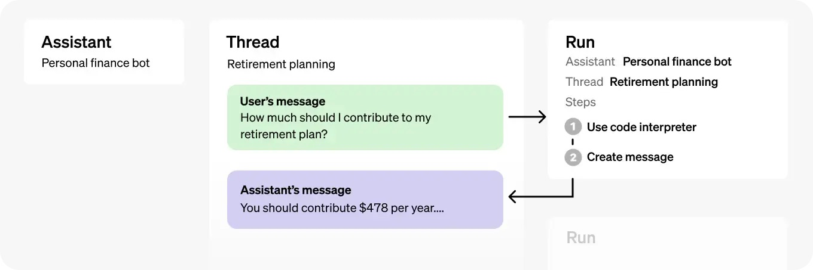
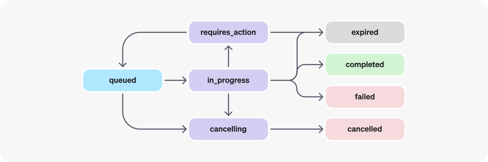

OpenAI has done it again with a [groundbreaking DevDay](https://openai.com/blog/new-models-and-developer-products-announced-at-devday) showcasing some of the latest improvements to the OpenAI suite of tools, products and services. One major release was the new [Assistants API](https://platform.openai.com/docs/assistants/overview) that makes it easier for developers to build their own assistive AI apps that have goals and can call models and tools.

The new Assistants API currently supports three types of tools: Code Interpreter, Retrieval, and Function calling. Although you might expect the Retrieval tool to support online information retrieval (such as search APIs or as ChatGPT plugins), it only supports raw data for now such as text or CSV files.

This blog will demonstrate how to leverage the latest Assistants API with online information using the function calling tool.

To skip the tutorial below, feel free to check out the full [Github Gist here](https://gist.github.com/assafelovic/579822cd42d52d80db1e1c1ff82ffffd).

At a high level, a typical integration of the Assistants API has the following steps:

- Create an [Assistant](https://platform.openai.com/docs/api-reference/assistants/createAssistant) in the API by defining its custom instructions and picking a model. If helpful, enable tools like Code Interpreter, Retrieval, and Function calling.
- Create a [Thread](https://platform.openai.com/docs/api-reference/threads) when a user starts a conversation.
- Add [Messages](https://platform.openai.com/docs/api-reference/messages) to the Thread as the user ask questions.
- [Run](https://platform.openai.com/docs/api-reference/runs) the Assistant on the Thread to trigger responses. This automatically calls the relevant tools.

As you can see below, an Assistant object includes Threads for storing and handling conversation sessions between the assistant and users, and Run for invocation of an Assistant on a Thread.



Let’s go ahead and implement these steps one by one! For the example, we will build a finance GPT that can provide insights about financial questions. We will use the [OpenAI Python SDK v1.2](https://github.com/openai/openai-python/tree/main#installation) and [Tavily Search API](https://tavily.com).

First things first, let’s define the assistant’s instructions:

```python
assistant_prompt_instruction = """You are a finance expert. 
Your goal is to provide answers based on information from the internet. 
You must use the provided Tavily search API function to find relevant online information. 
You should never use your own knowledge to answer questions.
Please include relevant url sources in the end of your answers.
"""
```
Next, let’s finalize step 1 and create an assistant using the latest [GPT-4 Turbo model](https://github.com/openai/openai-python/tree/main#installation) (128K context), and the call function using the [Tavily web search API](https://tavily.com/):

```python
# Create an assistant
assistant = client.beta.assistants.create(
    instructions=assistant_prompt_instruction,
    model="gpt-4-1106-preview",
    tools=[{
        "type": "function",
        "function": {
            "name": "tavily_search",
            "description": "Get information on recent events from the web.",
            "parameters": {
                "type": "object",
                "properties": {
                    "query": {"type": "string", "description": "The search query to use. For example: 'Latest news on Nvidia stock performance'"},
                },
                "required": ["query"]
            }
        }
    }]
)
```

Step 2+3 are quite straight forward, we’ll initiate a new thread and update it with a user message:

```python
thread = client.beta.threads.create()
user_input = input("You: ")
message = client.beta.threads.messages.create(
    thread_id=thread.id,
    role="user",
    content=user_input,
)
```

Finally, we’ll run the assistant on the thread to trigger the function call and get the response:

```python
run = client.beta.threads.runs.create(
    thread_id=thread.id,
    assistant_id=assistant_id,
)
```

So far so good! But this is where it gets a bit messy. Unlike with the regular GPT APIs, the Assistants API doesn’t return a synchronous response, but returns a status. This allows for asynchronous operations across assistants, but requires more overhead for fetching statuses and dealing with each manually.



To manage this status lifecycle, let’s build a function that can be reused and handles waiting for various statuses (such as ‘requires_action’):

```python
# Function to wait for a run to complete
def wait_for_run_completion(thread_id, run_id):
    while True:
        time.sleep(1)
        run = client.beta.threads.runs.retrieve(thread_id=thread_id, run_id=run_id)
        print(f"Current run status: {run.status}")
        if run.status in ['completed', 'failed', 'requires_action']:
            return run
```

This function will sleep as long as the run has not been finalized such as in cases where it’s completed or requires an action from a function call.

We’re almost there! Lastly, let’s take care of when the assistant wants to call the web search API:

```python
# Function to handle tool output submission
def submit_tool_outputs(thread_id, run_id, tools_to_call):
    tool_output_array = []
    for tool in tools_to_call:
        output = None
        tool_call_id = tool.id
        function_name = tool.function.name
        function_args = tool.function.arguments

        if function_name == "tavily_search":
            output = tavily_search(query=json.loads(function_args)["query"])

        if output:
            tool_output_array.append({"tool_call_id": tool_call_id, "output": output})

    return client.beta.threads.runs.submit_tool_outputs(
        thread_id=thread_id,
        run_id=run_id,
        tool_outputs=tool_output_array
    )
```

As seen above, if the assistant has reasoned that a function call should trigger, we extract the given required function params and pass back to the runnable thread. We catch this status and call our functions as seen below:

```python
if run.status == 'requires_action':
    run = submit_tool_outputs(thread.id, run.id, run.required_action.submit_tool_outputs.tool_calls)
    run = wait_for_run_completion(thread.id, run.id)
```

That’s it! We now have a working OpenAI Assistant that can be used to answer financial questions using real time online information. Below is the full runnable code:

```python
import os
import json
import time
from openai import OpenAI
from tavily import TavilyClient

# Initialize clients with API keys
client = OpenAI(api_key=os.environ["OPENAI_API_KEY"])
tavily_client = TavilyClient(api_key=os.environ["TAVILY_API_KEY"])

assistant_prompt_instruction = """You are a finance expert. 
Your goal is to provide answers based on information from the internet. 
You must use the provided Tavily search API function to find relevant online information. 
You should never use your own knowledge to answer questions.
Please include relevant url sources in the end of your answers.
"""

# Function to perform a Tavily search
def tavily_search(query):
    search_result = tavily_client.get_search_context(query, search_depth="advanced", max_tokens=8000)
    return search_result

# Function to wait for a run to complete
def wait_for_run_completion(thread_id, run_id):
    while True:
        time.sleep(1)
        run = client.beta.threads.runs.retrieve(thread_id=thread_id, run_id=run_id)
        print(f"Current run status: {run.status}")
        if run.status in ['completed', 'failed', 'requires_action']:
            return run

# Function to handle tool output submission
def submit_tool_outputs(thread_id, run_id, tools_to_call):
    tool_output_array = []
    for tool in tools_to_call:
        output = None
        tool_call_id = tool.id
        function_name = tool.function.name
        function_args = tool.function.arguments

        if function_name == "tavily_search":
            output = tavily_search(query=json.loads(function_args)["query"])

        if output:
            tool_output_array.append({"tool_call_id": tool_call_id, "output": output})

    return client.beta.threads.runs.submit_tool_outputs(
        thread_id=thread_id,
        run_id=run_id,
        tool_outputs=tool_output_array
    )

# Function to print messages from a thread
def print_messages_from_thread(thread_id):
    messages = client.beta.threads.messages.list(thread_id=thread_id)
    for msg in messages:
        print(f"{msg.role}: {msg.content[0].text.value}")

# Create an assistant
assistant = client.beta.assistants.create(
    instructions=assistant_prompt_instruction,
    model="gpt-4-1106-preview",
    tools=[{
        "type": "function",
        "function": {
            "name": "tavily_search",
            "description": "Get information on recent events from the web.",
            "parameters": {
                "type": "object",
                "properties": {
                    "query": {"type": "string", "description": "The search query to use. For example: 'Latest news on Nvidia stock performance'"},
                },
                "required": ["query"]
            }
        }
    }]
)
assistant_id = assistant.id
print(f"Assistant ID: {assistant_id}")

# Create a thread
thread = client.beta.threads.create()
print(f"Thread: {thread}")

# Ongoing conversation loop
while True:
    user_input = input("You: ")
    if user_input.lower() == 'exit':
        break

    # Create a message
    message = client.beta.threads.messages.create(
        thread_id=thread.id,
        role="user",
        content=user_input,
    )

    # Create a run
    run = client.beta.threads.runs.create(
        thread_id=thread.id,
        assistant_id=assistant_id,
    )
    print(f"Run ID: {run.id}")

    # Wait for run to complete
    run = wait_for_run_completion(thread.id, run.id)

    if run.status == 'failed':
        print(run.error)
        continue
    elif run.status == 'requires_action':
        run = submit_tool_outputs(thread.id, run.id, run.required_action.submit_tool_outputs.tool_calls)
        run = wait_for_run_completion(thread.id, run.id)

    # Print messages from the thread
    print_messages_from_thread(thread.id)
```

The assistant can be further customized and improved using additional retrieval information, OpenAI’s coding interpreter and more. Also, you can go ahead and add more function tools to make the assistant even smarter.

Feel free to drop a comment below if you have any further questions!
