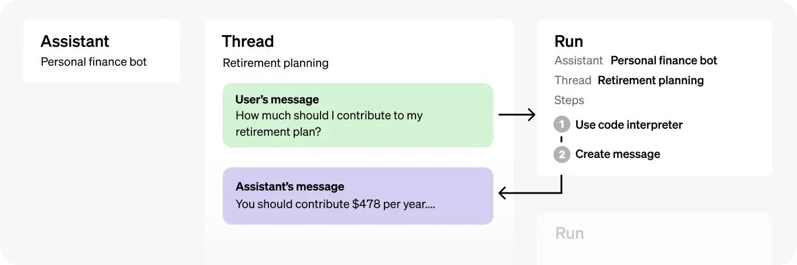
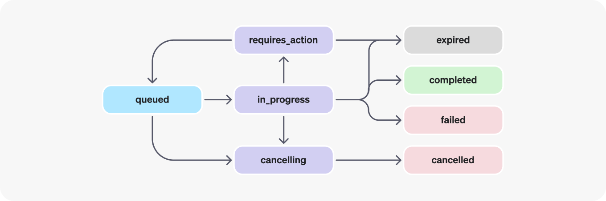

OpenAI hat mit einem [bahnbrechenden DevDay](https://openai.com/blog/new-models-and-developer-products-announced-at-devday) erneut gezeigt, wie weit die OpenAI-Suite aus Tools, Produkten und Diensten inzwischen ist. Eine wichtige Neuerung war die neue [Assistants API](https://platform.openai.com/docs/assistants/overview), mit der Entwickler leichter eigene assistive KI-Apps bauen können, die Ziele verfolgen und Modelle sowie Tools aufrufen.

Die neue Assistants API unterstützt aktuell drei Tool-Typen: Code Interpreter, Retrieval und Function Calling. Auch wenn man erwarten könnte, dass das Retrieval-Tool auch Online-Informationen unterstützt, also Such-APIs oder ChatGPT-Plugins, unterstützt es derzeit nur Rohdaten wie Text- oder CSV-Dateien.

Dieser Beitrag zeigt, wie man die aktuelle Assistants API mit Online-Informationen über das Function-Calling-Tool nutzt.

Wer das Tutorial überspringen möchte, findet hier den vollständigen [Github Gist](https://gist.github.com/assafelovic/579822cd42d52d80db1e1c1ff82ffffd).

Auf hoher Ebene umfasst eine typische Integration der Assistants API diese Schritte:

- Erstelle einen [Assistant](https://platform.openai.com/docs/api-reference/assistants/createAssistant), indem du eigene Anweisungen definierst und ein Modell auswählst. Falls hilfreich, aktiviere Tools wie Code Interpreter, Retrieval und Function Calling.
- Erstelle einen [Thread](https://platform.openai.com/docs/api-reference/threads), wenn ein Nutzer eine Unterhaltung startet.
- Füge [Messages](https://platform.openai.com/docs/api-reference/messages) zum Thread hinzu, wenn Nutzer Fragen stellen.
- [Run](https://platform.openai.com/docs/api-reference/runs) den Assistant auf dem Thread, um Antworten auszulösen. Dabei werden passende Tools automatisch aufgerufen.

Wie unten zu sehen ist, enthält ein Assistant-Objekt Threads zum Speichern und Verwalten von Gesprächssitzungen zwischen Assistant und Nutzer, und Runs dienen dazu, einen Assistant auf einem Thread auszuführen.



Legen wir direkt los und setzen diese Schritte nacheinander um! Im Beispiel bauen wir einen Finance-GPT, der Fragen rund um Finanzen beantworten kann. Wir nutzen dafür das [OpenAI Python SDK v1.2](https://github.com/openai/openai-python/tree/main#installation) und die [Tavily Search API](https://tavily.com).

Zuerst definieren wir die Anweisungen des Assistants:

```python
assistant_prompt_instruction = """You are a finance expert. 
Your goal is to provide answers based on information from the internet. 
You must use the provided Tavily search API function to find relevant online information. 
You should never use your own knowledge to answer questions.
Please include relevant url sources in the end of your answers.
"""
```
Als Nächstes schließen wir Schritt 1 ab und erstellen einen Assistant mit dem neuesten [GPT-4 Turbo-Modell](https://github.com/openai/openai-python/tree/main#installation) (128K Kontext) sowie einer Function-Call-Verknüpfung mit der [Tavily-Websuche](https://tavily.com/):

```python
# Assistant erstellen
assistant = client.beta.assistants.create(
    instructions=assistant_prompt_instruction,
    model="gpt-4-1106-preview",
    tools=[{
        "type": "function",
        "function": {
            "name": "tavily_search",
            "description": "Get information on recent events from the web.",
            "parameters": {
                "type": "object",
                "properties": {
                    "query": {"type": "string", "description": "The search query to use. For example: 'Latest news on Nvidia stock performance'"},
                },
                "required": ["query"]
            }
        }
    }]
)
```

Schritt 2 und 3 sind recht unkompliziert: Wir starten einen neuen Thread und fügen ihm eine Nutzernachricht hinzu:

```python
thread = client.beta.threads.create()
user_input = input("You: ")
message = client.beta.threads.messages.create(
    thread_id=thread.id,
    role="user",
    content=user_input,
)
```

Schließlich führen wir den Assistant auf dem Thread aus, um den Funktionsaufruf auszulösen und die Antwort zu erhalten:

```python
run = client.beta.threads.runs.create(
    thread_id=thread.id,
    assistant_id=assistant_id,
)
```

Bisher sieht alles gut aus. Aber genau hier wird es etwas unübersichtlich. Anders als bei den normalen GPT-APIs liefert die Assistants API keine synchrone Antwort, sondern einen Status. Das ermöglicht asynchrone Operationen über mehrere Assistants hinweg, erfordert aber zusätzlichen Aufwand beim Abfragen von Status und beim Umgang damit.



Um diesen Status-Lebenszyklus zu verwalten, bauen wir eine Funktion, die wiederverwendbar ist und verschiedene Zustände abwarten kann (zum Beispiel `requires_action`):

```python
# Funktion, um auf den Abschluss eines Runs zu warten
def wait_for_run_completion(thread_id, run_id):
    while True:
        time.sleep(1)
        run = client.beta.threads.runs.retrieve(thread_id=thread_id, run_id=run_id)
        print(f"Current run status: {run.status}")
        if run.status in ['completed', 'failed', 'requires_action']:
            return run
```

Diese Funktion schläft so lange, bis der Run finalisiert ist, etwa wenn er abgeschlossen wurde oder wenn eine Aktion aus einem Function Call erforderlich ist.

Fast geschafft! Zuletzt kümmern wir uns darum, was passiert, wenn der Assistant die Websuche aufrufen möchte:

```python
# Funktion zur Übermittlung von Tool-Ausgaben
def submit_tool_outputs(thread_id, run_id, tools_to_call):
    tool_output_array = []
    for tool in tools_to_call:
        output = None
        tool_call_id = tool.id
        function_name = tool.function.name
        function_args = tool.function.arguments

        if function_name == "tavily_search":
            output = tavily_search(query=json.loads(function_args)["query"])

        if output:
            tool_output_array.append({"tool_call_id": tool_call_id, "output": output})

    return client.beta.threads.runs.submit_tool_outputs(
        thread_id=thread_id,
        run_id=run_id,
        tool_outputs=tool_output_array
    )
```

Wie oben zu sehen ist, extrahieren wir die erforderlichen Parameter aus dem Function Call und geben sie an den laufenden Thread zurück. Diesen Status behandeln wir dann wie unten gezeigt:

```python
if run.status == 'requires_action':
    run = submit_tool_outputs(thread.id, run.id, run.required_action.submit_tool_outputs.tool_calls)
    run = wait_for_run_completion(thread.id, run.id)
```

Das war's! Jetzt haben wir einen funktionierenden OpenAI Assistant, der Finanzfragen mit aktuellen Online-Informationen beantworten kann. Unten steht der vollständige lauffähige Code:

```python
import os
import json
import time
from openai import OpenAI
from tavily import TavilyClient

# Clients mit API-Keys initialisieren
client = OpenAI(api_key=os.environ["OPENAI_API_KEY"])
tavily_client = TavilyClient(api_key=os.environ["TAVILY_API_KEY"])

assistant_prompt_instruction = """You are a finance expert. 
Your goal is to provide answers based on information from the internet. 
You must use the provided Tavily search API function to find relevant online information. 
You should never use your own knowledge to answer questions.
Please include relevant url sources in the end of your answers.
"""

# Funktion für eine Tavily-Suche
def tavily_search(query):
    search_result = tavily_client.get_search_context(query, search_depth="advanced", max_tokens=8000)
    return search_result

# Auf den Abschluss eines Runs warten
def wait_for_run_completion(thread_id, run_id):
    while True:
        time.sleep(1)
        run = client.beta.threads.runs.retrieve(thread_id=thread_id, run_id=run_id)
        print(f"Current run status: {run.status}")
        if run.status in ['completed', 'failed', 'requires_action']:
            return run

# Tool-Ausgaben übermitteln
def submit_tool_outputs(thread_id, run_id, tools_to_call):
    tool_output_array = []
    for tool in tools_to_call:
        output = None
        tool_call_id = tool.id
        function_name = tool.function.name
        function_args = tool.function.arguments

        if function_name == "tavily_search":
            output = tavily_search(query=json.loads(function_args)["query"])

        if output:
            tool_output_array.append({"tool_call_id": tool_call_id, "output": output})

    return client.beta.threads.runs.submit_tool_outputs(
        thread_id=thread_id,
        run_id=run_id,
        tool_outputs=tool_output_array
    )

# Nachrichten eines Threads ausgeben
def print_messages_from_thread(thread_id):
    messages = client.beta.threads.messages.list(thread_id=thread_id)
    for msg in messages:
        print(f"{msg.role}: {msg.content[0].text.value}")

# Assistant erstellen
assistant = client.beta.assistants.create(
    instructions=assistant_prompt_instruction,
    model="gpt-4-1106-preview",
    tools=[{
        "type": "function",
        "function": {
            "name": "tavily_search",
            "description": "Get information on recent events from the web.",
            "parameters": {
                "type": "object",
                "properties": {
                    "query": {"type": "string", "description": "The search query to use. For example: 'Latest news on Nvidia stock performance'"},
                },
                "required": ["query"]
            }
        }
    }]
)
assistant_id = assistant.id
print(f"Assistant ID: {assistant_id}")

# Thread erstellen
thread = client.beta.threads.create()
print(f"Thread: {thread}")

# Laufende Gesprächsschleife
while True:
    user_input = input("You: ")
    if user_input.lower() == 'exit':
        break

    # Nachricht erstellen
    message = client.beta.threads.messages.create(
        thread_id=thread.id,
        role="user",
        content=user_input,
    )

    # Run erstellen
    run = client.beta.threads.runs.create(
        thread_id=thread.id,
        assistant_id=assistant_id,
    )
    print(f"Run ID: {run.id}")

    # Auf Abschluss warten
    run = wait_for_run_completion(thread.id, run.id)

    if run.status == 'failed':
        print(run.error)
        continue
    elif run.status == 'requires_action':
        run = submit_tool_outputs(thread.id, run.id, run.required_action.submit_tool_outputs.tool_calls)
        run = wait_for_run_completion(thread.id, run.id)

    # Nachrichten aus dem Thread ausgeben
    print_messages_from_thread(thread.id)
```

Der Assistant kann mit zusätzlicher Retrieval-Information, dem OpenAI Code Interpreter und mehr weiter angepasst und verbessert werden. Außerdem kannst du weitere Function-Tools hinzufügen, um den Assistant noch smarter zu machen.

Wenn du weitere Fragen hast, hinterlasse gern einen Kommentar!
