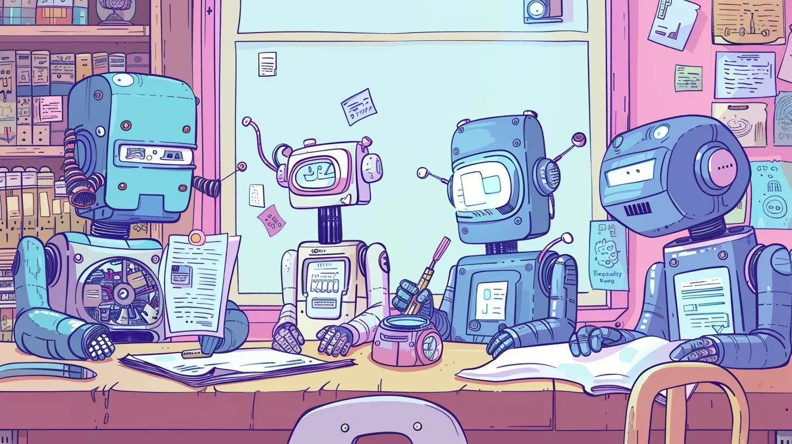
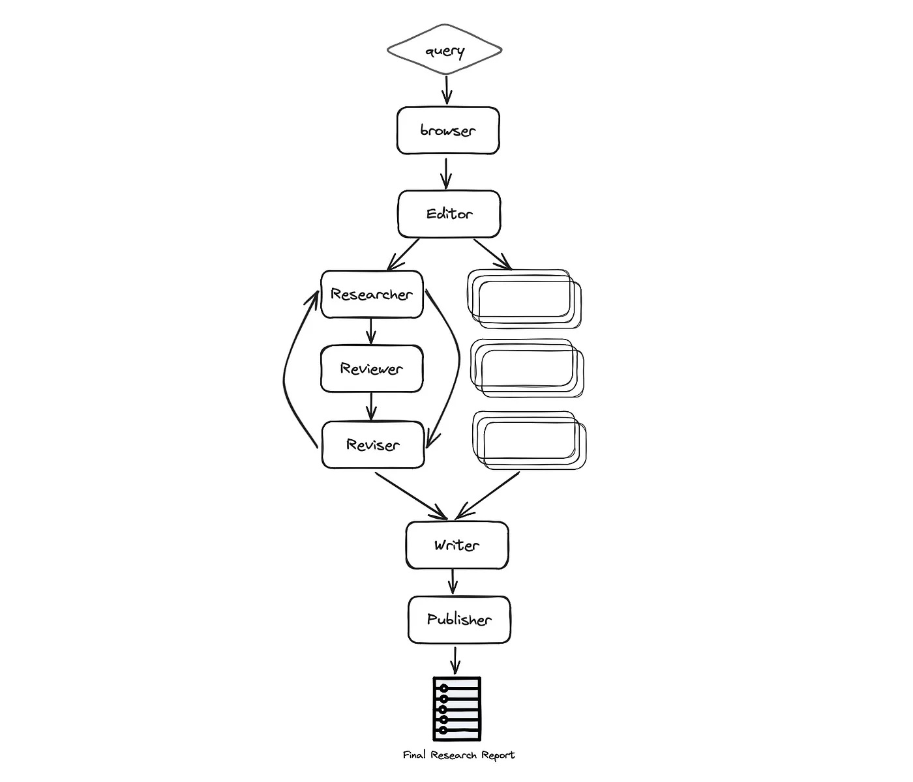

# Introducing the GPT Researcher Multi-Agent Assistant
### Learn how to build an autonomous research assistant using LangGraph with a team of specialized AI agents

It has only been a year since the initial release of GPT Researcher, but methods for building, testing, and deploying AI agents have already evolved significantly. That’s just the nature and speed of the current AI progress. What started as simple zero-shot or few-shot prompting, has quickly evolved to agent function calling, RAG and now finally agentic workflows (aka “flow engineering”).

Andrew Ng has [recently stated](https://www.deeplearning.ai/the-batch/how-agents-can-improve-llm-performance/), “I think AI agent workflows will drive massive AI progress this year — perhaps even more than the next generation of foundation models. This is an important trend, and I urge everyone who works in AI to pay attention to it.”

In this article you will learn why multi-agent workflows are the current best standard and how to build the optimal autonomous research multi-agent assistant using LangGraph.

To skip this tutorial, feel free to check out the Github repo of [GPT Researcher x LangGraph](https://github.com/assafelovic/gpt-researcher/tree/master/multi_agents).

## Introducing LangGraph
LangGraph is an extension of LangChain aimed at creating agent and multi-agent flows. It adds in the ability to create cyclical flows and comes with memory built in — both important attributes for creating agents.

LangGraph provides developers with a high degree of controllability and is important for creating custom agents and flows. Nearly all agents in production are customized towards the specific use case they are trying solve. LangGraph gives you the flexibility to create arbitrary customized agents, while providing an intuitive developer experience for doing so.

Enough with the smalltalk, let’s start building!

## Building the Ultimate Autonomous Research Agent
By leveraging LangGraph, the research process can be significantly improved in depth and quality by leveraging multiple agents with specialized skills. Having every agent focus and specialize only a specific skill, allows for better separation of concerns, customizability, and further development at scale as the project grows.

Inspired by the recent STORM paper, this example showcases how a team of AI agents can work together to conduct research on a given topic, from planning to publication. This example will also leverage the leading autonomous research agent GPT Researcher.

### The Research Agent Team
The research team consists of seven LLM agents:

* **Chief Editor** — Oversees the research process and manages the team. This is the “master” agent that coordinates the other agents using LangGraph. This agent acts as the main LangGraph interface.
* **GPT Researcher** — A specialized autonomous agent that conducts in depth research on a given topic.
* **Editor** — Responsible for planning the research outline and structure.
* **Reviewer** — Validates the correctness of the research results given a set of criteria.
* **Reviser** — Revises the research results based on the feedback from the reviewer.
* **Writer** — Responsible for compiling and writing the final report.
* **Publisher** — Responsible for publishing the final report in various formats.

### Architecture
As seen below, the automation process is based on the following stages: Planning the research, data collection and analysis, review and revision, writing the report and finally publication:



More specifically the process is as follows:

* **Browser (gpt-researcher)** — Browses the internet for initial research based on the given research task. This step is crucial for LLMs to plan the research process based on up to date and relevant information, and not rely solely on pre-trained data for a given task or topic.
* **Editor** — Plans the report outline and structure based on the initial research. The Editor is also responsible for triggering the parallel research tasks based on the planned outline.
* For each outline topic (in parallel):
  * **Researcher (gpt-researcher)** — Runs an in depth research on the subtopics and writes a draft. This agent leverages the GPT Researcher Python package under the hood, for optimized, in depth and factual research report.
  * **Reviewer** — Validates the correctness of the draft given a set of guidelines and provides feedback to the reviser (if any).
  * **Reviser** — Revises the draft until it is satisfactory based on the reviewer feedback.
* **Writer** — Compiles and writes the final report including an introduction, conclusion and references section from the given research findings.
* **Publisher** — Publishes the final report to multi formats such as PDF, Docx, Markdown, etc.

* We will not dive into all the code since there’s a lot of it, but focus mostly on the interesting parts I’ve found valuable to share.

## Define the Graph State
One of my favorite features with LangGraph is state management. States in LangGraph are facilitated through a structured approach where developers define a GraphState that encapsulates the entire state of the application. Each node in the graph can modify this state, allowing for dynamic responses based on the evolving context of the interaction.

Like in every start of a technical design, considering the data schema throughout the application is key. In this case we’ll define a ResearchState like so:

```python
class ResearchState(TypedDict):
    task: dict
    initial_research: str
    sections: List[str]
    research_data: List[dict]
    # Report layout
    title: str
    headers: dict
    date: str
    table_of_contents: str
    introduction: str
    conclusion: str
    sources: List[str]
    report: str
```

As seen above, the state is divided into two main areas: the research task and the report layout content. As data circulates through the graph agents, each agent will, in turn, generate new data based on the existing state and update it for subsequent processing further down the graph with other agents.

We can then initialize the graph with the following:


```python
from langgraph.graph import StateGraph
workflow = StateGraph(ResearchState)
```

Initializing the graph with LangGraph
As stated above, one of the great things about multi-agent development is building each agent to have specialized and scoped skills. Let’s take an example of the Researcher agent using GPT Researcher python package:

```python
from gpt_researcher import GPTResearcher

class ResearchAgent:
    def __init__(self):
        pass
  
    async def research(self, query: str):
        # Initialize the researcher
        researcher = GPTResearcher(parent_query=parent_query, query=query, report_type=research_report, config_path=None)
        # Conduct research on the given query
        await researcher.conduct_research()
        # Write the report
        report = await researcher.write_report()
  
        return report
```

As you can see above, we’ve created an instance of the Research agent. Now let’s assume we’ve done the same for each of the team’s agent. After creating all of the agents, we’d initialize the graph with LangGraph:

```python
def init_research_team(self):
    # Initialize agents
    editor_agent = EditorAgent(self.task)
    research_agent = ResearchAgent()
    writer_agent = WriterAgent()
    publisher_agent = PublisherAgent(self.output_dir)
    
    # Define a Langchain StateGraph with the ResearchState
    workflow = StateGraph(ResearchState)
    
    # Add nodes for each agent
    workflow.add_node("browser", research_agent.run_initial_research)
    workflow.add_node("planner", editor_agent.plan_research)
    workflow.add_node("researcher", editor_agent.run_parallel_research)
    workflow.add_node("writer", writer_agent.run)
    workflow.add_node("publisher", publisher_agent.run)
    
    workflow.add_edge('browser', 'planner')
    workflow.add_edge('planner', 'researcher')
    workflow.add_edge('researcher', 'writer')
    workflow.add_edge('writer', 'publisher')
    
    # set up start and end nodes
    workflow.set_entry_point("browser")
    workflow.add_edge('publisher', END)
    
    return workflow
```

As seen above, creating the LangGraph graph is very straight forward and consists of three main functions: add_node, add_edge and set_entry_point. With these main functions you can first add the nodes to the graph, connect the edges and finally set the starting point.

Focus check: If you’ve been following the code and architecture properly, you’ll notice that the Reviewer and Reviser agents are missing in the initialization above. Let’s dive into it!

## A Graph within a Graph to support stateful Parallelization
This was the most exciting part of my experience working with LangGraph! One exciting feature of this autonomous assistant is having a parallel run for each research task, that would be reviewed and revised based on a set of predefined guidelines.

Knowing how to leverage parallel work within a process is key for optimizing speed. But how would you trigger parallel agent work if all agents report to the same state? This can cause race conditions and inconsistencies in the final data report. To solve this, you can create a sub graph, that would be triggered from the main LangGraph instance. This sub graph would hold its own state for each parallel run, and that would solve the issues that were raised.

As we’ve done before, let’s define the LangGraph state and its agents. Since this sub graph basically reviews and revises a research draft, we’ll define the state with draft information:

```python
class DraftState(TypedDict):
    task: dict
    topic: str
    draft: dict
    review: str
    revision_notes: str
```

As seen in the DraftState, we mostly care about the topic discussed, and the reviewer and revision notes as they communicate between each other to finalize the subtopic research report. To create the circular condition we’ll take advantage of the last important piece of LangGraph which is conditional edges:

```python
async def run_parallel_research(self, research_state: dict):
    workflow = StateGraph(DraftState)
    
    workflow.add_node("researcher", research_agent.run_depth_research)
    workflow.add_node("reviewer", reviewer_agent.run)
    workflow.add_node("reviser", reviser_agent.run)
    
    # set up edges researcher->reviewer->reviser->reviewer...
    workflow.set_entry_point("researcher")
    workflow.add_edge('researcher', 'reviewer')
    workflow.add_edge('reviser', 'reviewer')
    workflow.add_conditional_edges('reviewer',
                                   (lambda draft: "accept" if draft['review'] is None else "revise"),
                                   {"accept": END, "revise": "reviser"})
```

By defining the conditional edges, the graph would direct to reviser if there exists review notes by the reviewer, or the cycle would end with the final draft. If you go back to the main graph we’ve built, you’ll see that this parallel work is under a node named “researcher” called by ChiefEditor agent.

Running the Research Assistant
After finalizing the agents, states and graphs, it’s time to run our research assistant! To make it easier to customize, the assistant runs with a given task.json file:

```json
{
  "query": "Is AI in a hype cycle?",
  "max_sections": 3,
  "publish_formats": {
    "markdown": true,
    "pdf": true,
    "docx": true
  },
  "follow_guidelines": false,
  "model": "gpt-4-turbo",
  "guidelines": [
    "The report MUST be written in APA format",
    "Each sub section MUST include supporting sources using hyperlinks. If none exist, erase the sub section or rewrite it to be a part of the previous section",
    "The report MUST be written in spanish"
  ]
}
```

The task object is pretty self explanatory, however please notice that follow_guidelines if false would cause the graph to ignore the revision step and defined guidelines. Also, the max_sections field defines how many subheaders to research for. Having less will generate a shorter report.

Running the assistant will result in a final research report in formats such as Markdown, PDF and Docx.

To download and run the example check out the GPT Researcher x LangGraph [open source page](https://github.com/assafelovic/gpt-researcher/tree/master/multi_agents).

## What’s Next?
Going forward, there are super exciting things to think about. Human in the loop is key for optimized AI experiences. Having a human help the assistant revise and focus on just the right research plan, topics and outline, would enhance the overall quality and experience. Also generally, aiming for relying on human intervention throughout the AI flow ensures correctness, sense of control and deterministic results. Happy to see that LangGraph already supports this out of the box as seen here.

In addition, having support for research about both web and local data would be key for many types of business and personal use cases.

Lastly, more efforts can be done to improve the quality of retrieved sources and making sure the final report is built in the optimal storyline.

A step forward in LangGraph and multi-agent collaboration in a whole would be where assistants can plan and generate graphs dynamically based on given tasks. This vision would allow assistants to choose only a subset of agents for a given task and plan their strategy based on the graph fundamentals as presented in this article and open a whole new world of possibilities. Given the pace of innovation in the AI space, it won’t be long before a new disruptive version of GPT Researcher is launched. Looking forward to what the future brings!

To keep track of this project’s ongoing progress and updates please join our Discord community. And as always, if you have any feedback or further questions, please comment below!