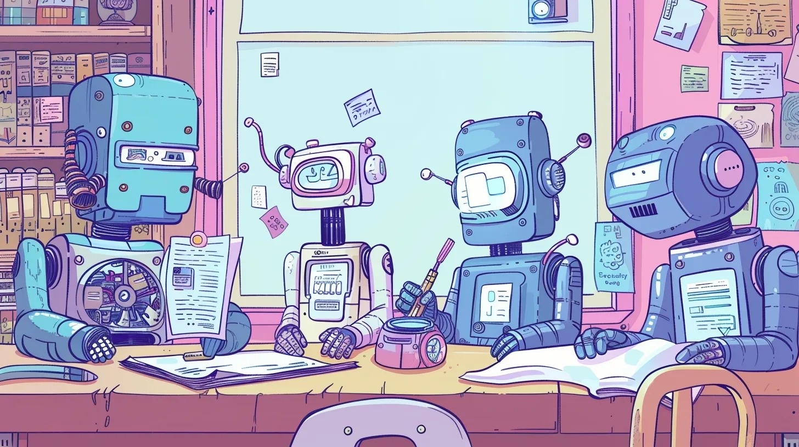
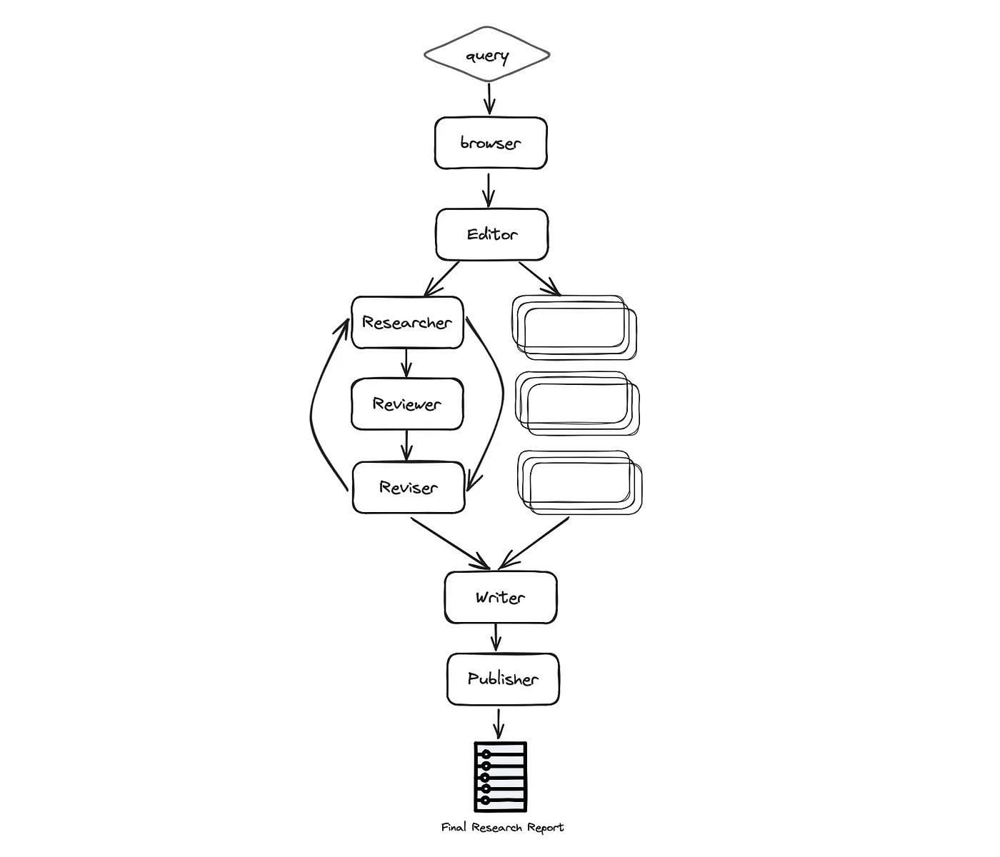

# Einführung in den GPT Researcher Multi-Agent-Assistenten
### Erfahre, wie du mit LangGraph und einem Team spezialisierter KI-Agenten einen autonomen Rechercheassistenten baust

Seit der ersten Veröffentlichung von GPT Researcher ist erst ein Jahr vergangen, aber die Methoden zum Bauen, Testen und Ausrollen von KI-Agenten haben sich bereits enorm weiterentwickelt. So schnell ist der aktuelle KI-Fortschritt. Was als einfaches Zero-Shot- oder Few-Shot-Prompting begann, entwickelte sich rasch zu Agent Function Calling, RAG und schließlich zu agentischen Workflows (auch „Flow Engineering“ genannt).

Andrew Ng hat [kürzlich gesagt](https://www.deeplearning.ai/the-batch/how-agents-can-improve-llm-performance/): „Ich glaube, KI-Agenten-Workflows werden dieses Jahr einen enormen KI-Fortschritt antreiben - vielleicht sogar mehr als die nächste Generation von Foundation Models. Das ist ein wichtiger Trend, und ich rufe alle, die im KI-Bereich arbeiten, dazu auf, darauf zu achten.“

In diesem Artikel erfährst du, warum Multi-Agent-Workflows derzeit der beste Standard sind und wie man mit LangGraph einen optimalen autonomen Multi-Agenten-Assistenten für Recherche baut.

Wenn du das Tutorial überspringen willst, schau dir gern das GitHub-Repo von [GPT Researcher x LangGraph](https://github.com/assafelovic/gpt-researcher/tree/master/multi_agents) an.

## LangGraph vorstellen
LangGraph ist eine Erweiterung von LangChain für Agenten- und Multi-Agenten-Flows. Sie ermöglicht zyklische Abläufe und bringt Memory direkt mit - beides wichtige Eigenschaften für Agenten.

LangGraph bietet Entwicklern ein hohes Maß an Steuerbarkeit und ist wichtig für die Erstellung individueller Agenten und Abläufe. Nahezu alle produktiven Agenten sind auf ihren jeweiligen Anwendungsfall zugeschnitten. LangGraph gibt dir die Flexibilität, beliebig angepasste Agenten zu bauen, und bietet dabei eine intuitive Entwicklererfahrung.

Genug der Vorrede, lass uns bauen!

## Den ultimativen autonomen Rechercheagenten bauen
Mit LangGraph lässt sich der Rechercheprozess in Tiefe und Qualität deutlich verbessern, indem mehrere Agenten mit spezialisierten Fähigkeiten zusammenarbeiten. Wenn jeder Agent nur eine bestimmte Fähigkeit abdeckt, verbessert das die Trennung der Verantwortlichkeiten, die Anpassbarkeit und die Weiterentwicklung im Maßstab, während das Projekt wächst.

Inspiriert von der jüngeren STORM-Arbeit zeigt dieses Beispiel, wie ein Team von KI-Agenten gemeinsam eine Recherche von der Planung bis zur Veröffentlichung durchführen kann. Dieses Beispiel nutzt außerdem den führenden autonomen Rechercheagenten GPT Researcher.

### Das Rechercheteam
Das Team besteht aus sieben LLM-Agenten:

* **Chief Editor** - Überwacht den Forschungsprozess und verwaltet das Team. Dies ist der „Master“-Agent, der die anderen Agenten über LangGraph koordiniert.
* **GPT Researcher** - Ein spezialisierter autonomer Agent, der ein Thema tiefgehend recherchiert.
* **Editor** - Zuständig für Planung, Gliederung und Struktur der Recherche.
* **Reviewer** - Prüft die Korrektheit der Ergebnisse anhand von Kriterien.
* **Reviser** - Überarbeitet die Ergebnisse auf Basis des Feedbacks.
* **Writer** - Erstellt und schreibt den finalen Bericht.
* **Publisher** - Verantwortlich für die Veröffentlichung in verschiedenen Formaten.

### Architektur
Wie unten zu sehen, basiert der Ablauf auf diesen Phasen: Planung der Recherche, Datensammlung und -analyse, Review und Revision, Berichtserstellung und schließlich Veröffentlichung:



Konkret läuft der Prozess so ab:

* **Browser (gpt-researcher)** - Durchsucht das Internet für eine erste Recherche auf Basis der gegebenen Aufgabe. Dieser Schritt ist entscheidend, damit LLMs den Forschungsprozess auf Basis aktueller und relevanter Informationen planen und sich nicht nur auf vortrainierte Daten verlassen.
* **Editor** - Plant Gliederung und Struktur des Berichts auf Basis der ersten Recherche. Der Editor stößt außerdem die parallelen Rechercheaufgaben an.
* Für jedes Gliederungsthema (parallel):
  * **Researcher (gpt-researcher)** - Führt eine tiefgehende Recherche zu den Unterthemen aus und schreibt einen Entwurf. Dieser Agent nutzt die Python-Paketlogik von GPT Researcher unter der Haube.
  * **Reviewer** - Prüft die Korrektheit des Entwurfs anhand von Richtlinien und gibt Feedback an den Reviser.
  * **Reviser** - Überarbeitet den Entwurf, bis er anhand des Feedbacks zufriedenstellend ist.
* **Writer** - Fasst alles in einem finalen Bericht zusammen, inklusive Einleitung, Schluss und Quellen.
* **Publisher** - Veröffentlicht den finalen Bericht in mehreren Formaten wie PDF, Docx und Markdown.

* Wir gehen nicht in alle Code-Details, weil es sehr viel ist, sondern konzentrieren uns auf die besonders interessanten Teile.

## Den Graph-Status definieren
Eine meiner Lieblingsfunktionen von LangGraph ist das State-Management. Zustände werden über eine strukturierte Definition eines `GraphState` verwaltet, der den kompletten Zustand der Anwendung kapselt. Jeder Knoten im Graphen kann diesen Zustand verändern, sodass dynamische Antworten auf den sich entwickelnden Kontext möglich sind.

Wie bei jeder technischen Konzeption ist es wichtig, die Datenstruktur früh mitzudenken. In diesem Fall definieren wir einen `ResearchState`:

```python
class ResearchState(TypedDict):
    task: dict
    initial_research: str
    sections: List[str]
    research_data: List[dict]
    # Berichtsstruktur
    title: str
    headers: dict
    date: str
    table_of_contents: str
    introduction: str
    conclusion: str
    sources: List[str]
    report: str
```

Der Zustand teilt sich in zwei Hauptbereiche: die Forschungsaufgabe und den Berichtsteil. Während Daten durch die Agenten im Graphen zirkulieren, erzeugt jeder Agent neue Daten auf Basis des vorhandenen Zustands und aktualisiert ihn für die nachfolgenden Verarbeitungsschritte.

Den Graphen initialisieren wir so:

```python
from langgraph.graph import StateGraph
workflow = StateGraph(ResearchState)
```

### Den Graphen initialisieren
Wie oben erwähnt, ist einer der großen Vorteile von Multi-Agent-Entwicklung, dass jeder Agent spezialisierte und klar abgegrenzte Fähigkeiten haben kann. Nehmen wir zum Beispiel den Researcher-Agenten auf Basis von GPT Researcher:

```python
from gpt_researcher import GPTResearcher

class ResearchAgent:
    def __init__(self):
        pass
  
    async def research(self, query: str):
        # Researcher initialisieren
        researcher = GPTResearcher(parent_query=parent_query, query=query, report_type=research_report, config_path=None)
        # Recherche ausführen
        await researcher.conduct_research()
        # Bericht schreiben
        report = await researcher.write_report()
  
        return report
```

Wie oben zu sehen ist, haben wir eine Instanz des Research-Agenten erstellt. Wenn wir das für alle Agenten wiederholen, können wir den Graphen mit LangGraph initialisieren:

```python
def init_research_team(self):
    # Skills initialisieren
    editor_agent = EditorAgent(self.task)
    research_agent = ResearchAgent()
    writer_agent = WriterAgent()
    publisher_agent = PublisherAgent(self.output_dir)
    
    # StateGraph mit ResearchState definieren
    workflow = StateGraph(ResearchState)
    
    # Knoten für jeden Agenten hinzufügen
    workflow.add_node("browser", research_agent.run_initial_research)
    workflow.add_node("planner", editor_agent.plan_research)
    workflow.add_node("researcher", editor_agent.run_parallel_research)
    workflow.add_node("writer", writer_agent.run)
    workflow.add_node("publisher", publisher_agent.run)
    
    workflow.add_edge('browser', 'planner')
    workflow.add_edge('planner', 'researcher')
    workflow.add_edge('researcher', 'writer')
    workflow.add_edge('writer', 'publisher')
    
    # Start- und Endknoten setzen
    workflow.set_entry_point("browser")
    workflow.add_edge('publisher', END)
    
    return workflow
```

Wie zu sehen ist, ist die Erstellung des LangGraph-Graphen recht einfach und besteht im Wesentlichen aus drei Funktionen: `add_node`, `add_edge` und `set_entry_point`. Damit kannst du Knoten hinzufügen, sie verbinden und den Startpunkt festlegen.

Wenn du genau auf den Code und die Architektur geachtet hast, fällt dir auf, dass der Reviewer und der Reviser in der obigen Initialisierung fehlen. Schauen wir uns das an.

## Ein Graph innerhalb eines Graphen für zustandsbehaftete Parallelisierung
Das war der spannendste Teil meiner Arbeit mit LangGraph! Ein besonders interessantes Feature dieses autonomen Assistenten ist ein paralleler Lauf für jede Forschungsaufgabe, die anhand eines festen Regelwerks überprüft und überarbeitet wird.

Parallelarbeit ist ein zentraler Hebel für Geschwindigkeit. Aber wie triggert man parallele Agentenarbeit, wenn alle Agenten denselben Zustand teilen? Das kann Race Conditions und Inkonsistenzen im finalen Bericht verursachen. Die Lösung ist ein Subgraph, der vom Haupt-Graphen ausgelöst wird. Dieser Subgraph führt seinen eigenen Zustand pro parallelem Lauf und löst damit das Problem.

Wie zuvor definieren wir den Zustand und die Agenten für den Subgraphen. Da dieser im Grunde einen Entwurf überprüft und überarbeitet, halten wir die State-Struktur entsprechend schlank:

```python
class DraftState(TypedDict):
    task: dict
    topic: str
    draft: dict
    review: str
    revision_notes: str
```

Im `DraftState` interessieren uns vor allem das Thema sowie Review- und Revisionshinweise, die zwischen den Agenten ausgetauscht werden. Für die zyklische Bedingung nutzen wir die bedingten Kanten von LangGraph:

```python
async def run_parallel_research(self, research_state: dict):
    workflow = StateGraph(DraftState)
    
    workflow.add_node("researcher", research_agent.run_depth_research)
    workflow.add_node("reviewer", reviewer_agent.run)
    workflow.add_node("reviser", reviser_agent.run)
    
    # researcher->reviewer->reviser->reviewer...
    workflow.set_entry_point("researcher")
    workflow.add_edge('researcher', 'reviewer')
    workflow.add_edge('reviser', 'reviewer')
    workflow.add_conditional_edges('reviewer',
                                   (lambda draft: "accept" if draft['review'] is None else "revise"),
                                   {"accept": END, "revise": "reviser"})
```

Durch die bedingten Kanten wird der Graph zum Reviser geleitet, wenn der Reviewer noch Feedback hat; andernfalls endet der Zyklus mit dem finalen Entwurf. Wenn du zum Hauptgraphen zurückgehst, siehst du, dass diese parallele Arbeit unter einem Knoten namens `researcher` hängt, den der Chief-Editor-Agent aufruft.

### Den Rechercheassistenten ausführen
Nachdem Agenten, Zustände und Graphen definiert sind, ist es Zeit, den Rechercheassistenten zu starten. Damit die Konfiguration leicht anpassbar bleibt, wird der Assistent mit einer `task.json`-Datei ausgeführt:

```json
{
  "query": "Is AI in a hype cycle?",
  "max_sections": 3,
  "publish_formats": {
    "markdown": true,
    "pdf": true,
    "docx": true
  },
  "follow_guidelines": false,
  "model": "gpt-4-turbo",
  "guidelines": [
    "The report MUST be written in APA format",
    "Each sub section MUST include supporting sources using hyperlinks. If none exist, erase the sub section or rewrite it to be a part of the previous section",
    "The report MUST be written in spanish"
  ]
}
```

Das Task-Objekt ist recht selbsterklärend. Achte jedoch darauf, dass `follow_guidelines=false` dazu führt, dass der Graph den Revisionsschritt und die definierten Richtlinien ignoriert. Außerdem bestimmt `max_sections`, wie viele Unterüberschriften recherchiert werden. Weniger davon erzeugen einen kürzeren Bericht.

Das Ausführen des Assistenten führt zu einem finalen Forschungsbericht in Formaten wie Markdown, PDF und Docx.

Wenn du das Beispiel herunterladen und ausführen willst, schau dir die GPT Researcher x LangGraph [Open-Source-Seite](https://github.com/assafelovic/gpt-researcher/tree/master/multi_agents) an.

## Was kommt als Nächstes?
Für die Zukunft gibt es noch viele spannende Fragen. Human-in-the-loop ist entscheidend für optimale KI-Erlebnisse. Wenn Menschen dem Assistenten helfen, den Forschungsplan, die Themen und die Gliederung zu verfeinern, verbessert das die Qualität und die Nutzererfahrung deutlich. Auch generell sorgt menschliche Beteiligung im KI-Flow für mehr Korrektheit, Kontrolle und Determinismus. Schön ist, dass LangGraph das bereits nativ unterstützt.

Außerdem wäre Unterstützung für Recherche auf Web- und lokalen Daten wichtig für viele geschäftliche und private Anwendungsfälle.

Darüber hinaus kann die Qualität der gefundenen Quellen noch weiter verbessert werden, damit der finale Bericht in einer optimalen Erzählstruktur aufgebaut ist.

Ein weiterer Schritt bei LangGraph und Multi-Agent-Kollaboration insgesamt wäre, wenn Assistenten Graphen dynamisch auf Basis gegebener Aufgaben planen und erzeugen könnten. Diese Vision würde es Assistenten ermöglichen, nur eine Teilmenge von Agenten für eine Aufgabe zu wählen und ihre Strategie auf Basis der Graph-Grundlagen aus diesem Artikel zu planen. Das würde eine völlig neue Welt an Möglichkeiten eröffnen. Bei der Geschwindigkeit der Innovation im KI-Bereich wird es nicht lange dauern, bis eine neue disruptive Version von GPT Researcher veröffentlicht wird. Ich bin gespannt, was die Zukunft bringt!

Um über den Fortschritt und die Updates dieses Projekts auf dem Laufenden zu bleiben, tritt unserer Discord-Community bei. Und wie immer: Wenn du Feedback oder weitere Fragen hast, schreib gern einen Kommentar!
