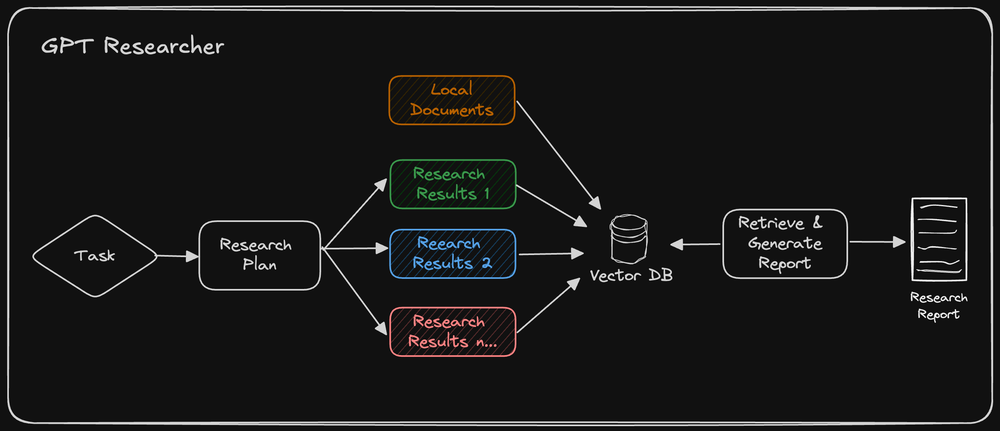

In den letzten Jahren haben wir eine Explosion neuer KI-Tools gesehen, die Forschung verändern sollen. Einige, wie [ChatPDF](https://www.chatpdf.com/) und [Consensus](https://consensus.app), konzentrieren sich auf das Extrahieren von Erkenntnissen aus Dokumenten. Andere, wie [Perplexity](https://www.perplexity.ai/), sind stark darin, das Web nach Informationen zu durchsuchen. Aber das Entscheidende ist: Keines dieser Tools kombiniert Web- und lokale Dokumentensuche in einer einzigen kontextuellen Research-Pipeline.

Genau deshalb freue ich mich, die neuesten Fortschritte von **[GPT Researcher](https://gptr.dev)** vorzustellen - jetzt in der Lage, hybride Recherchen zu jeder Aufgabe und zu beliebigen Dokumenten durchzuführen.

Web-basierte Recherche fehlt oft der spezifische Kontext, sie ist anfällig für Informationsüberlastung und kann veraltete oder unzuverlässige Daten enthalten. Lokale Recherche hingegen ist auf historische Daten und bestehendes Wissen beschränkt, wodurch sich leicht organisatorische Echokammern bilden und wichtige Markttrends oder Wettbewerbsbewegungen übersehen werden. Beide Ansätze allein führen oft zu unvollständigen oder verzerrten Erkenntnissen und erschweren fundierte Entscheidungen.

Heute ändern wir das Spiel. Am Ende dieses Leitfadens weißt du, wie du hybride Recherche durchführst, die das Beste aus beiden Welten kombiniert - Web und lokal - und dadurch gründlichere, relevantere und aufschlussreichere Ergebnisse liefert.

## Warum hybride Recherche besser funktioniert

Durch die Kombination von Web- und lokalen Quellen adressiert hybride Recherche diese Grenzen und bietet mehrere wichtige Vorteile:

1. **Fundierter Kontext**: Lokale Dokumente bieten eine Basis aus verifizierten, organisationsspezifischen Informationen. So wird die Recherche auf etabliertem Wissen aufgebaut und das Risiko verringert, an Kernkonzepten vorbeizugehen oder branchenspezifische Begriffe falsch zu deuten.
   
   *Beispiel*: Ein Pharmaunternehmen, das eine neue Wirkstoffentwicklung untersucht, kann interne Forschungsarbeiten und Studiendaten als Basis verwenden und diese mit den neuesten Publikationen und regulatorischen Updates aus dem Web ergänzen.

2. **Höhere Genauigkeit**: Webquellen liefern aktuelle Informationen, lokale Dokumente liefern historischen Kontext. Diese Kombination ermöglicht präzisere Trendanalysen und bessere Entscheidungen.
   
   *Beispiel*: Ein Finanzdienstleister kann historische Handelsdaten mit aktuellen Marktnews und Social-Media-Stimmungen kombinieren, um fundiertere Anlageentscheidungen zu treffen.

3. **Weniger Verzerrung**: Durch die Nutzung von Web- und lokalen Quellen gleichzeitig verringern wir das Risiko von Verzerrungen, die in einer Quelle allein vorhanden sein könnten.
   
   *Beispiel*: Ein Tech-Unternehmen, das seine Produkt-Roadmap bewertet, kann interne Feature-Requests und Nutzungsdaten mit externen Reviews und Wettbewerbsanalysen ausbalancieren.

4. **Bessere Planung und besseres Reasoning**: LLMs können den Kontext aus lokalen Dokumenten nutzen, um ihre Web-Recherche besser zu planen und gefundene Informationen online sauberer einzuordnen.
   
   *Beispiel*: Ein KI-gestütztes Marktforschungstool kann frühere Kampagnendaten eines Unternehmens verwenden, um die Websuche nach aktuellen Marketingtrends gezielter zu steuern.

5. **Individuelle Erkenntnisse**: Hybride Recherche erlaubt die Kombination proprietärer Informationen mit öffentlichen Daten und erzeugt so einzigartige, organisationsspezifische Erkenntnisse.
   
   *Beispiel*: Eine Einzelhandelskette kann Verkaufsdaten mit webgescrapten Wettbewerberpreisen und Wirtschaftsdaten verbinden, um ihre Preisstrategie regional zu optimieren.

Das sind nur einige Beispiele für Business-Anwendungen, die hybride Recherche nutzen können. Aber genug der Vorrede - lass uns bauen!

## Den Hybrid-Research-Assistenten bauen

Bevor wir ins Detail gehen, ist wichtig zu wissen: GPT Researcher kann hybride Recherche bereits out of the box! Um aber besser zu verstehen, wie das funktioniert, schauen wir unter die Haube.



GPT Researcher führt Webrecherche auf Basis eines automatisch erzeugten Plans aus lokalen Dokumenten durch. Anschließend ruft es relevante Informationen aus lokalen und Web-Daten für den finalen Forschungsbericht ab.

Wir schauen uns an, wie lokale Dokumente mit LangChain verarbeitet werden - ein zentraler Baustein für die Dokumentenverarbeitung von GPT Researcher. Danach zeigen wir, wie man GPT Researcher nutzt, um hybride Recherche mit den Vorteilen von Websuche und lokalem Dokumentenwissen durchzuführen.

### Lokale Dokumente mit LangChain verarbeiten

LangChain stellt verschiedene Document-Loader bereit, mit denen sich unterschiedliche Dateitypen verarbeiten lassen. Diese Flexibilität ist entscheidend, wenn man mit vielfältigen lokalen Dokumenten arbeitet. So richtest du das ein:

```python
from langchain_community.document_loaders import (
    PyMuPDFLoader, 
    TextLoader, 
    UnstructuredCSVLoader, 
    UnstructuredExcelLoader,
    UnstructuredMarkdownLoader, 
    UnstructuredPowerPointLoader,
    UnstructuredWordDocumentLoader
)
from langchain.text_splitter import RecursiveCharacterTextSplitter
from langchain.embeddings import OpenAIEmbeddings
from langchain.vectorstores import Chroma

def load_local_documents(file_paths):
    documents = []
    for file_path in file_paths:
        if file_path.endswith('.pdf'):
            loader = PyMuPDFLoader(file_path)
        elif file_path.endswith('.txt'):
            loader = TextLoader(file_path)
        elif file_path.endswith('.csv'):
            loader = UnstructuredCSVLoader(file_path)
        elif file_path.endswith('.xlsx'):
            loader = UnstructuredExcelLoader(file_path)
        elif file_path.endswith('.md'):
            loader = UnstructuredMarkdownLoader(file_path)
        elif file_path.endswith('.pptx'):
            loader = UnstructuredPowerPointLoader(file_path)
        elif file_path.endswith('.docx'):
            loader = UnstructuredWordDocumentLoader(file_path)
        else:
            raise ValueError(f"Unsupported file type: {file_path}")
        
        documents.extend(loader.load())
    
    return documents

# Funktion zum Laden lokaler Dokumente
local_docs = load_local_documents(['company_report.pdf', 'meeting_notes.docx', 'data.csv'])

# Dokumente in kleinere Chunks aufteilen
text_splitter = RecursiveCharacterTextSplitter(chunk_size=1000, chunk_overlap=200)
splits = text_splitter.split_documents(local_docs)

# Embeddings erzeugen und in einer Vektordatenbank speichern
embeddings = OpenAIEmbeddings()
vectorstore = Chroma.from_documents(documents=splits, embedding=embeddings)

# Beispiel für eine Similarity Search
query = "What were the key points from our last strategy meeting?"
relevant_docs = vectorstore.similarity_search(query, k=3)

for doc in relevant_docs:
    print(doc.page_content)
```

### Web-Recherche mit GPT Researcher durchführen

Nachdem wir lokale Dokumente verstanden haben, werfen wir einen kurzen Blick darauf, wie GPT Researcher intern arbeitet:


Wie oben zu sehen ist, erstellt GPT Researcher einen Forschungsplan auf Basis der gegebenen Aufgabe, indem es mögliche Suchanfragen generiert, die zusammen eine objektive und breite Übersicht über das Thema liefern. Sobald diese Suchanfragen erstellt sind, nutzt GPT Researcher eine Suchmaschine wie Tavily, um relevante Ergebnisse zu finden. Jedes gescrapte Ergebnis wird anschließend in einer Vektordatenbank gespeichert. Schließlich werden die relevantesten Chunks für die Forschungsaufgabe zurückgeholt, um den finalen Bericht zu erzeugen.

GPT Researcher unterstützt hybride Recherche, bei der ein zusätzlicher Schritt zur Chunking-Verarbeitung lokaler Dokumente (über LangChain) erfolgt, bevor die relevantesten Informationen abgerufen werden. Nach zahlreichen Evaluierungen durch die Community haben wir festgestellt, dass hybride Recherche die Korrektheit der finalen Ergebnisse um mehr als 40 % verbessert hat!

### Hybride Recherche mit GPT Researcher ausführen

Jetzt, da du besser verstehst, wie hybride Recherche funktioniert, zeigen wir, wie einfach sich das mit GPT Researcher umsetzen lässt.

#### Schritt 1: GPT Researcher per PIP installieren

```bash
pip install gpt-researcher
```

#### Schritt 2: Umgebung einrichten

Wir führen GPT Researcher mit OpenAI als LLM-Anbieter und Tavily als Suchmaschine aus. Du brauchst also vorab API-Keys für beide. Danach exportierst du die Umgebungsvariablen in der CLI:

```bash
export OPENAI_API_KEY={your-openai-key}
export TAVILY_API_KEY={your-tavily-key}
```

#### Schritt 3: GPT Researcher mit Hybrid-Konfiguration initialisieren

GPT Researcher lässt sich leicht mit Parametern initialisieren, die hybride Recherche signalisieren. Es gibt viele Rechercheformen; schau in die Dokumentation, um mehr zu erfahren.

Damit GPT Researcher hybride Recherche ausführt, musst du alle relevanten Dateien im Verzeichnis `my-docs` ablegen (lege es an, falls es nicht existiert), und dann den `report_source` der Instanz auf `"hybrid"` setzen. Sobald die Quelle auf hybrid steht, sucht GPT Researcher nach vorhandenen Dokumenten im `my-docs`-Verzeichnis und bezieht sie in die Recherche ein. Falls keine Dokumente vorhanden sind, wird dieser Teil ignoriert.

```python
from gpt_researcher import GPTResearcher
import asyncio

async def get_research_report(query: str, report_type: str, report_source: str) -> str:
    researcher = GPTResearcher(query=query, report_type=report_type, report_source=report_source)
    research = await researcher.conduct_research()
    report = await researcher.write_report()
    return report
    
if __name__ == "__main__":
    query = "How does our product roadmap compare to emerging market trends in our industry?"
    report_source = "hybrid"

    report = asyncio.run(get_research_report(query=query, report_type="research_report", report_source=report_source))
    print(report)
```

Wie oben zu sehen ist, können wir die Recherche für folgendes Beispiel ausführen:

- Forschungsaufgabe: "How does our product roadmap compare to emerging market trends in our industry?"
- Web: Aktuelle Markttrends, Wettbewerber-Ankündigungen und Branchenprognosen
- Lokal: Interne Produkt-Roadmap-Dokumente und Feature-Priorisierungslisten

Nach verschiedenen Community-Evaluierungen haben wir festgestellt, dass die Ergebnisse dieser Recherche die Qualität und Korrektheit um mehr als 40 % verbessern und Halluzinationen um 50 % reduzieren. Außerdem hilft lokale Information dem LLM beim Planungs-Reasoning und damit dabei, bessere Entscheidungen zu treffen und relevantere Webquellen zu recherchieren.

Aber das ist noch nicht alles! GPT Researcher enthält außerdem eine schicke Frontend-App mit NextJS und Tailwind. Wie du sie startest, erfährst du in der Dokumentation. Dort kannst du Dokumente per Drag-and-Drop einbinden, um hybride Recherche durchzuführen.

## Fazit

Hybride Recherche ist ein bedeutender Fortschritt bei Datensammlung und Entscheidungsfindung. Mit Tools wie [GPT Researcher](https://gptr.dev) können Teams heute umfassendere, kontextbewusstere und handlungsorientiertere Recherchen durchführen. Dieser Ansatz adressiert die Grenzen von Web- oder lokalen Quellen in Isolation und bietet Vorteile wie fundierten Kontext, höhere Genauigkeit, weniger Verzerrung, bessere Planung und besseres Reasoning sowie maßgeschneiderte Erkenntnisse.

Die Automatisierung hybrider Recherche kann Teams dabei helfen, schneller und datengetriebener zu entscheiden, die Produktivität zu steigern und einen Wettbewerbsvorteil bei der Analyse wachsender Mengen unstrukturierter und dynamischer Informationen zu erzielen.
