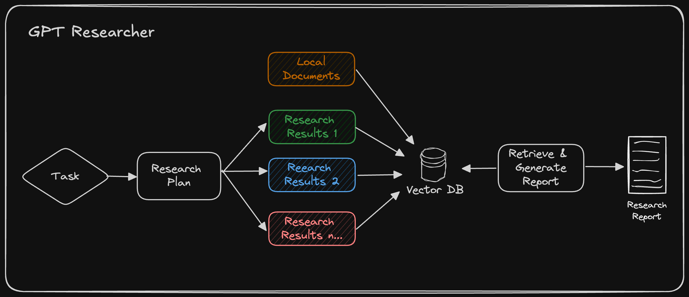

Over the past few years, we've seen an explosion of new AI tools designed to disrupt research. Some, like [ChatPDF](https://www.chatpdf.com/) and [Consensus](https://consensus.app), focus on extracting insights from documents. Others, such as [Perplexity](https://www.perplexity.ai/), excel at scouring the web for information. But here's the thing: none of these tools combine both web and local document search within a single contextual research pipeline.

This is why I'm excited to introduce the latest advancements of **[GPT Researcher](https://gptr.dev)** — now able to conduct hybrid research on any given task and documents.

Web driven research often lacks specific context, risks information overload, and may include outdated or unreliable data. On the flip side, local driven research is limited to historical data and existing knowledge, potentially creating organizational echo chambers and missing out on crucial market trends or competitor moves. Both approaches, when used in isolation, can lead to incomplete or biased insights, hampering your ability to make fully informed decisions.

Today, we're going to change the game. By the end of this guide, you'll learn how to conduct hybrid research that combines the best of both worlds — web and local — enabling you to conduct more thorough, relevant, and insightful research.

## Why Hybrid Research Works Better

By combining web and local sources, hybrid research addresses these limitations and offers several key advantages:

1. **Grounded context**: Local documents provide a foundation of verified, organization specific information. This grounds the research in established knowledge, reducing the risk of straying from core concepts or misinterpreting industry specific terminology.
   
   *Example*: A pharmaceutical company researching a new drug development opportunity can use its internal research papers and clinical trial data as a base, then supplement this with the latest published studies and regulatory updates from the web.

2. **Enhanced accuracy**: Web sources offer up-to-date information, while local documents provide historical context. This combination allows for more accurate trend analysis and decision-making.
   
   *Example*: A financial services firm analyzing market trends can combine their historical trading data with real-time market news and social media sentiment analysis to make more informed investment decisions.

3. **Reduced bias**: By drawing from both web and local sources, we mitigate the risk of bias that might be present in either source alone.
   
   *Example*: A tech company evaluating its product roadmap can balance internal feature requests and usage data with external customer reviews and competitor analysis, ensuring a well-rounded perspective.

4. **Improved planning and reasoning**: LLMs can leverage the context from local documents to better plan their web research strategies and reason about the information they find online.
   
   *Example*: An AI-powered market research tool can use a company's past campaign data to guide its web search for current marketing trends, resulting in more relevant and actionable insights.

5. **Customized insights**: Hybrid research allows for the integration of proprietary information with public data, leading to unique, organization-specific insights.
   
   *Example*: A retail chain can combine its sales data with web-scraped competitor pricing and economic indicators to optimize its pricing strategy in different regions.

These are just a few examples for business use cases that can leverage hybrid research, but enough with the small talk — let's build!

## Building the Hybrid Research Assistant

Before we dive into the details, it's worth noting that GPT Researcher has the capability to conduct hybrid research out of the box! However, to truly appreciate how this works and to give you a deeper understanding of the process, we're going to take a look under the hood.



GPT Researcher conducts web research based on an auto-generated plan from local documents, as seen in the architecture above. It then retrieves relevant information from both local and web data for the final research report.

We'll explore how local documents are processed using LangChain, which is a key component of GPT Researcher's document handling. Then, we'll show you how to leverage GPT Researcher to conduct hybrid research, combining the advantages of web search with your local document knowledge base.

### Processing Local Documents with Langchain

LangChain provides a variety of document loaders that allow us to process different file types. This flexibility is crucial when dealing with diverse local documents. Here's how to set it up:

```python
from langchain_community.document_loaders import (
    PyMuPDFLoader, 
    TextLoader, 
    UnstructuredCSVLoader, 
    UnstructuredExcelLoader,
    UnstructuredMarkdownLoader, 
    UnstructuredPowerPointLoader,
    UnstructuredWordDocumentLoader
)
from langchain.text_splitter import RecursiveCharacterTextSplitter
from langchain.embeddings import OpenAIEmbeddings
from langchain.vectorstores import Chroma

def load_local_documents(file_paths):
    documents = []
    for file_path in file_paths:
        if file_path.endswith('.pdf'):
            loader = PyMuPDFLoader(file_path)
        elif file_path.endswith('.txt'):
            loader = TextLoader(file_path)
        elif file_path.endswith('.csv'):
            loader = UnstructuredCSVLoader(file_path)
        elif file_path.endswith('.xlsx'):
            loader = UnstructuredExcelLoader(file_path)
        elif file_path.endswith('.md'):
            loader = UnstructuredMarkdownLoader(file_path)
        elif file_path.endswith('.pptx'):
            loader = UnstructuredPowerPointLoader(file_path)
        elif file_path.endswith('.docx'):
            loader = UnstructuredWordDocumentLoader(file_path)
        else:
            raise ValueError(f"Unsupported file type: {file_path}")
        
        documents.extend(loader.load())
    
    return documents

# Use the function to load your local documents
local_docs = load_local_documents(['company_report.pdf', 'meeting_notes.docx', 'data.csv'])

# Split the documents into smaller chunks for more efficient processing
text_splitter = RecursiveCharacterTextSplitter(chunk_size=1000, chunk_overlap=200)
splits = text_splitter.split_documents(local_docs)

# Create embeddings and store them in a vector database for quick retrieval
embeddings = OpenAIEmbeddings()
vectorstore = Chroma.from_documents(documents=splits, embedding=embeddings)

# Example of how to perform a similarity search
query = "What were the key points from our last strategy meeting?"
relevant_docs = vectorstore.similarity_search(query, k=3)

for doc in relevant_docs:
    print(doc.page_content)
```

### Conducting Web Research with GPT Researcher

Now that we've learned how to work with local documents, let's take a quick look at how GPT Researcher works under the hood:


As seen above, GPT Researcher creates a research plan based on the given task by generating potential research queries that can collectively provide an objective and broad overview of the topic. Once these queries are generated, GPT Researcher uses a search engine like Tavily to find relevant results. Each scraped result is then saved in a vector database. Finally, the top k chunks most related to the research task are retrieved to generate a final research report.

GPT Researcher supports hybrid research, which involves an additional step of chunking local documents (implemented using Langchain) before retrieving the most related information. After numerous evaluations conducted by the community, we've found that hybrid research improved the correctness of final results by over 40%!

### Running the Hybrid Research with GPT Researcher

Now that you have a better understanding of how hybrid research works, let's demonstrate how easy this can be achieved with GPT Researcher.

#### Step 1: Install GPT Researcher with PIP

```bash
pip install gpt-researcher
```

#### Step 2: Setting up the environment

We will run GPT Researcher with OpenAI as the LLM vendor and Tavily as the search engine. You'll need to obtain API keys for both before moving forward. Then, export the environment variables in your CLI as follows:

```bash
export OPENAI_API_KEY={your-openai-key}
export TAVILY_API_KEY={your-tavily-key}
```

#### Step 3: Initialize GPT Researcher with hybrid research configuration

GPT Researcher can be easily initialized with params that signal it to run a hybrid research. You can conduct many forms of research, head to the documentation page to learn more.

To get GPT Researcher to run a hybrid research, you need to include all relevant files in my-docs directory (create it if it doesn't exist), and set the instance report_source to "hybrid" as seen below. Once the report source is set to hybrid, GPT Researcher will look for existing documents in the my-docs directory and include them in the research. If no documents exist, it will ignore it.

```python
from gpt_researcher import GPTResearcher
import asyncio

async def get_research_report(query: str, report_type: str, report_source: str) -> str:
    researcher = GPTResearcher(query=query, report_type=report_type, report_source=report_source)
    research = await researcher.conduct_research()
    report = await researcher.write_report()
    return report
    
if __name__ == "__main__":
    query = "How does our product roadmap compare to emerging market trends in our industry?"
    report_source = "hybrid"

    report = asyncio.run(get_research_report(query=query, report_type="research_report", report_source=report_source))
    print(report)
```

As seen above, we can run the research on the following example:

- Research task: "How does our product roadmap compare to emerging market trends in our industry?"
- Web: Current market trends, competitor announcements, and industry forecasts
- Local: Internal product roadmap documents and feature prioritization lists

After various community evaluations we've found that the results of this research improve quality and correctness of research by over 40% and remove hallucinations by 50%. Moreover as stated above, local information helps the LLM improve planning reasoning allowing it to make better decisions and researching more relevant web sources.

But wait, there's more! GPT Researcher also includes a sleek front-end app using NextJS and Tailwind. To learn how to get it running check out the documentation page. You can easily use drag and drop for documents to run hybrid research.

## Conclusion

Hybrid research represents a significant advancement in data gathering and decision making. By leveraging tools like [GPT Researcher](https://gptr.dev), teams can now conduct more comprehensive, context-aware, and actionable research. This approach addresses the limitations of using web or local sources in isolation, offering benefits such as grounded context, enhanced accuracy, reduced bias, improved planning and reasoning, and customized insights.

The automation of hybrid research can enable teams to make faster, more data-driven decisions, ultimately enhancing productivity and offering a competitive advantage in analyzing an expanding pool of unstructured and dynamic information.