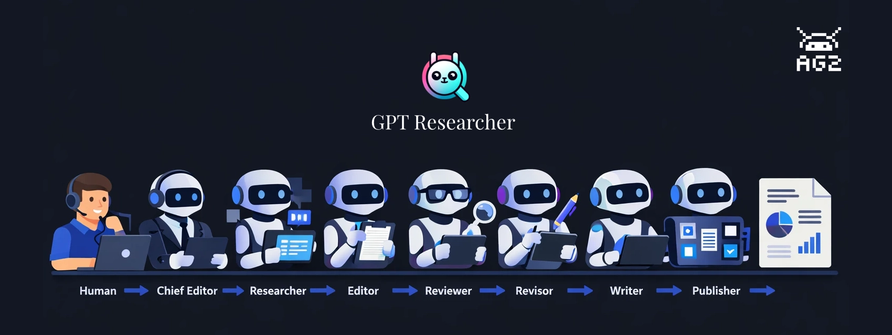
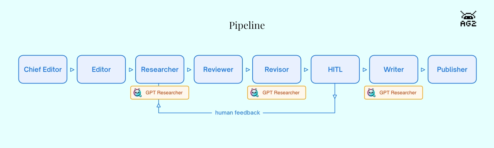

Ask an LLM to research a topic and write a report. It'll produce something -- sometimes quite good. But probe the sources, check the claims, or ask for substantial revisions and the limitations show up fast. The agent that searched the web is also the one drawing conclusions from it. There's no review step between research and writing. Errors and gaps pass straight through to the final document.

The fix isn't a better prompt. It's division of labor.

[GPT Researcher](https://docs.gptr.dev/), created by [Assaf Elovic](https://github.com/assafelovic), is built on this idea: specialized agents, each with a distinct job, working through a staged pipeline. A researcher gathers, an editor outlines, a reviewer challenges the findings, a revisor incorporates the feedback, and a writer only touches finalized content. Every handoff is a quality check.

This post walks through the [build-with-ag2](https://github.com/ag2ai/build-with-ag2/tree/main/ag-ui/gpt-researcher) example, which runs the full pipeline with **AG2 as the orchestration layer**. The example ships with two run modes -- a terminal script and a web UI built on [AG-UI](https://docs.ag2.ai/latest/docs/user-guide/ag-ui/) that shows pipeline progress in real time and includes a human-in-the-loop review step before writing begins.

<!--truncate-->

## The Research Pipeline



The example uses AG2's `DefaultPattern` to run eight agents in sequence. Each is a separate `ConversableAgent` with its own system message and dedicated tool function. When a tool returns, it explicitly hands off to the next agent via `AgentNameTarget` -- the same pattern described in AG2's [pipeline cookbook](https://docs.ag2.ai/latest/docs/user-guide/agentchat/group-chat/sequential-chats):

1. **Chief Editor** (`init_research`) — receives the query, creates a `GPTResearcher` instance
2. **Editor** (`plan_sections`) — outlines 3-5 report sections
3. **Researcher** (`do_research`) — calls `GPTResearcher.conduct_research()` to search and collect sources
4. **Reviewer** (`evaluate_research`) — scores research quality 1-10 and identifies gaps
5. **Revisor** (`do_revision`) — runs a supplementary `GPTResearcher` search if gaps were found
6. **Human Review** (`present_for_review`) — presents findings and **pauses for human approval**
7. **Writer** (`do_write_report`) — calls `GPTResearcher.write_report()` to compile the report
8. **Publisher** (`do_publish`) — stamps the report with source count and date metadata

The Human Review step is first-class in this pipeline, not optional. `present_for_review` emits a structured summary to the browser -- quality score, gaps, report outline, sources, findings preview -- then returns `RevertToUserTarget()`. AG2 fires an `InputRequestEvent`, which the SSE endpoint converts to an `INPUT_REQUEST` event for the frontend. The browser shows an approve/feedback panel and the pipeline waits. When the user responds, the `human_review_agent` uses an LLM condition to decide: loop back to the Researcher, or advance to the Writer.

If you'd prefer a lighter-weight option, AG2's built-in [`DeepResearchTool`](https://docs.ag2.ai/latest/docs/api-reference/autogen/tools/experimental/DeepResearchTool/) is a composable tool that any agent can call directly -- the [Deep Research reference page](https://docs.ag2.ai/latest/docs/user-guide/reference-tools/deep-research/) covers when to use which.

## How Agents and UI Connect

AG2's `DefaultPattern` coordinates the eight agents as a group chat. Rather than a single orchestrator deciding who speaks next, each agent makes that decision itself: when its tool function returns, the result includes a `target` naming the next agent by name. The pipeline sequence is deterministic by construction -- no LLM needed to decide the order -- though the Human Review agent does use LLM conditions to branch after human feedback: loop back to the Researcher if the user wants more research, or advance to the Writer if they approve. A shared `ContextVariables` dictionary flows through every tool call, carrying pipeline state -- active agent, stage, query, source count, and eventually the finished report -- readable and writable by any step in the chain.

The frontend stays in sync through two parallel SSE streams that serve different kinds of information. The main `/research/` endpoint translates AG2 group chat events into AG-UI protocol: tool call start and end events as each tool runs, a state snapshot when the active agent changes, and an `INPUT_REQUEST` event when the pipeline pauses at Human Review waiting for the user. The second stream, `/logs`, carries everything that comes out of GPT Researcher itself -- live log lines as it searches the web, the report text chunk by chunk as the Writer runs, cost updates, and the structured summary that populates the Human Review panel.

The bridge between them is a lightweight `StreamAdapter` class that mimics the WebSocket interface GPT Researcher expects, but routes its output to an asyncio queue instead of a network socket. The same GPT Researcher code that normally writes to a WebSocket writes to the queue, and the `/logs` endpoint drains that queue to the browser in real time. No WebSocket server needed.

## Running the Pipeline

Clone the [build-with-ag2](https://github.com/ag2ai/build-with-ag2) repository, navigate to the example, and install dependencies:

```bash
git clone https://github.com/ag2ai/build-with-ag2.git
cd build-with-ag2/ag-ui/gpt-researcher
pip install -r requirements.txt
```

You'll need two API keys: OpenAI for the LLM, and [Tavily](https://tavily.com/) for web search (Assaf's own search API, with a free tier):

```bash
export OPENAI_API_KEY=your_openai_key
export TAVILY_API_KEY=your_tavily_key
```

Set your research question in `task.json`:

```json
{
  "query": "Is AI in a hype cycle?",
  "report_type": "research_report"
}
```

### Terminal Mode

```bash
python main.py
```

`GPTResearcher` runs its web search and writes the report to stdout.

### Web UI Mode (AG-UI)

```bash
python server.py
```

Open `http://localhost:8457`. Enter your question and click **Research**. The pipeline panel on the right tracks each agent as it runs. When the Revisor finishes, the Human Review panel appears with a structured summary -- quality score, identified gaps, report outline, and a collapsible source list -- and the pipeline pauses until you approve or send feedback.

Here's the core pattern from `server.py`. Each agent is a separate `ConversableAgent` with its own system message and tool. Handoffs are explicit: each tool function returns an `AgentNameTarget` pointing to the next agent. `DefaultPattern` and `a_run_group_chat` drive the group chat:

<details>
<summary>server.py (excerpts)</summary>

```python
from autogen import ConversableAgent, UserProxyAgent, LLMConfig
from autogen.agentchat import a_run_group_chat
from autogen.agentchat.group import (
    AgentNameTarget, AgentTarget, ContextVariables, OnCondition,
    ReplyResult, RevertToUserTarget, StringLLMCondition, TerminateTarget,
)
from autogen.agentchat.group.patterns import DefaultPattern
from gpt_researcher import GPTResearcher

llm_config = LLMConfig(
    {"model": "gpt-4o-mini", "parallel_tool_calls": False, "cache_seed": None}
)

researcher_agent = ConversableAgent(
    name="researcher",
    system_message="You are the Researcher. Call do_research to search the web and collect sources.",
    functions=[do_research],
    llm_config=llm_config,
)

async def do_research(context_variables: ContextVariables) -> ReplyResult:
    """Researcher: search the web and collect sources."""
    context_variables["active_agent"] = "Researcher"
    await _emit_state("Researcher", "researching")
    await _researcher.conduct_research()
    sources = _researcher.get_source_urls()
    return ReplyResult(
        message=f"Research complete. {len(sources)} sources. Reviewer, evaluate quality.",
        context_variables=context_variables,
        target=AgentNameTarget("reviewer"),
    )

# Human Review pauses the pipeline for human input
async def present_for_review(context_variables: ContextVariables) -> ReplyResult:
    """Human Review: present research findings for human approval."""
    await _stream_adapter.emit({"type": "hitl_summary", "data": {
        "query": query, "score": score, "gaps": gaps,
        "sections": sections, "sources": source_urls[:10],
        "findings_preview": context[:1500],
    }})
    return ReplyResult(
        message="Research summary ready. Please review.",
        context_variables=context_variables,
        target=RevertToUserTarget(),
    )

# After human responds, LLM conditions route back to Researcher or forward to Writer
human_review_agent.handoffs.add_llm_condition(
    OnCondition(
        target=AgentTarget(researcher_agent),
        condition=StringLLMCondition("The user wants changes, more research, or is not satisfied."),
    )
)
human_review_agent.handoffs.add_llm_condition(
    OnCondition(
        target=AgentTarget(writer_agent),
        condition=StringLLMCondition("The user approves or wants to proceed with writing."),
    )
)

# Wire agents together and run
pattern = DefaultPattern(
    initial_agent=chief_editor,
    agents=[chief_editor, editor, researcher_agent, reviewer_agent,
            revisor_agent, human_review_agent, writer_agent, publisher_agent],
    user_agent=user,
    context_variables=shared_context,
)
response = await a_run_group_chat(pattern, messages=query, max_rounds=50)
```

</details>

`GPTResearcher` expects a WebSocket for its internal streaming output. `StreamAdapter` mimics that interface, routing messages to an asyncio queue that the `/logs` SSE endpoint serves to the frontend:

<details>
<summary>server.py — StreamAdapter and /logs endpoint</summary>

```python
class StreamAdapter:
    """Imitation WebSocket that gpt-researcher writes to via send_json().

    Messages are pushed to an asyncio Queue and consumed by the /logs SSE
    endpoint, giving the frontend real-time research progress, cost updates,
    HITL summary data, and the final report.
    """
    def __init__(self) -> None:
        self.queue: asyncio.Queue = asyncio.Queue()

    async def send_json(self, data: dict) -> None:
        await self.queue.put(data)

    async def emit(self, data: dict) -> None:
        """Emit directly — used by pipeline tools for state and HITL data."""
        await self.queue.put(data)

_stream_adapter = StreamAdapter()

# Pass the adapter as websocket when creating GPTResearcher:
_researcher = GPTResearcher(query=query, websocket=_stream_adapter, ...)

@app.get("/logs")
async def logs_stream():
    async def generate():
        while True:
            msg = await _stream_adapter.queue.get()
            if msg is None:
                break
            yield f"data: {json.dumps(msg)}\n\n"
    return StreamingResponse(generate(), media_type="text/event-stream")
```

</details>

The main `/research/` POST endpoint translates AG2 group chat events into AG-UI protocol. The key moment is the `InputRequestEvent` that fires when `RevertToUserTarget()` pauses the pipeline at Human Review:

<details>
<summary>server.py — /research/ endpoint (excerpt)</summary>

```python
async for event in response.events:
    if isinstance(event, ToolCallEvent):
        for tc in event.content.tool_calls:
            yield _sse({"type": "TOOL_CALL_START", "toolCallName": tc.function.name, ...})

    elif isinstance(event, ExecutedFunctionEvent):
        yield _sse({"type": "TOOL_CALL_END", "toolCallId": event.content.call_id, ...})

    elif isinstance(event, InputRequestEvent):
        _hitl_respond = event.content.respond
        yield _sse({"type": "INPUT_REQUEST", "prompt": event.content.prompt, ...})
```

</details>

The `/research/respond` endpoint resumes the pipeline when the user submits input:

<details>
<summary>server.py — HITL respond endpoint</summary>

```python
@app.post("/research/respond")
async def respond_endpoint(request: Request):
    body = await request.json()
    await _hitl_respond(body["response"])
    return {"status": "ok"}
```

</details>

The frontend connects two parallel streams. The `/research/` SSE fetch carries AG-UI events: tool call activity, `INPUT_REQUEST` to trigger the HITL panel, and agent state snapshots. The `/logs` EventSource carries everything from gpt-researcher -- research progress log entries, report text as it's written chunk by chunk, cost updates, and the structured HITL summary:

<details>
<summary>frontend.html (excerpts)</summary>

```javascript
// Start both streams in parallel
connectLogStream();       // EventSource('/logs') — gpt-researcher streaming
await fetch('/research/', ...);  // SSE fetch — AG-UI events

// /logs handler: research progress, progressive report, cost, HITL summary
function handleLogMessage(msg) {
    if (msg.type === 'report') {
        reportAccumulator += msg.output;
        reportEl.innerHTML = marked.parse(reportAccumulator);
    }
    if (msg.type === 'hitl_summary') {
        hitlPromptEl.innerHTML = renderHitlSummary(msg.data);
    }
    if (msg.type === 'cost') {
        totalCost += parseFloat(msg.data.total_cost.replace('$', ''));
        costEl.textContent = '$' + totalCost.toFixed(4);
    }
    if (msg.type === 'state') {
        handleSnapshot(msg.data);
    }
}

// /research/ main SSE surfaces the HITL panel when INPUT_REQUEST arrives
case 'INPUT_REQUEST':
    showHitl(event.prompt);
    break;

// Approve: resume with a simple message
async function sendHitlApprove() {
    await fetch('/research/respond', {
        method: 'POST',
        body: JSON.stringify({ response: 'Looks good, proceed with writing the report.' }),
    });
}

// Feedback: resume with the user's text — human_review_agent routes back to Researcher
async function sendHitlFeedback() {
    const text = hitlInputEl.value.trim();
    await fetch('/research/respond', {
        method: 'POST',
        body: JSON.stringify({ response: text }),
    });
}
```

</details>

## Where to Take It Next

`task.json` only needs a `query` and `report_type` to run. The `report_type` field is passed directly to `GPTResearcher` -- `"research_report"` produces a comprehensive multi-section report, while `"outline_report"` and `"resource_report"` give you lighter-weight alternatives. You can also pass additional parameters to the `GPTResearcher` constructor in `init_research`: `max_sections` controls depth, `model` sets the research LLM independently from the AG2 orchestration model, and `report_source` scopes the search to web or local sources.

The pipeline itself is straightforward to extend. Because each agent is a separate `ConversableAgent` with an explicit handoff, adding a stage means writing a new tool function and inserting an `AgentNameTarget` into the chain. A fact-checking agent between Reviewer and Revisor, for example, would cross-reference key claims before the revision step. A notification agent at the end could post the finished report to Slack or email with a few lines using AG2's [communication platform tools](https://docs.ag2.ai/latest/docs/user-guide/reference-tools/communication-platforms/slack/).

The human-in-the-loop step can also be extended. Right now there's one `RevertToUserTarget()` at the Human Review stage. Adding a second review checkpoint after the Writer produces a draft -- with its own approve/feedback cycle -- is a matter of another agent with the same pattern.

**Clone and run it from AG2's [Build with AG2 repository](https://github.com/ag2ai/build-with-ag2/tree/main/ag-ui/gpt-researcher) and make it your own!**

## Learn More

- [GPT Researcher documentation](https://docs.gptr.dev/) — Assaf Elovic's full documentation for GPT Researcher
- [AG2 integration guide](https://docs.gptr.dev/docs/gpt-researcher/multi_agents/ag2) — the original AG2 integration docs from the GPT Researcher team
- [Deep Research reference page](https://docs.ag2.ai/latest/docs/user-guide/reference-tools/deep-research/) — DeepResearchTool vs. GPT Researcher comparison
- [AG-UI protocol](https://docs.ag2.ai/latest/docs/user-guide/ag-ui/backend-deepdive/) — streaming agent state to a frontend

---

*This post was originally published on the [AG2 blog](https://docs.ag2.ai/latest/docs/blog/2026/03/03/GPT-Researcher-AG2/) by Mark Sze.*
