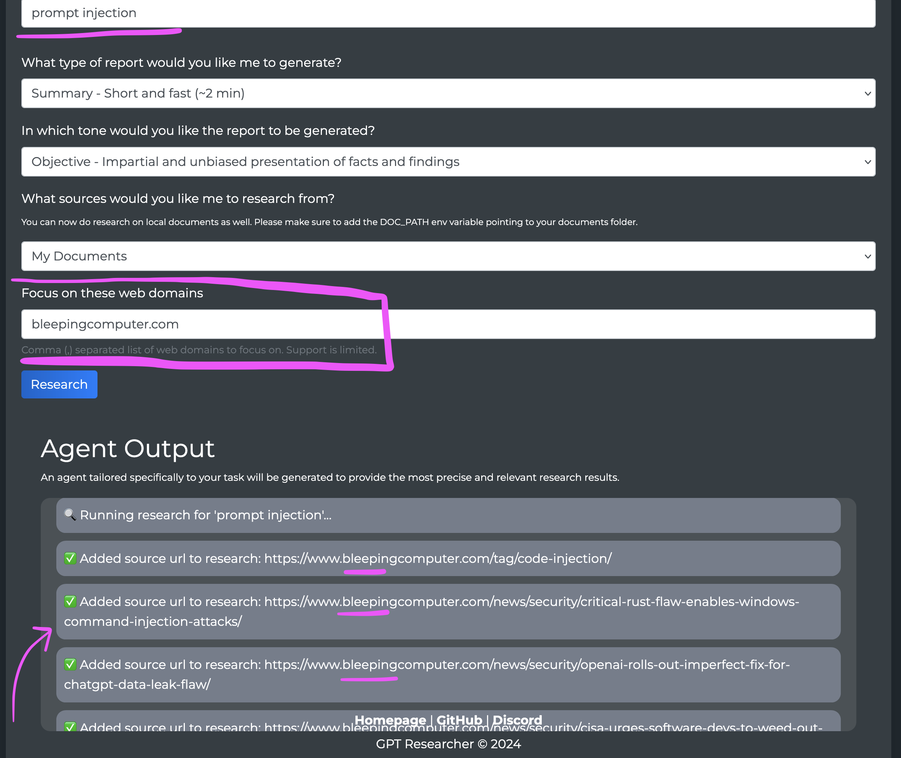

# Filtering by Domain

You can filter web search results by specific domains when using either the Tavily or Google Search retrievers. This functionality is available across all interfaces - pip package, NextJS frontend, and vanilla JS frontend.

> Note: We welcome contributions to add domain filtering to other retrievers!

To set Tavily as a retriever, you'll need to set the `RETRIEVER` environment variable to `tavily` and set the `TAVILY_API_KEY` environment variable to your Tavily API key.

```bash
RETRIEVER=tavily
TAVILY_API_KEY=your_tavily_api_key
```

To set Google as a retriever, you'll need to set the `RETRIEVER` environment variable to `google` and set the `GOOGLE_API_KEY` and `GOOGLE_CX_KEY` environment variables to your Google API key and Google Custom Search Engine ID.

```bash
RETRIEVER=google
GOOGLE_API_KEY=your_google_api_key
GOOGLE_CX_KEY=your_google_custom_search_engine_id
```

## Using the Pip Package

When using the pip package, you can pass a list of domains to filter results:

```python
report = GPTResearcher(
    query="Latest AI Startups",
    report_type="research_report",
    report_source="web",
    domains=["forbes.com", "techcrunch.com"]
)
```

## Using the NextJS Frontend

When using the NextJS frontend, you can pass a list of domains to filter results via the Settings Modal:


## Using the Vanilla JS Frontend

When using the Vanilla JS frontend, you can pass a list of domains to filter results via the relevant input field:



## Filtering by Domain based on URL Param

If you'd like to show off for your work pals how GPTR is the ultra-customizable Deep Research Agent, you can send them a link to your hosted GPTR app with the domain filter included in the URL itself.

This can be handle for demonstrating a proof of concept of the Research Agent tailored to a specific domain. Some examples below:

### Single Domain:

https://app.gptr.dev/?domains=wikipedia.org

### Multiple Domains:

https://app.gptr.dev/?domains=wired.com,forbes.com,wikipedia.org

The `https://app.gptr.dev` part of the URL can be replaces with [the domain that you deployed GPTR on](https://docs.gptr.dev/docs/gpt-researcher/getting-started/linux-deployment).
