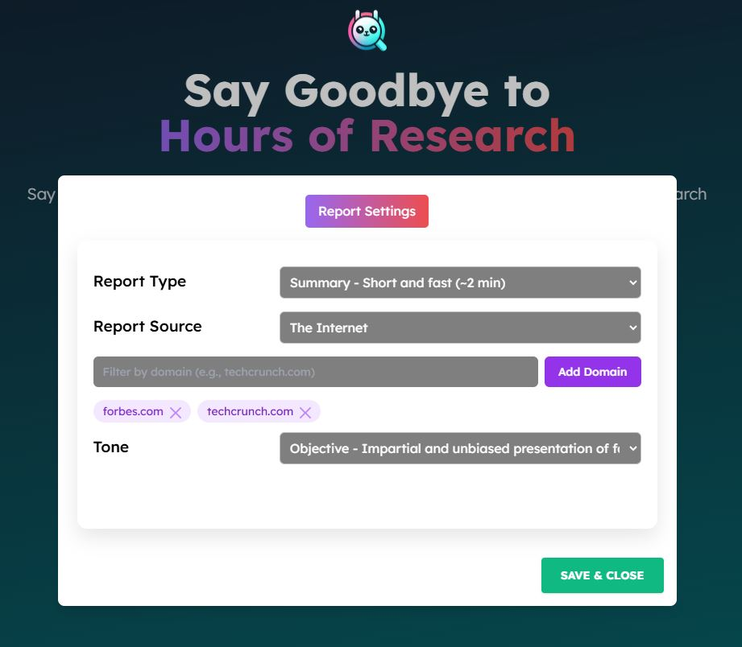
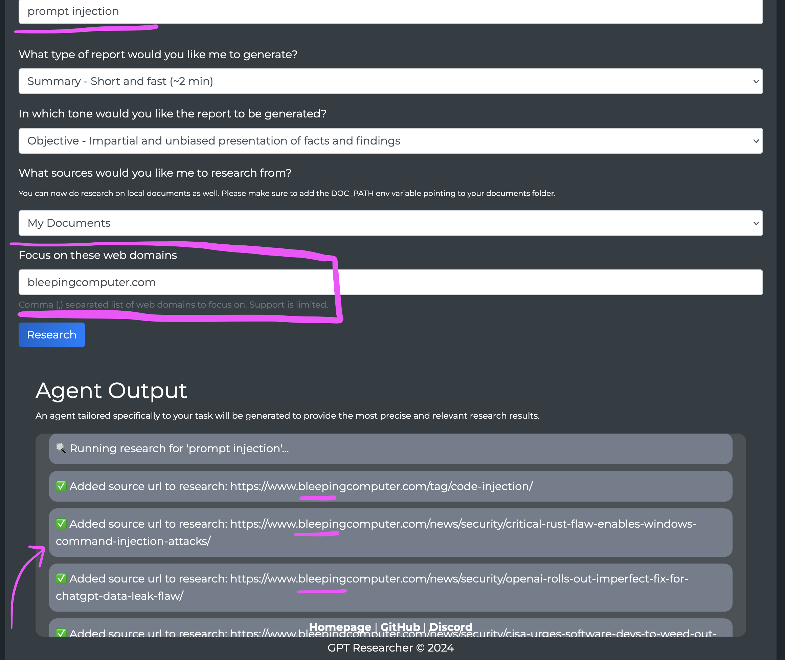

# Nach Domänen filtern

Du kannst Web-Suchergebnisse nach bestimmten Domänen filtern, wenn du den Tavily- oder Google-Retriever verwendest. Diese Funktion steht über alle Interfaces hinweg zur Verfügung - PIP-Paket, NextJS-Frontend und Vanilla-JS-Frontend.

> Hinweis: Beiträge sind willkommen, um die Domänenfilterung auf weitere Retriever auszuweiten!

Um Tavily zu verwenden, setze `RETRIEVER=tavily` und `TAVILY_API_KEY` auf deinen Tavily-API-Key.

```bash
RETRIEVER=tavily
TAVILY_API_KEY=your_tavily_api_key
```

Um Google zu verwenden, setze `RETRIEVER=google` sowie `GOOGLE_API_KEY` und `GOOGLE_CX_KEY` auf deine Google-API-Daten und die ID deiner Custom Search Engine.

```bash
RETRIEVER=google
GOOGLE_API_KEY=your_google_api_key
GOOGLE_CX_KEY=your_google_custom_search_engine_id
```

## Verwendung mit dem PIP-Paket

Beim PIP-Paket kannst du eine Liste von Domänen übergeben:

```python
report = GPTResearcher(
    query="Latest AI Startups",
    report_type="research_report",
    report_source="web",
    domains=["forbes.com", "techcrunch.com"]
)
```

## Verwendung mit dem NextJS-Frontend

Im NextJS-Frontend kannst du Domänen über das Settings-Modal filtern:



## Verwendung mit dem Vanilla-JS-Frontend

Im Vanilla-JS-Frontend kannst du Domänen über das entsprechende Eingabefeld filtern:



## Filtern über die URL

Wenn du dein gehostetes GPTR-App-Beispiel mit Domänenfilter zeigen möchtest, kannst du die Domänen direkt in die URL einbauen.

Beispiele:

### Eine Domäne:

https://app.gptr.dev/?domains=wikipedia.org

### Mehrere Domänen:

https://app.gptr.dev/?domains=wired.com,forbes.com,wikipedia.org

Der Teil `https://app.gptr.dev` kann durch die Domain ersetzt werden, auf der du GPTR selbst bereitgestellt hast.
