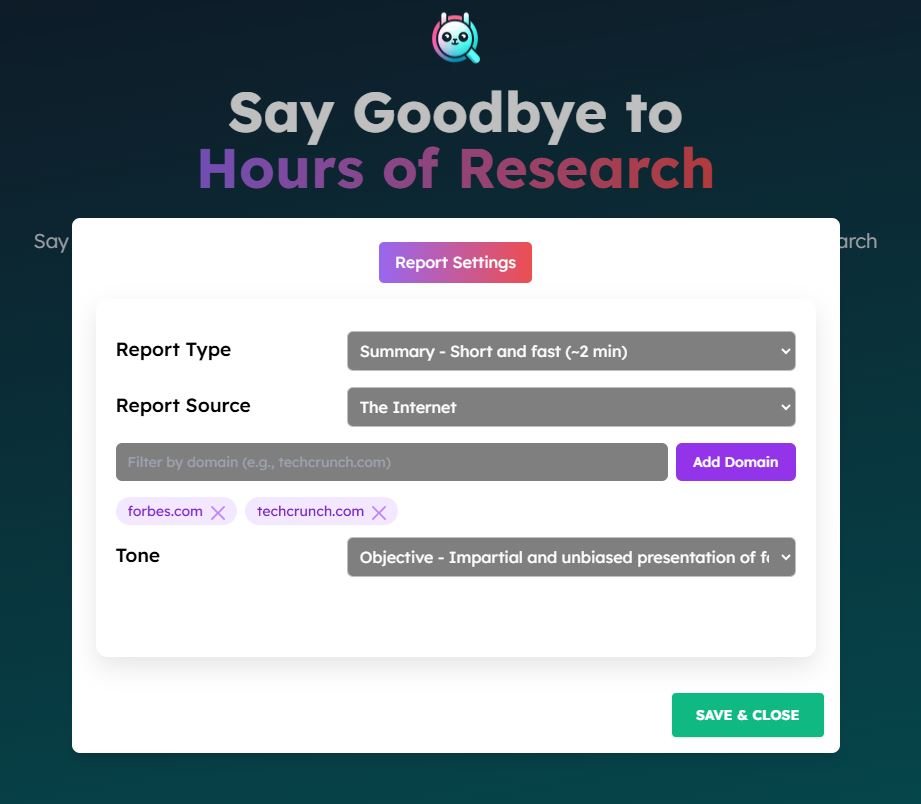

# Filtering by Domain

If you set Google as a Retriever, you can filter web results by site.

For example, set in the query param you pass the GPTResearcher class instance: `query="site:linkedin.com a python web developer to implement my custom gpt-researcher flow"` will limit the results to linkedin.com

> **Step 1** -  Set these environment variables with a .env file in the root folder

```bash
TAVILY_API_KEY=
LANGCHAIN_TRACING_V2=true
LANGCHAIN_API_KEY=
OPENAI_API_KEY=
DOC_PATH=./my-docs
RETRIEVER=google
GOOGLE_API_KEY=
GOOGLE_CX_KEY=
```

> **Step 2** -  from the root project run:

docker-compose up -- build

```python
report = GPTResearcher(
    query="Latest AI Startups",
    report_type="research_report",
    report_source="web",
    domains=["forbes.com", "techcrunch.com"]
)
```

## Using the NextJS Frontend

When using the NextJS frontend, you can pass a list of domains to filter results via the Settings Modal:



## Using the Vanilla JS Frontend

When using the Vanilla JS frontend, you can pass a list of domains to filter results via the relevant input field:


## Filtering by Domain based on URL Param

If you'd like to show off for your work pals how GPTR is the ultra-customizable Deep Research Agent, you can send them a link to your hosted GPTR app with the domain filter included in the URL itself.

This can be handle for demonstrating a proof of concept of the Research Agent tailored to a specific domain. Some examples below:

### Single Domain:

https://app.gptr.dev/?domains=wikipedia.org

### Multiple Domains:

https://app.gptr.dev/?domains=wired.com,forbes.com,wikipedia.org

The `https://app.gptr.dev` part of the URL can be replaces with [the domain that you deployed GPTR on](https://docs.gptr.dev/docs/gpt-researcher/getting-started/linux-deployment).
