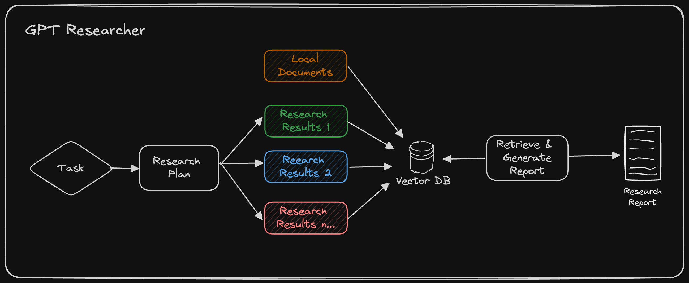

# Local Documents

## Just Local Docs

You can instruct the GPT Researcher to run research tasks based on your local documents. Currently supported file formats are: PDF, plain text, CSV, Excel, Markdown, PowerPoint, and Word documents.

Step 1: Add the env variable `DOC_PATH` pointing to the folder where your documents are located.

```bash
export DOC_PATH="./my-docs"
```

Step 2: 
 - If you're running the frontend app on localhost:8000, simply select "My Documents" from the "Report Source" Dropdown Options.
 - If you're running GPT Researcher with the [PIP package](https://docs.tavily.com/docs/gpt-researcher/gptr/pip-package), pass the `report_source` argument as "local" when you instantiate the `GPTResearcher` class [code sample here](https://docs.gptr.dev/docs/gpt-researcher/context/tailored-research).

## Local Docs + Web (Hybrid)



Check out the blog post on [Hybrid Research](https://docs.gptr.dev/blog/gptr-hybrid) to learn more about how to combine local documents with web research.
```
