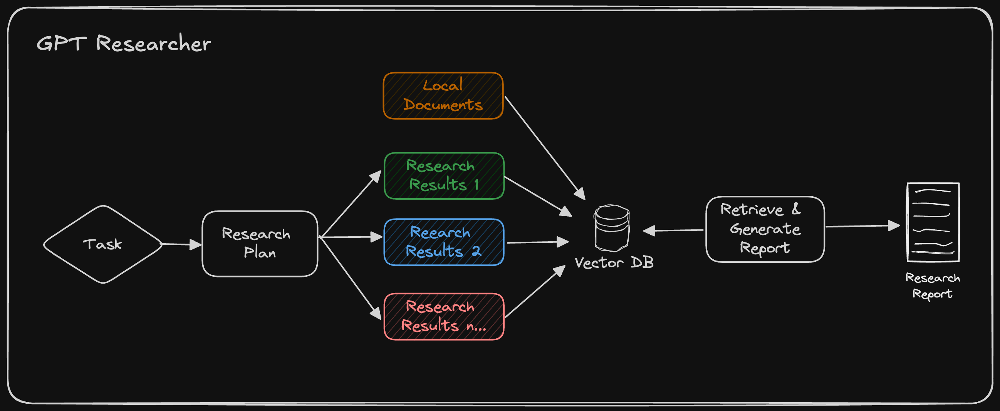

# Lokale Dokumente

## Nur lokale Dokumente

Du kannst GPT Researcher anweisen, auf Basis deiner lokalen Dokumente zu recherchieren. Unterstützte Formate sind aktuell: PDF, Text, CSV, Excel, Markdown, PowerPoint und Word.

### Schritt 1
Setze die Umgebungsvariable `DOC_PATH` auf den Ordner, in dem deine Dokumente liegen.

```bash
export DOC_PATH="./my-docs"
```

### Schritt 2

- Wenn du die Frontend-App auf `localhost:8000` laufen hast, wähle im Dropdown **Report Source** einfach **My Documents** aus.
- Wenn du GPT Researcher als [PIP-Paket](/docs/gpt-researcher/gptr/pip-package) verwendest, übergib beim Erzeugen der `GPTResearcher`-Instanz `report_source="local"`.

## Lokale Dokumente + Web (Hybrid)



Mehr dazu im Blogpost über [Hybrid Research](/blog/gptr-hybrid).
