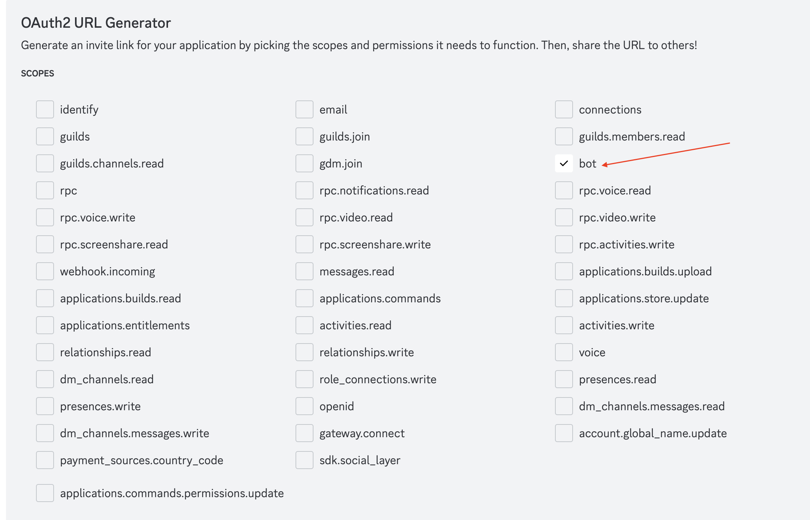
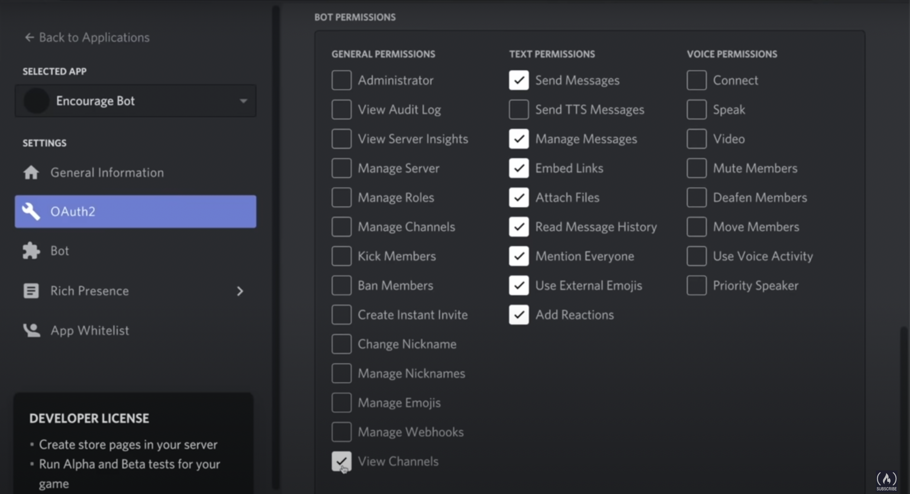

# Discord-Bot

## Einführung

Du kannst entweder den offiziellen GPTR-Discord-Bot verwenden oder dir einen eigenen Bot bauen.

Um den offiziellen GPTR-Discord-Bot hinzuzufügen, [klicke hier und lade GPTR in deinen Discord-Server ein](https://discord.com/oauth2/authorize?client_id=1281438963034361856&permissions=1689934339898432&integration_type=0&scope=bot).

## Einen eigenen Discord-Bot mit GPTR-Funktionalität erstellen

Lege im Projektstamm eine `.env`-Datei an und trage Folgendes ein:

```
DISCORD_BOT_TOKEN=
DISCORD_CLIENT_ID=
```

Den Token bekommst du über das Discord Developer Portal:

1. Öffne https://discord.com/developers/applications/
2. Klicke auf **New Application** und vergebe einen Namen
3. Wechsle zum Tab **OAuth2**, um eine Invite-URL für deinen Bot zu erzeugen
4. Wähle unter **Scopes** den Eintrag **bot**



5. Wähle die passenden Bot-Berechtigungen



6. Kopiere den Bot-Token und füge ihn in deine `.env`-Datei ein

### Bot-Befehle deployen

```bash
node deploy-commands.js
```

Dadurch stehen den Nutzern die Befehle **ask** und **ping** zur Verfügung.

### Bot per Docker starten

```bash
docker compose --profile discord run --rm discord-bot
```

### Bot per CLI starten

```bash
# Abhängigkeiten installieren
npm install

# Bot starten
npm run dev
```

### NodeJS und NPM unter Ubuntu installieren

```bash
# nvm installieren
wget -qO- https://raw.githubusercontent.com/nvm-sh/nvm/v0.39.4/install.sh | bash

export NVM_DIR="$([ -z "${XDG_CONFIG_HOME-}" ] && printf %s "${HOME}/.nvm" || printf %s "${XDG_CONFIG_HOME}/nvm")"
[ -s "$NVM_DIR/nvm.sh" ] && \. "$NVM_DIR/nvm.sh" # Lädt nvm

# nodejs installieren
nvm install 18.17.0

# npm installieren
sudo apt-get install npm
```
