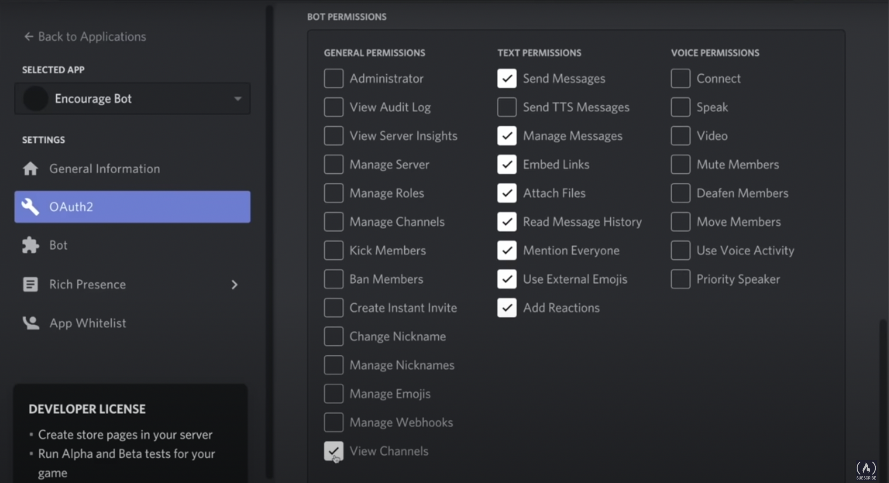

# Discord Bot

## Intro

You can either leverage the official GPTR Discord bot or create your own custom bot.

To add the official GPTR Discord bot, simply [click here to invite GPTR to your Discord server](https://discord.com/oauth2/authorize?client_id=1281438963034361856&permissions=1689934339898432&integration_type=0&scope=bot).


## To create your own discord bot with GPTR functionality

Add a .env file in the root of the project and add the following:

```
DISCORD_BOT_TOKEN=
DISCORD_CLIENT_ID=
```
You can fetch the token from the Discord Developer Portal by following these steps:

1. Go to https://discord.com/developers/applications/
2. Click the "New Application" button and give your bot a name
3. Navigate to the OAuth2 tab to generate an invite URL for your bot
4. Under "Scopes", select "bot"


5. Select the appropriate bot permissions



6. Copy your bot's token and paste it into the `.env` file you created earlier


### Deploying the bot commands

```bash
node deploy-commands.js
```

In our case, this will make the "ask" and "ping" commands available to users of the bot.


### Running the bot via Docker

```bash
docker compose --profile discord run --rm discord-bot
```

### Running the bot via CLI

```bash
# install dependencies
npm install

# run the bot
npm run dev
```

### Installing NodeJS and NPM on Ubuntu

```bash
#install nvm
wget -qO- https://raw.githubusercontent.com/nvm-sh/nvm/v0.39.4/install.sh | bash

export NVM_DIR="$([ -z "${XDG_CONFIG_HOME-}" ] && printf %s "${HOME}/.nvm" || printf %s "${XDG_CONFIG_HOME}/nvm")"
[ -s "$NVM_DIR/nvm.sh" ] && \. "$NVM_DIR/nvm.sh" # This loads nvm

# install nodejs
nvm install 18.17.0

# install npm
sudo apt-get install npm
```
