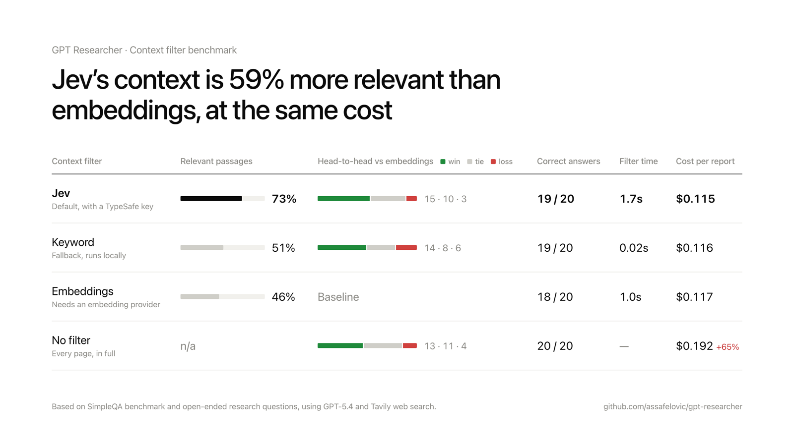

# Context Filter



Every research run scrapes dozens of pages, and most of each page doesn't help answer the question. The **context filter** is the step that decides which passages the LLM actually reads. It is the single biggest lever on report quality after search itself: whatever it drops, the writer never sees, and whatever noise it keeps, the writer has to wade through.

GPT Researcher uses **[Jev](https://typesafe.ai/blog/introducing-system-one-models-and-jev)** by TypeSafe as its default context filter. Jev scores how *useful* each passage is for the question, rather than how *similar* it looks. On our benchmark, **Jev's context is 59% more relevant than embeddings, at the same cost** (73% of kept passages relevant, against 46%). With no TypeSafe key, GPT Researcher falls back to a local keyword filter that needs no API, model or embeddings. No filter mode is required.

This page covers how the filter works, how Jev is integrated, and the benchmark behind the defaults.

## Where the filter sits

```
query ─► plan sub-queries ─► for each sub-query:
                               search ─► scrape pages ─► CONTEXT FILTER ─► passages
                                                                            │
                        all sub-queries' passages ─► writer LLM ─► report ◄─┘
```

For every sub-query, the scraped pages go through `select_context()` (`gpt_researcher/context/select.py`). Each page is capped at 50,000 characters and split into 1,000-character chunks with 100 characters of overlap. The filter then chooses which chunks become context. Up to 10 are kept per sub-query for Jev and embeddings, and up to 25 for keyword. Sub-queries run concurrently, and their contexts are joined and passed to the writer.

**Report chat uses the same function.** When you chat with a finished report, the report is treated as a single page and the latest message as the query, so chat gets exactly the same filtering, and the same fallbacks, as research.

## Modes

Set with `CONTEXT_FILTER`:

| mode | how passages are chosen | needs |
|---|---|---|
| `auto` (default) | `jev` when `TYPESAFE_API_KEY` is set, otherwise `keyword` | nothing |
| `jev` | Jev usefulness score per chunk, above a threshold | `TYPESAFE_API_KEY` |
| `keyword` | BM25 keyword ranking, relative threshold | nothing |
| `embeddings` | cosine similarity between chunk and query embeddings | an `EMBEDDING` provider |
| `none` | no filtering: every page, in full | nothing |

**Fallback chain:** `jev` falls back to `keyword` on any failure (missing key, network error, rate limiting after retries, malformed response). `embeddings` falls back to `keyword` if the embedding model can't be built. So no setting can leave a run without context, and only the `embeddings` mode ever constructs an embedding model. When a page set is small (under 8,000 characters in total, with no more pages than the chunk budget), every mode passes it through unfiltered.

## How Jev is used

Jev is a *System One* model: instead of generating text, it answers typed questions about an input, and returns calibrated probabilities. GPT Researcher asks it one question per chunk: how useful is this passage for answering the sub-query, on a four-level rubric.

```http
POST https://api.typesafe.ai/v1/systemone
Authorization: Bearer $TYPESAFE_API_KEY

{
  "state": "<the 1,000-character chunk>",
  "model": "jev-latest",
  "questions": {
    "usefulness": {
      "type": "score",
      "instructions": "How useful is this passage for answering the question: <sub-query>",
      "criteria": [
        "Unrelated to the question",
        "Same topic, but does not help answer the question",
        "Partially answers the question or gives useful supporting facts",
        "Directly answers the question with specific facts"
      ]
    }
  }
}
```

The response's `score` is the probability-weighted level, from 0 to 3. A chunk that is certainly "directly answers" scores 3.0; one split evenly between "partially answers" and "directly answers" scores 2.5.

**Selection.** Chunks are sorted by score, ties kept in page order, and a chunk is kept only if it scores at least `JEV_MIN_SCORE` (1.5, meaning it at least partially answers the question), up to the budget. The threshold matters more than the ranking. Forced to fill all 10 slots with no threshold, Jev's precision drops from 73% to 50%, barely above embeddings. A calibrated usefulness score can say "nothing else on this page is worth including"; a similarity score can't.

**Throughput.** Jev takes one input per request, so every chunk is its own call. Calls run in parallel under a per-process limit of `JEV_CONCURRENCY` (64). We measured about 0.33s per warm call, with latency nearly flat in input size (0.45s at 13k tokens), and 64 concurrent calls completing in about 1.1s. The limit is shared per event loop, because concurrent sub-queries would otherwise each open their own full-width pool. Raising it to 128 made filtering no faster.

**Limits and errors.** Jev accepts up to about 32k tokens of input per call; 1,000-character chunks are far below that. HTTP 429 (rate limited) and 529 (overloaded) are retried up to three times with exponential backoff. Any other failure raises `JevError`, and `select_context` falls back to `keyword`.

**Cost.** Jev bills $0.042 per million input tokens; output tokens are free. Each call's `usage.input_tokens` is added to the research cost, so `researcher.get_costs()` includes Jev. In the benchmark, filtering cost about half a cent per report.

## How the keyword fallback works

`keyword` ranks the same chunks with **BM25**, the lexical scoring behind most search engines, computed over the chunks scraped for that sub-query (`gpt_researcher/context/lexical.py`). It is pure Python with no dependencies, and filters a typical sub-query in about 20 milliseconds.

- **Tokens:** lowercase word tokens (Unicode-aware, so non-English text works), English stopwords removed, and light plural stemming so "batteries" matches "battery" and "costs" matches "cost".
- **Scoring:** standard BM25 (k1 = 1.5, b = 0.75), with IDF computed from the sub-query's own chunks.
- **Selection:** keep chunks scoring at least `KEYWORD_RELATIVE_THRESHOLD` (0.5) of the best chunk, up to `KEYWORD_MAX_RESULTS` (25). As with Jev, the threshold is what makes it work: plain top-10 BM25 lost to embeddings in the benchmark. If nothing matches any query term, the pages' opening chunks are used.

## The benchmark

The defaults above come from a controlled replay benchmark in [`evals/context_filter`](https://github.com/assafelovic/gpt-researcher/tree/main/evals/context_filter). Anyone can rerun it.

### Method

1. **Record.** `collect.py` ran 28 real research tasks through GPT Researcher and recorded the exact pages that reached the filter for each sub-query. The tasks were 20 [SimpleQA](https://openai.com/index/introducing-simpleqa/) questions with known answers (fixed random seed) and 8 open-ended research questions: memory chip shortage causes, solid-state vs lithium-ion batteries, intermittent fasting evidence, the EU AI Act, base vs prime editing, carbon capture costs, the 2008 financial crisis, and LLM factuality evaluation. That came to a median of 4 filter calls, 10.5 pages and 168k characters per task.
2. **Replay.** `replay.py` rebuilt each task's context from the *same recorded pages* with every filter, and wrote the report with the same model (`gpt-5.4`). Search and scraping, the noisiest parts of a run, were held constant, so the filter is the only thing that differs.
3. **Judge.** `judge.py` scored every report three ways:
   - **Relevant passages (precision):** the share of the passages given to the writer that an independent judge (`gpt-5.4-mini`) rated relevant to the question. This measures the filter directly.
   - **Head-to-head:** a blind comparison against the embeddings report for the same task, judged by `gpt-5.4` on accuracy and specificity, then relevance, then completeness. Each pair was judged in both orders, and it counts as a win or loss only if both orders agree; otherwise it is a tie.
   - **Correct answers:** SimpleQA reports graded against the known answer with the repository's SimpleQA grader.

### Results

| filter | relevant passages | head-to-head vs embeddings (win · tie · loss) | correct answers | filter time (median) | context sent (median) | cost per report |
|---|---|---|---|---|---|---|
| **Jev** | **73%** | **15 · 10 · 3** | 19/20 | 1.7s | 4.5k tokens | $0.115 |
| Keyword | 51% | 14 · 8 · 6 | 19/20 | 0.02s | 6.4k tokens | $0.116 |
| Embeddings | 46% | baseline | 18/20 | 1.0s | 7.6k tokens | $0.117 |
| Unranked (control) | 33% | 7 · 8 · 13 | 19/20 | 0.01s | 8.0k tokens | $0.117 |
| No filter | n/a | 13 · 11 · 4 | 20/20 | — | 33.4k tokens | $0.192 |

*The unranked control takes the same 10-chunk budget round-robin across pages, with no relevance ranking. It shows how much ranking matters at all. Jev's filter time is at the default concurrency of 64 (3.6s at p90); embeddings' p90 is 1.3s.*

Report writing took about 45 seconds with every filter, because generating the output dominates, not reading the input. **A run's total time therefore changes only by the filter step**: Jev adds about 0.7s at the median over embeddings, on a run of roughly two minutes.

### Other Jev configurations tested

| configuration | relevant passages | vs embeddings | notes |
|---|---|---|---|
| 1,000-char chunks, threshold 1.5, up to 10 (**default**) | 73% | 15 · 10 · 3 | |
| No threshold, top 10 | 50% | 13 · 10 · 5 | the threshold is the source of the gain |
| 3,000-char chunks, top 4 | 72% | 11 · 10 · 7 | a third of the API calls; 1.2s median |
| Threshold 1.5, up to 30 | 74% | 13 · 8 · 7 | few extra chunks clear the threshold |
| 3,000-char chunks, threshold 1.0, up to 12 | 76% | 7 · 1 · 0 (open-ended) | larger context, $0.191 per report |

### Keyword configurations tested

| configuration | relevant passages | vs embeddings | cost per report |
|---|---|---|---|
| BM25, top 10 | 40% | 7 · 9 · 12 | $0.118 |
| BM25, ≥ 50% of best, top 10 | 53% | 7 · 13 · 8 | $0.107 |
| **BM25, ≥ 50% of best, up to 25 (shipped)** | 51% | **14 · 8 · 6** | $0.116 |
| Pages in search order, 48k characters per sub-query | 54% | 11 · 13 · 4 | $0.152 |

Ranking by how often a source appears across sub-queries was also considered, but GPT Researcher removes duplicate URLs before scraping, and none of the 300 recorded pages recurred, so that signal isn't available at this step.

### What the results show

1. **Jev is the most accurate filter, at the same cost as embeddings.** 73% of the passages it keeps are relevant, against 46% for embeddings. Its reports won 15–3 head-to-head (sign test on the 18 non-ties, p ≈ 0.008). Every Jev configuration tested beat embeddings.
2. **The gain is less noise, not more content.** Jev sends *less* context (4.5k vs 7.6k tokens), and the amount of relevant text is about the same (≈ 3.3k vs 3.5k tokens). What changes is how much irrelevant text the writer has to read.
3. **No integration is needed for a good fallback.** Keyword ranking with a relative threshold is at least as good as embeddings on every measure, at the same cost and about 50× faster to filter. Its 14–6 head-to-head is directional (p ≈ 0.12), not as strong as Jev's.
4. **Skipping the filter costs more and isn't faster.** Sending every page wins on open-ended questions (8–0 against embeddings), because more material makes broader reports, but it costs 65% more per report on average (83% on open-ended questions) and sent up to 108k tokens to the writer on a standard report. Detailed and deep research run many more sub-queries, so the gap grows there. On fact-finding questions it adds nothing.
5. **SimpleQA is saturated.** 18–20 of 20 for every filter: when search finds the fact, any reasonable filter keeps it, so differences of a question or two are noise.

### Caveats

- 28 tasks, with one writer model and one report type (`research_report`). Detailed and deep research were not replayed.
- Reports were written and head-to-head judged by the same model family (`gpt-5.4`). Any self-preference applies equally to every filter, but pairwise results are directional evidence, not a leaderboard.
- The benchmark cost about $41 in tracked writing and filtering across all configurations (Jev: $0.59), plus an estimated $8–15 for judging.

### Reproduce

```bash
export OPENAI_API_KEY=... TAVILY_API_KEY=... TYPESAFE_API_KEY=...
python -m evals.context_filter.collect --out runs/                 # record 28 tasks
python -m evals.context_filter.replay  --runs runs/ --out results/  # every filter, same pages
python -m evals.context_filter.judge   --results results/            # precision, head-to-head, SimpleQA
```

Per-run metrics and scores from the run above are committed in `evals/context_filter/results/`. Scraped pages and generated reports are not.

## Configuration reference

```bash
export TYPESAFE_API_KEY=...              # enables jev under the default `auto`
export CONTEXT_FILTER=auto               # auto | jev | keyword | embeddings | none

export JEV_MIN_SCORE=1.5                 # 0-3 usefulness a chunk needs to be kept
export JEV_CONCURRENCY=64                # parallel Jev calls per process
export JEV_CHUNK_SIZE=1000               # characters per scored chunk
export JEV_MODEL=jev-latest

export KEYWORD_RELATIVE_THRESHOLD=0.5    # keep chunks scoring >= this fraction of the best
export KEYWORD_MAX_RESULTS=25            # most chunks kept per sub-query

export SIMILARITY_THRESHOLD=0.42         # embeddings mode only
export COMPRESSION_THRESHOLD=8000        # below this many characters, pages pass through unfiltered
```

Embeddings are still used for vector stores you pass in yourself (`vector_store=`). When an embedding model is available, they are also used to spot overlap between sections of detailed reports; without one, that check uses keyword ranking.
