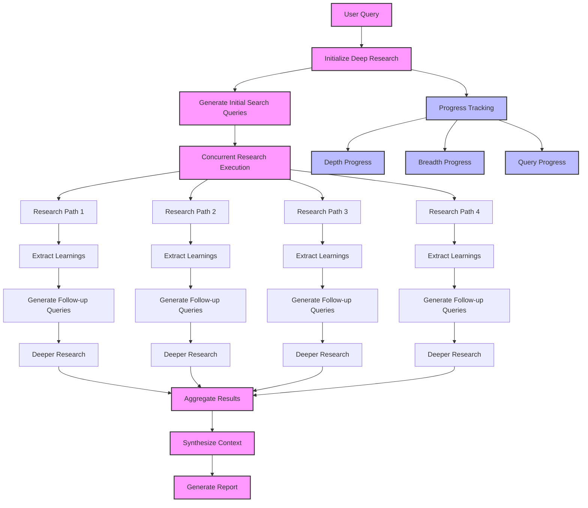

# Deep Research with GPT Researcher 🚀

With the latest "Deep Research" trend in the AI community, we're excited to implement our own Open source deep research capability! Introducing GPT Researcher's Deep Research - an advanced recursive research system that explores topics with unprecedented depth and breadth.

## How It Works

Deep Research employs a fascinating tree-like exploration pattern:

1. **Breadth**: At each level, it generates multiple search queries to explore different aspects of your topic
2. **Depth**: For each branch, it recursively dives deeper, following leads and uncovering connections
3. **Concurrent Processing**: Utilizes async/await patterns to run multiple research paths simultaneously
4. **Smart Context Management**: Automatically aggregates and synthesizes findings across all branches
5. **Progress Tracking**: Real-time updates on research progress across both breadth and depth dimensions

Think of it as deploying a team of AI researchers, each following their own research path while collaborating to build a comprehensive understanding of your topic.

## Process Flow



## Quick Start

```python
from gpt_researcher import GPTResearcher
from gpt_researcher.utils.enum import ReportType, Tone
import asyncio

async def main():
    # Initialize researcher with deep research type
    researcher = GPTResearcher(
        query="What are the latest developments in quantum computing?",
        report_type="deep",  # This triggers deep research modd
    )
    
    # Run research
    research_data = await researcher.conduct_research()
    
    # Generate report
    report = await researcher.write_report()
    print(report)

if __name__ == "__main__":
    asyncio.run(main())
```

## Configuration

Deep Research behavior can be customized through several parameters:

- `deep_research_breadth`: Number of parallel research paths at each level (default: 4)
- `deep_research_depth`: How many levels deep to explore (default: 2)
- `deep_research_concurrency`: Maximum number of concurrent research operations (default: 2)

You can configure these in your config file, pass as environment variables or pass them directly:

```python
researcher = GPTResearcher(
    query="your query",
    report_type="deep",
    config_path="path/to/config.yaml"  # Configure deep research parameters here
)
```

## Progress Tracking

The `on_progress` callback provides real-time insights into the research process:

```python
class ResearchProgress:
    current_depth: int       # Current depth level
    total_depth: int         # Maximum depth to explore
    current_breadth: int     # Current number of parallel paths
    total_breadth: int       # Maximum breadth at each level
    current_query: str       # Currently processing query
    completed_queries: int   # Number of completed queries
    total_queries: int       # Total queries to process
```

## Advanced Usage

### Custom Research Flow

```python
researcher = GPTResearcher(
    query="your query",
    report_type="deep",
    tone=Tone.Objective,
    headers={"User-Agent": "your-agent"},  # Custom headers for web requests
    verbose=True  # Enable detailed logging
)

# Get raw research context
context = await researcher.conduct_research()

# Access research sources
sources = researcher.get_research_sources()

# Get visited URLs
urls = researcher.get_source_urls()

# Generate formatted report
report = await researcher.write_report()
```

### Error Handling

The deep research system is designed to be resilient:

- Failed queries are automatically skipped
- Research continues even if some branches fail
- Progress tracking helps identify any issues

## Best Practices

1. **Start Broad**: Begin with a general query and let the system explore specifics
2. **Monitor Progress**: Use the progress callback to understand the research flow
3. **Adjust Parameters**: Tune breadth and depth based on your needs:
   - More breadth = wider coverage
   - More depth = deeper insights
4. **Resource Management**: Consider concurrency limits based on your system capabilities

## Limitations

- Usage of reasoning LLM models such as `o3-mini`. This means that permissions for reasoning are required and the overall run will be significantly slower.
- Deep research may take longer than standard research
- Higher API usage and costs due to multiple concurrent queries
- May require more system resources for parallel processing

Happy researching! 🎉 