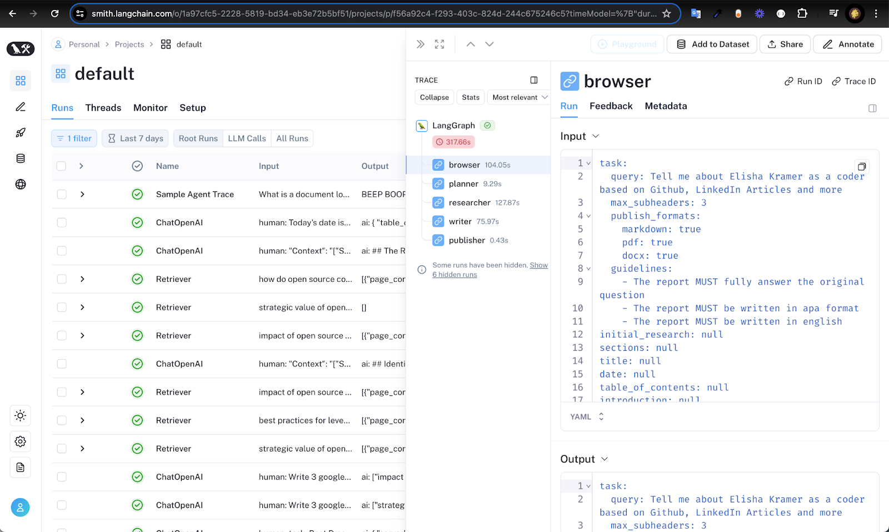

# Langsmith Logs

With the help of Langsmith, you can easily visualize logs on cost and errors within your Langsmith Dashboard (calculated per LLM call or grouped by project)

Here are the steps to setup Langsmith:

Step 1: Setup a Langsmith account at: [smith.langchain.com](https://smith.langchain.com)

Step 2: Create a new API key at: [smith.langchain.com/settings](https://smith.langchain.com/settings)

Step 3: Add these 2 environment variables:

```bash
LANGCHAIN_TRACING_V2=true
LANGCHAIN_API_KEY=Set this to your API key
```

Here's what this looks like in the Langsmith Dashboard:



This can be helpful for: 

- Enabling users to visualize and inspect the backend data flow
- Quality assurance debugging - where can the input or output of our AI flows use improvement
- Cost analysis - where are we spending the most on LLM calls
- Error analysis - where are we getting the most errors
- Optimizing speed - which parts of the flow are taking the most time
