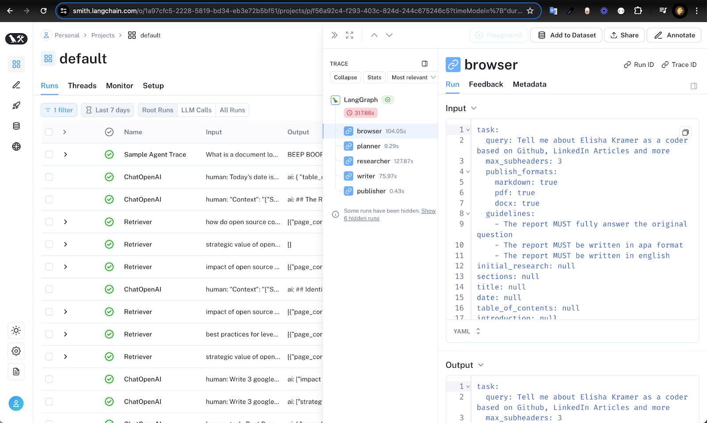

# LangSmith-Logs

Mit LangSmith kannst du Logs zu Kosten und Fehlern direkt in deinem LangSmith-Dashboard visualisieren, entweder pro LLM-Aufruf oder gebündelt nach Projekt.

So richtest du LangSmith ein:

Schritt 1: Lege einen LangSmith-Account an unter [smith.langchain.com](https://smith.langchain.com)

Schritt 2: Erstelle einen neuen API-Key unter [smith.langchain.com/settings](https://smith.langchain.com/settings)

Schritt 3: Setze diese beiden Umgebungsvariablen:

```bash
LANGCHAIN_TRACING_V2=true
LANGCHAIN_API_KEY=Hier deinen API-Key eintragen
```

So sieht das im LangSmith-Dashboard aus:



Das kann nützlich sein für:

- Das Visualisieren und Prüfen des Backend-Datenflusses
- Debugging zur Qualitätssicherung, um zu sehen, wo Input oder Output verbessert werden kann
- Kostenanalyse, um zu erkennen, wo die meisten LLM-Aufrufe stattfinden
- Fehleranalyse, um die häufigsten Fehler zu finden
- Geschwindigkeitsoptimierung, um die langsamsten Teile des Flows zu identifizieren
