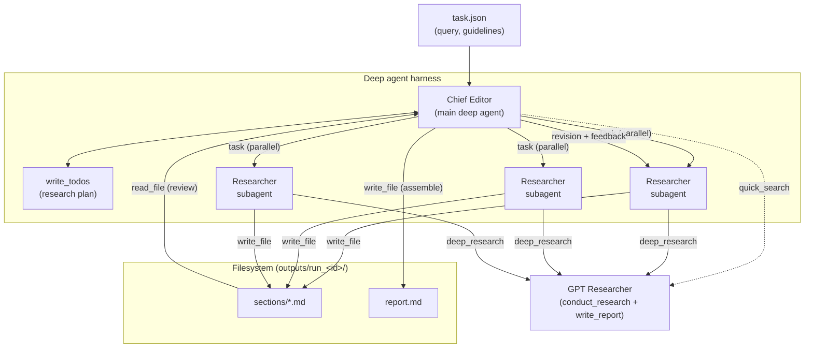

# Deep Agents

[Deep Agents](https://docs.langchain.com/oss/python/deepagents/overview) is LangChain's "batteries-included" agent harness, with built-in task planning, a virtual filesystem for context management, and subagent spawning.

This example uses GPT Researcher as the **research engine inside a deep agent**: the harness provides the orchestration that the [LangGraph example](./langgraph.md) implements manually as a hardcoded graph, while `GPTResearcher` provides citation-grade research for each section of the report.

The full example lives in [`deep_agents/`](https://github.com/assafelovic/gpt-researcher/tree/master/deep_agents) in the repository.

## Use case

The LangGraph example wires 8 agents into an explicit state machine. This example produces a similar STORM-style pipeline (plan → parallel section research → review → publish) with far less code, because those behaviors are emergent from the deep agent harness:

| Capability | LangGraph example | Deep Agents example |
|---|---|---|
| Planning | `EditorAgent` node + `ResearchState` | built-in `write_todos` tool |
| Parallel section research | nested subgraph per section | `task` tool spawning `researcher` subagents in parallel |
| Context management | state keys passed between nodes | drafts offloaded to a filesystem, subagent context isolation |
| Review / revision | `Reviewer` and `Revisor` nodes in a loop | the chief editor reads drafts and delegates revisions |
| Publishing | `PublisherAgent` | final `report.md` assembled on disk |

Research is not limited to the web: by setting `source` to `local` or `hybrid` in `task.json`, the same pipeline runs over your own documents (PDF, DOCX, markdown and more via the `DOC_PATH` env var), or combines them with web sources — for example, researching an internal strategy doc and enriching it with market data from the web.

## Benchmarked against the stock setup

We measured this setup against the deepagents quickstart (same harness, same `gpt-5.4` model, same prompt and step budget — the only variable being a raw Tavily search tool vs GPT Researcher's `quick_search`/`deep_research` tools) on [DeepResearch Bench](https://github.com/Ayanami0730/deep_research_bench), the industry-standard benchmark for deep research agents, using its official RACE (report quality) and FACT (citation verification) scoring:

| Metric | Deep agent + raw search | Deep agent + GPT Researcher |
|---|---|---|
| RACE report quality | 0.503 | **0.512** |
| **Effective (verified) citations per report** | 18.6 | **35.2 (+89%)** |
| Citation precision | 53.9% | **56.0%** |

With GPT Researcher as the engine, the same agent grounds its reports in roughly **2x the verified evidence**: a raw search tool returns snippets, while GPT Researcher plans sub-queries, scrapes and reads the full pages, filters them for relevance and returns pre-cited synthesis. Full methodology and reproduction steps live in [`deep_agents/BENCHMARK.md`](https://github.com/assafelovic/gpt-researcher/blob/master/deep_agents/BENCHMARK.md).

## How it works

The team is two agents plus the core GPT Researcher:

- **Chief Editor** (the main deep agent) — scopes the topic with a quick search, plans the outline as todos, delegates one section per `researcher` subagent (in parallel), reviews the drafts against the task guidelines, and assembles the final report with a deduplicated references section.
- **Researcher** (subagent) — wraps `GPTResearcher`. For its assigned section it runs the full research pipeline (`conduct_research` + `write_report`), writes the cited draft to a file, and returns only a short summary, so the heavy research output stays out of the chief editor's context.

### Architecture



GPT Researcher is exposed to the agent as two tools:

```python
async def quick_search(query: str) -> str:
    """Fast search returning ranked results with snippets and URLs,
    via GPTResearcher.quick_search."""

async def deep_research(query: str, parent_query: str = "") -> str:
    """The full GPT Researcher pipeline: plans sub-queries, scrapes and
    validates sources, and returns a cited markdown research report."""
```

And the deep agent is created in a few lines:

```python
from deepagents import create_deep_agent
from deepagents.backends import FilesystemBackend

agent = create_deep_agent(
    model="openai:gpt-5.4",
    tools=[quick_search],
    system_prompt=CHIEF_EDITOR_PROMPT,
    subagents=[{
        "name": "researcher",
        "description": "Conducts in-depth, citation-grade research on one report section and writes a draft to a file.",
        "system_prompt": RESEARCHER_PROMPT,
        "tools": [quick_search, deep_research],
    }],
    backend=FilesystemBackend(root_dir=run_dir, virtual_mode=True),
)
```

The agent runs on a `FilesystemBackend`, so section drafts and the final `report.md` are written as real files under `deep_agents/outputs/run_<id>/`.

## How to run

Requires Python 3.11+.

1. Install dependencies from the repository root:

    ```bash
    pip install -r requirements.txt
    pip install -r deep_agents/requirements.txt
    ```

2. Set your API keys (see the [LLM config pages](https://docs.gptr.dev/docs/gpt-researcher/llms) for supported providers and retrievers):

    ```bash
    export OPENAI_API_KEY=...
    export TAVILY_API_KEY=...
    ```

3. Run it:

    ```bash
    python deep_agents/main.py
    ```

To change the research query and customize the report, edit `deep_agents/task.json`:

- `query` — the research topic.
- `model` — the model for the deep agent, in `provider:model` format (e.g. `openai:gpt-5.4`). Overridden by the `STRATEGIC_LLM` env var if set.
- `max_sections` — the maximum number of report sections.
- `source` — where to conduct the research: `web`, `local` or `hybrid`. For `local` and `hybrid`, set the `DOC_PATH` env var to your documents directory; GPT Researcher's document pipeline handles parsing (PDF, DOCX, etc.) while the deep agent's filesystem stays a workspace for drafts.
- `follow_guidelines` / `guidelines` — report guidelines the chief editor enforces during review.
- `verbose` — stream detailed progress to the console.

## Observability

Set `LANGCHAIN_API_KEY` to trace runs in [LangSmith](https://smith.langchain.com). Each subagent's runs are tagged with `lc_agent_name` metadata (e.g. `researcher`), so you can filter the coordinator and each section's research separately.

## Benchmarks

Why use GPT Researcher as the research engine instead of a raw search tool? We benchmarked both setups on [DeepResearch Bench](https://github.com/Ayanami0730/deep_research_bench) — the industry-standard benchmark for deep research agents — using the same harness, model (`gpt-5.4`), prompt and step budget. The only variable was the research tooling.

| Metric (10 tasks, official RACE + FACT pipelines) | Raw search tool | GPT Researcher tools |
|---|---|---|
| Report quality (RACE overall) | 0.503 | **0.512** |
| Citations per report | 34.5 | **62.9** |
| **Verified citations per report (FACT)** | 18.6 | **35.2 (+89%)** |
| Reports with zero verifiable citations | 2/10 | **0/10** |

FACT scrapes every cited page and verifies each claim against its source, so the headline number measures **real, checkable evidence**: the same chief agent puts nearly twice as much of it behind every report when its research tool scrapes and synthesizes full sources instead of reading search snippets. Full methodology and reproduction steps live in [`deep_agents/BENCHMARK.md`](https://github.com/assafelovic/gpt-researcher/blob/master/deep_agents/BENCHMARK.md).
