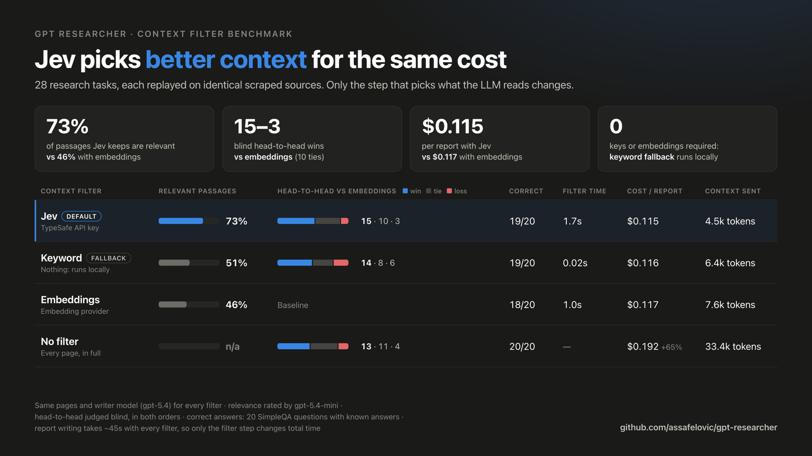

# Context filter benchmark: embeddings vs Jev vs no filter



Every scraped page reaches a GPT Researcher report through one step: for each
sub-query, the scraped pages are cut into chunks and a filter decides which
chunks become the writer's context. Until now that filter was embedding
similarity. This benchmark asks two questions:

1. Is there a better filter? We test [TypeSafe's Jev](https://docs.typesafe.ai/),
   a model that returns calibrated, typed decisions, scoring each chunk on how
   useful it is for answering the question.
2. With today's long context windows, do we need a filter at all?

## Method

**Fixed inputs.** `collect.py` runs 28 real research tasks once and records
the exact `(sub_query, pages)` pairs that reached the filter: 20 SimpleQA
questions with known answers (fixed seed, from `evals/simple_evals`) and 8
open-ended research questions. `replay.py` rebuilds the context from those
same pages with each strategy and writes the report with the same model
(`gpt-5.4`). Search and scraping, the noisiest parts of a run, are held
constant, so the filter is the only thing that differs.

**Strategies.**

| strategy | what reaches the writer |
|---|---|
| `embeddings` | today: 1000-char chunks, cosine similarity > 0.42, top 10 per sub-query |
| `jev` | same chunks, scored by Jev on a 4-level usefulness rubric, top 10 scoring ≥ 1.5 |
| `jev_top10` | Jev's 10 best chunks, no threshold (same budget as embeddings) |
| `jev_large` | Jev on 3000-char chunks, top 4 (≈ same characters, a third of the calls) |
| `jev_wide` | Jev threshold 1.5, up to 30 chunks |
| `jev_broad` | Jev on 3000-char chunks, threshold 1.0, up to 12 (open-ended only) |
| `bm25` | keyword (BM25) ranking of the same chunks, top 10; runs locally, no API or model |
| `bm25_rel` | BM25, keeping chunks scoring ≥ 50% of the best chunk, top 10 |
| `bm25_wide` | BM25 with the same relative threshold, up to 25 chunks (shipped as `keyword`) |
| `none_capped` | no ranking: pages in search order, capped at 48k characters per sub-query |
| `none` | no filter: every page in full (capped at 50k chars per page, as today) |
| `truncate` | control: 10 chunks round-robin across pages, no relevance ranking |

**Quality signals** (`judge.py`):

- **SimpleQA accuracy**: each report graded with the repo's SimpleQA grader.
- **Context precision**: the share of context chunks an independent judge
  (`gpt-5.4-mini`) rates as relevant to the question. This measures the filter
  itself. It isn't defined for `none`.
- **Pairwise preference**: a blind head-to-head judged by `gpt-5.4`, run in both
  orders. A win counts only if the strategy wins in *both* orders; any
  disagreement is a tie.

## Results

### Cost and speed (28 questions)

| strategy | filter time p50 / p90 | filter $ | context tokens p50 (max) | write $ | total $ / report |
|---|---|---|---|---|---|
| embeddings | 1.0s / 1.3s | 0.0028 | 7.6k (10.7k) | 0.114 | **0.117** |
| jev | 2.4s / 6.0s ¹ | 0.0054 | 4.5k (10.6k) | 0.110 | **0.115** |
| jev_top10 | 2.7s / 6.2s | 0.0054 | 8.6k (10.6k) | 0.119 | 0.124 |
| jev_large | 1.2s / 5.1s | 0.0031 | 6.5k | 0.111 | 0.114 |
| truncate | 0.0s | — | 8.0k (11.0k) | 0.117 | 0.117 |
| none | 0.0s | — | **33.4k (107.7k)** | **0.192** | **0.192** |

¹ Measured with 32 concurrent Jev calls. At 64, the new default, the same
filtering takes **1.7s p50 / 3.6s p90**; 128 was no faster.

Report writing takes the same ~45s for every strategy: generating the output
dominates, and input size barely matters. Removing the filter makes nothing
faster; it makes each report 65% more expensive.

### Quality

| strategy | SimpleQA correct | context precision | vs embeddings (W/T/L) | vs none (W/T/L) |
|---|---|---|---|---|
| embeddings | 18/20 | 0.46 | — | 3 / 12 / 13 |
| **jev** | 19/20 | **0.73** | **15 / 10 / 3** | 6 / 12 / 10 |
| jev_top10 | 19/20 | 0.50 | 13 / 10 / 5 | — |
| jev_large | 19/20 | 0.72 | 11 / 10 / 7 | 8 / 7 / 13 |
| jev_wide | 20/20 | **0.74** | 13 / 8 / 7 | 7 / 11 / 10 |
| truncate | 19/20 | 0.33 | 7 / 8 / 13 | — |
| none | 20/20 | — | 13 / 11 / 4 | — |

### Open-ended questions only (8)

| strategy | context p50 | total $ / report | vs embeddings | vs none |
|---|---|---|---|---|
| embeddings | 8.8k | 0.155 | — | 0 / 1 / 7 |
| jev | 9.1k | 0.160 | 5 / 2 / 1 | 0 / 2 / 6 |
| jev_broad | 26.9k | 0.191 | **7 / 1 / 0** | 0 / 3 / 5 |
| none | 61.3k | **0.284** | 8 / 0 / 0 | — |

The `none` reports on open-ended questions were *shorter* than the embeddings
reports (2,099 vs 2,416 median words) and still preferred, so the judge is not
rewarding length.

### Filters that need nothing: keyword (BM25)

Without a Jev key, GPT Researcher needs a filter with no API, model or
embeddings. The candidates, on the same 28 runs:

| strategy | SimpleQA | context precision | vs embeddings (W/T/L) | vs none (W/T/L) | filter p50 | context p50 | total $ |
|---|---|---|---|---|---|---|---|
| bm25 | 18/20 | 0.40 | 7 / 9 / 12 | 3 / 12 / 13 | 0.02s | 8.1k | 0.118 |
| bm25_rel | 19/20 | 0.53 | 7 / 13 / 8 | 5 / 10 / 13 | 0.02s | 4.7k | **0.107** |
| **bm25_wide** | 19/20 | 0.51 | **14 / 8 / 6** | 6 / 9 / 13 | 0.02s | 6.4k | 0.116 |
| none_capped | 20/20 | 0.54 | 11 / 13 / 4 | 6 / 10 / 12 | 0.00s | 23.8k | 0.152 |
| *embeddings* | *18/20* | *0.46* | — | *3 / 12 / 13* | *1.04s* | *7.6k* | *0.117* |

`bm25_wide` ships as the `keyword` fallback: at least as good as embeddings on
every measure, at the same cost, about 50× faster to filter, and with nothing
to set up. Its 14–6 head-to-head is directional (sign test p ≈ 0.12), not as
strong as Jev's 15–3. As with Jev, the relative threshold is what does the
work: plain top-10 BM25 loses to embeddings 7–12.

GPT Researcher removes duplicate URLs across sub-queries before scraping
(0 of 300 pages recurred), so "sources that came back most often" isn't a
signal available at this step.

## What this shows

1. **Jev is a better filter than embeddings at the same cost.** 73% of the
   chunks Jev selects are relevant, against 46% for embeddings; the unranked
   control gets 33%. Jev reports beat embeddings reports 15–3 head-to-head
   (sign test on the 18 non-ties, p ≈ 0.008). Every Jev variant beat
   embeddings. Total cost per report is the same; both filters cost well
   under a cent.
2. **Most of the gain comes from the threshold.** `jev_top10`, forced to fill
   10 slots, drops to 0.50 precision. Cosine similarity cannot say "nothing
   else here is worth including"; a calibrated usefulness score can.
3. **Skipping the filter gives the best open-ended reports, at 65–83% higher
   cost.** More source material makes for broader reports. But on a *standard*
   research report the context already reaches 108k tokens; detailed and deep
   research run many more sub-queries and would overflow context windows and
   budgets. For fact-finding questions it adds nothing: SimpleQA is at
   ceiling for every strategy, and Jev vs none is 6–10–4.
4. **No integration is needed for a good filter.** Keyword ranking with a
   relative threshold matches or beats embeddings at the same cost (above),
   so the default without a Jev key is `keyword`, and nothing requires an
   embeddings provider.
5. **SimpleQA is saturated.** 18–20 of 20 for every strategy: when search
   finds the fact, any reasonable filter keeps it. Differences of one question
   are noise.

## Caveats

- 28 questions, judged by one model family (`gpt-5.4`), which also writes the
  reports. Self-preference would apply to every strategy equally, but the
  pairwise numbers are directional evidence, not a leaderboard.
- One writer model and one report type (`research_report`). Detailed and deep
  research were not replayed.
- Jev latency depends on chunk count and concurrency. `jev_large` matches
  embeddings at the median; tails come from large pages.

## Reproduce

```bash
export OPENAI_API_KEY=... TAVILY_API_KEY=... TYPESAFE_API_KEY=...
python -m evals.context_filter.collect --out runs/            # ~$0.40, ~20 min
python -m evals.context_filter.replay  --runs runs/ --out results/
python -m evals.context_filter.judge   --results results/
python -m evals.context_filter.judge   --results results/ --baseline none --only jev embeddings
python -m evals.context_filter.replay  --runs runs/ --out results/ --strategies bm25 bm25_rel bm25_wide none_capped
```

`results/` in this folder holds the scores and per-run metrics from the run
above (`runs.json`, `scored_*.json`, `summary_*.json`). Scraped pages and
generated reports are not committed.

Total spend: about $40 in tracked writing and filtering across all strategies
(of which $0.59 was Jev; keyword and none cost nothing to filter), plus an
estimated $8–15 for judging.
