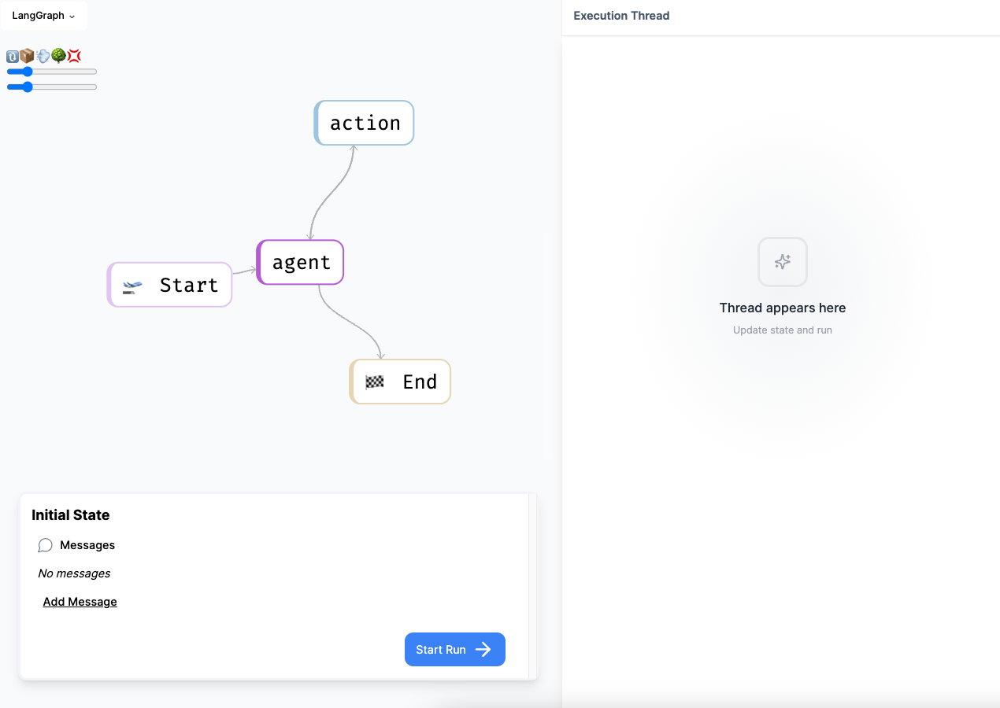

# `langgraph-api` Example



This is an example of how to use `langgraph-api` to stand up a REST API for your custom LangGraph StateGraph. This API can be used to interact with your StateGraph from any programming language that can make HTTP requests.

[LangGraph](https://github.com/langchain-ai/langgraph) is a library for building stateful, multi-actor applications with LLMs. The main use cases for LangGraph are conversational agents, and long-running, multi-step LLM applications or any LLM application that would benefit from built-in support for persistent checkpoints, cycles and human-in-the-loop interactions (ie. LLM and human collaboration).

`langgraph-api` shortens the time-to-market for developers using LangGraph, with a one-liner command to start a production-ready HTTP microservice for your LangGraph applications, with built-in persistence. This lets you focus on the logic of your LangGraph graph, and leave the scaling and API design to us. The API is inspired by the OpenAI assistants API, and is designed to fit in alongside your existing services.

## API Features

It has the following features:

- saved assistants, tracking config for your graphs
- saved threads, tracking state/conversation history
- human in the loop endpoints (interrupt a run, authorize nodes, get thread state, update thread state, get history of past thread states)
- streaming runs (with multiple stream formats, including token-by-token messages, state values and node updates)
- background runs (powered by a built-in task queue with exactly-once semantics, and FIFO ordering, with api for checking status and events, and support for completion webhooks)
- horizontally scalable, both the HTTP server and task queue are designed to run in many machines in parallel, with all state stored in Postgres
- "double texting" modes, fully configurable support to handle new input arriving while a thread still processing previous input, choose from these modes: reject, enqueue, cancel, rollback
- low latency, all interactions with the database have been optimized into a single roundtrip per endpoint, all database ops during runs are backgrounded and batched, and lots of other optimizations from our experience running high performance python services at scale

We've designed it as a robust server you can run in production at high scale, and also easily test locally.

## Quickstart

This will cover how to get started with the example LangGraph application in this repo.
If you already have a LangGraph application and you want to deploy that (rather than this example LangGraph application) see the next section.

The LangGraph agent we are deploying is a simple Anthropic agent with a single search tool.
You can see the full graph in `agent.py`

You will need to have Docker running locally in order to use LangGraph Cloud. Download it [here](https://docs.docker.com/desktop/install/mac-install/), open the app, and ensure the Docker engine is running.

Clone this repo and switch your active directory to the newly created one:

```bash
git clone https://github.com/langchain-ai/langgraph-example.git
```

```bash
cd langgraph-example
```

Install the `langgraph-cli` package:

```bash
pip install langgraph-cli
```

Create a `.env` file with the correct environment variables.

```shell
cp .env.example .env
```

Go into `.env` file and add your credentials.
You will need an [Anthropic](https://console.anthropic.com/login?returnTo=%2F%3F), [Tavily](https://docs.tavily.com/), and [LangSmith](https://smith.langchain.com/) API keys.

Then, run the following command to start the API server:

```bash
langgraph up
```

This will start the API server on `http://localhost:8123`.
You can now interact with your StateGraph using the API or SDK.
For this example we will use the SDK, so let's go into a separate environment and install the SDK.

### Python

```shell
pip install langgraph-sdk
```

We can now interact with our deployed graph!

```python
from langgraph_sdk import get_client

client = get_client()

# List all assistants
assistants = await client.assistants.search()

# We auto-create an assistant for each graph you register in config.
agent = assistants[0]

# Start a new thread
thread = await client.threads.create()

# Start a streaming run
input = {"messages": [{"role": "human", "content": "whats the weather in la"}]}
async for chunk in client.runs.stream(thread['thread_id'], agent['assistant_id'], input=input):
    print(chunk)
```

### JS/TS

```bash
yarn add @langchain/langgraph-sdk
```

```js
import { Client } from "@langchain/langgraph-sdk";

const client = new Client();

// List all assistants
const assistants = await client.assistants.search({
  metadata: null,
  offset: 0,
  limit: 10,
});

// We auto-create an assistant for each graph you register in config.
const agent = assistants[0];

// Start a new thread
const thread = await client.threads.create();

// Start a streaming run
const messages = [{ role: "human", content: "whats the weather in la" }];

const streamResponse = client.runs.stream(
  thread["thread_id"],
  agent["assistant_id"],
  {
    input: { messages },
  },
);

for await (const chunk of streamResponse) {
  console.log(chunk);
}
```

There we go! Up and running.
There's still a lot left to learn.

For more examples of how to interact with the API once it is deployed using the SDK, see the example notebooks in [notebooks](./examples/python/notebooks)

For an explanation of how the deployment works and how to deploy a custom graph, see the section below.

## Deploy a custom agent

The quickstart walked through deploying a simple agent. But what if you want to deploy it for your custom agent?

### Build your agent

First: build your agent with LangGraph. See LangGraph documentation [here](https://github.com/langchain-ai/langgraph) for references and examples.

### Define `langgraph.json`

Now we will define our `langgraph.json` file. This configuration has three parts:

#### `graphs`

In the graphs mapping, the key is the graph_id and the value is the path to the agent (a StateGraph).
The graph_id is used in the API when creating an assistant.
You can declare multiple graphs.

In the example, we had:

```json
  "graphs": {
    "agent": "./agent.py:graph"
  },
```

This meant that we were defining an agent with graph_id `agent` and the path was in the `agent.py` file with a variable called `graph`.

#### `dependencies`

You can declare local and external python dependencies (which will be installed with pip) here.

In the example, we had:

```json
  "dependencies": ["."],
```

This meant we installed this current directory as a dependency.
That includes anything in `requirements.txt` and any helper files here.

You can also specify third party packages here.
For example, you could do something like:

```json
  "dependencies": [".", "wikipedia"],
```

This would install the current directory (and any requirements files located inside) as well as the `wikipedia` package.

#### `env`

This is a path to any environment variables/files to load.

In our example we had:

```json
  "env": ".env"
```

This meant we loaded the environment variables in the `.env` file

### Launch the LangGraph agent

We can now use our CLI to launch the LangGraph agent.

First, we need to install it. We can do this with:

```
pip install langgraph-cli
```

Once installed, we can then launch the service with:

```shell
langgraph up
```

There are a few extra commands for additional control. For a full list, run `langgraph up --help`

### Add custom services

`langgraph up` spins up the LangGraph agent using Docker Compose. If you want to launch other services as part of the same project, you can use the `-d` flag to pass an additional docker compose file to be merged into the same project.

For instance, if you create a docker compose file at `compose.yml` you can then run `langgraph up -d compose.yml` to spin up both the LangGraph services as well as your custom services.

## API Reference

The API reference is available at `http://localhost:8123/docs` when running locally. You can preview it here: [API Reference](https://langchain-ai.github.io/langgraph-example/).

## Server configuration

To configure throughput you can use the env vars N_WORKERS (default 2) and N_JOBS_PER_WORKER (default 5).
Throughput for background runs is the product of the two, so by default at most 10 runs can be running at any one time.

## UI

Part of LangGraph API includes a UI for interacting with created agents.
After running `langgraph up` you can access this UI by going to [http://localhost:8124](http://localhost:8124). You will be taken to an interactive playground whereby you can visualize and then interact with the agent.


